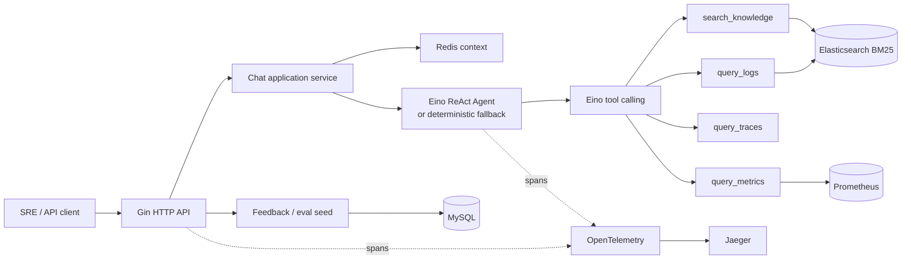

# WatchOps-Lite: Agentic RAG for Service Reliability

A Go-based Agentic RAG assistant for service reliability analysis, combining Eino ReAct tool calling, Elasticsearch RAG and logs, Prometheus metrics, Redis session memory, MySQL feedback/eval seed, and OpenTelemetry tracing.

WatchOps-Lite turns an incident question into a bounded investigation: it builds session context, selects read-only tools, gathers normalized evidence, and returns conclusions, inferences, recommendations, limitations, and tool-run metadata without treating unsupported model output as fact.

## Architecture



The local demo uses deterministic Agent routing, Prometheus-backed metrics, Elasticsearch-backed logs and knowledge, and mock traces. Redis session memory, MySQL feedback/eval persistence, and Jaeger tracing are real local integrations. An OpenAI-compatible Eino `ChatModel` can be enabled separately.

## MVP Features

- Gin HTTP API with thin handlers, structured errors, request IDs, and graceful shutdown
- Eino ReAct Agent with versioned PromptTemplate and optional OpenAI-compatible model
- Deterministic Agent fallback that requires no API key
- `query_logs`, `query_metrics`, `query_traces`, and `search_knowledge`
- Shared `ToolResult`, evidence, warning, and structured `ToolError` contracts
- Tool schema validation, timeout boundaries, safe error normalization, and tracing
- Evidence-aware output parsing that rejects invented evidence IDs
- Redis recent-message sliding window and deterministic rolling summary
- Elasticsearch chunk indexing and BM25 knowledge retrieval
- Elasticsearch-backed `query_logs` with bounded filters and explicit mock fallback
- Prometheus-backed `query_metrics` with allowlisted queries and explicit mock fallback
- MySQL upvote/downvote feedback and manual good/bad eval-case seeding
- OpenTelemetry spans, W3C trace propagation, response `trace_id`, and Jaeger visualization
- Reproducible Docker Compose and scripted demo flow

## Quick Start

Requirements:

- Go 1.23+
- Docker with Docker Compose
- `curl`
- Python 3 for JSON-safe demo-file loading and response ID extraction

Start Redis, Elasticsearch, Prometheus, the demo metrics exporter, MySQL, and Jaeger:

```bash
docker compose up -d --wait
docker compose ps
```

Create an ignored local configuration from the committed example:

```bash
cp configs/config.example.json configs/config.local.json
```

Start WatchOps-Lite:

```bash
make run CONFIG=configs/config.local.json
```

Equivalent direct command:

```bash
go run ./cmd/server -config configs/config.local.json
```

Check readiness from another terminal:

```bash
curl --fail-with-body http://localhost:8080/healthz
```

The local config enables Redis, Elasticsearch, MySQL, and OpenTelemetry, while keeping `llm.enabled=false` and `agent.mode=deterministic`. No LLM key is required.

To stop the dependencies:

```bash
docker compose down
```

Add `--volumes` only when you intentionally want to remove all local demo data.

## Reproducible Demo

With the application running, execute:

```bash
./scripts/demo_seed_knowledge.sh
./scripts/demo_seed_logs.sh
./scripts/demo_metrics.sh
./scripts/demo_chat.sh
./scripts/demo_feedback.sh
./scripts/demo_eval_case.sh
```

The flow demonstrates:

1. A checkout runbook and deterministic checkout log events are indexed in Elasticsearch.
2. Prometheus scrapes four checkout reliability signals from the Go demo exporter.
3. Chat loads Redis context and invokes real metrics, real logs, and real knowledge tools.
4. The response exposes evidence, limitations, `tool_runs`, and `trace_id`.
5. A downvote is stored in MySQL.
6. The feedback record seeds a reusable `bad_case`, which is then listed.

Open [Jaeger](http://localhost:16686), select the `watchops-lite` service, and search for the trace ID returned by Chat. Demo response state is stored under `/tmp/watchops-lite-demo` by default. Override the API or state location with:

```bash
export WATCHOPS_API_BASE_URL=http://localhost:8080
export WATCHOPS_DEMO_STATE_DIR=/tmp/watchops-lite-demo
```

The log seed uses stable IDs, shifts fixture timestamps into the current 20-minute demo window, and safely replaces its events on rerun. The Chat script generates the matching time range so Prometheus and Elasticsearch evidence can be correlated. Knowledge, feedback, and eval scripts create additional records.

`configs/config.example.json` selects Elasticsearch logs and Prometheus metrics with explicit mock fallback. If either backend is unavailable, Chat continues with `LOGS_FALLBACK` or `METRICS_FALLBACK` warning metadata. The dependency-light `configs/config.json` keeps both backends in mock mode.

Query the demo Prometheus signal directly:

```bash
./scripts/demo_metrics.sh
```

## API Examples

### Health

```bash
curl --fail-with-body http://localhost:8080/healthz
```

### Chat

```bash
curl --fail-with-body http://localhost:8080/api/v1/chat \
  -H 'Content-Type: application/json' \
  -d '{
    "session_id": "demo-checkout-session",
    "message": "Why did checkout errors increase? Check metrics, logs, and the runbook.",
    "time_context": {
      "from": "2026-06-30T00:00:00Z",
      "to": "2026-06-30T00:20:00Z"
    }
  }'
```

### Ingest Knowledge

Use the JSON-safe seed script:

```bash
./scripts/demo_seed_knowledge.sh
```

Or call `POST /api/v1/knowledge/documents` with `title`, `source`, `content`, and optional `metadata`.

### Search Knowledge

```bash
curl --fail-with-body http://localhost:8080/api/v1/knowledge/search \
  -H 'Content-Type: application/json' \
  -d '{
    "query": "checkout payment upstream timeout",
    "limit": 5,
    "filters": {"service": "checkout"}
  }'
```

### Create Feedback

```bash
curl --fail-with-body http://localhost:8080/api/v1/feedback \
  -H 'Content-Type: application/json' \
  -d '{
    "request_id": "replace-with-chat-request-id",
    "session_id": "demo-checkout-session",
    "rating": "down",
    "reason_tags": ["needs_trace_confirmation"],
    "comment": "The hypothesis still needs real trace confirmation."
  }'
```

### Create and List Eval Cases

```bash
curl --fail-with-body http://localhost:8080/api/v1/eval/cases \
  -H 'Content-Type: application/json' \
  -d '{
    "feedback_id": "replace-with-feedback-id",
    "case_type": "bad_case",
    "input_message": "Why did checkout errors increase?",
    "expected_behavior": "Cite evidence and state missing trace confirmation.",
    "forbidden_patterns": ["The payment service is definitely the root cause."]
  }'

curl --fail-with-body \
  'http://localhost:8080/api/v1/eval/cases?case_type=bad_case&limit=5'
```

See [docs/API.md](docs/API.md) for complete request, response, failure, and Agent-mode contracts.

## Optional Eino ReAct Mode

WatchOps-Lite supports OpenAI-compatible tool-calling models through Eino:

```bash
export WATCHOPS_AGENT_MODE=eino_react
export WATCHOPS_LLM_ENABLED=true
export WATCHOPS_LLM_BASE_URL=https://api.openai.com/v1
export WATCHOPS_LLM_MODEL=your-tool-calling-model
export WATCHOPS_LLM_API_KEY=replace-me
make run CONFIG=configs/config.local.json
```

`WATCHOPS_LLM_API_KEY_ENV` defaults to `WATCHOPS_LLM_API_KEY`; configuration stores the environment-variable name, not the secret. Missing startup configuration selects the deterministic runner. A request-time model failure also falls back cleanly and returns `AGENT_LLM_FALLBACK`.

## Configuration Modes

Configuration precedence is:

```text
defaults < JSON configuration file < WATCHOPS_* environment variables
```

- `configs/config.json`: dependency-light default; optional services and telemetry disabled
- `configs/config.example.json`: full local Compose demo; LLM disabled
- `configs/config.local.json`: ignored developer copy
- `.env.example`: complete environment-variable reference; not loaded automatically

The application remains runnable when optional Elasticsearch, MySQL, telemetry, or LLM integrations are disabled. Redis failures degrade Chat to single-turn behavior with an explicit limitation.

## Development

```bash
make fmt
go mod tidy
go test ./...
go vet ./...
git diff --check
```

Run the combined gate:

```bash
make verify
```

`scripts/verify.sh` checks formatting, confirms `go mod tidy` is stable, runs all tests and vet checks, and validates the Git diff.

## Project Layout

```text
.
├── cmd/
│   ├── server/                 # Application process entry point
│   └── demo-metrics/           # Static local Prometheus scrape target
├── configs/                    # Default and local-demo configuration
├── demo/                       # Safe runbook and deterministic log events
├── docs/                       # Architecture, API, roadmap, and ADRs
├── scripts/                    # Reproducible demo and verification scripts
└── internal/
    ├── agent/eino/             # ReAct, prompt/parser, tools, and fallback
    ├── application/chat/       # Chat use-case orchestration
    ├── bootstrap/              # Dependency wiring and lifecycle
    ├── config/                 # Configuration loading and validation
    ├── eval/                   # Eval-case policy and MySQL store
    ├── feedback/               # Feedback policy and MySQL store
    ├── memory/session/         # Redis context and rolling summary
    ├── observability/          # Structured logs and OpenTelemetry
    ├── platform/               # Elasticsearch and MySQL clients
    ├── retrieval/knowledge/    # Chunking, BM25 policy, and ES store
    ├── retrieval/logs/         # Bounded logs search and Elasticsearch store
    ├── retrieval/metrics/      # Allowlisted metrics policy and Prometheus client
    ├── tools/                  # WatchOps tool contracts and implementations
    └── transport/http/         # Gin router, middleware, DTOs, handlers
```

## Current Limitations

- Knowledge retrieval is BM25 only; embeddings, hybrid retrieval, RRF, and reranking are deferred.
- Session summarization is deterministic; an LLM summary model with deterministic fallback is deferred.
- Traces still use deterministic fixtures; logs and metrics have real backends with mock fallback.
- Eval cases are manually seeded; there is no automatic evaluator, scorer, or LLM judge.
- Prometheus application metrics and Grafana dashboards are not included.
- The LLM Agent is optional and disabled by default.
- MySQL currently stores feedback and eval cases, not long-term memory, document metadata, or audit records.

## Roadmap

- LLM session summary model with deterministic fallback
- Hybrid BM25/vector retrieval with evaluation-driven RRF and reranking
- Production trace query adapter
- Automatic eval runner and release comparison reports
- Prometheus application metrics and Grafana dashboards

## Design Documents

- [Project Blueprint](docs/PROJECT_BLUEPRINT.md)
- [Architecture](docs/ARCHITECTURE.md)
- [HTTP API](docs/API.md)
- [Roadmap](docs/ROADMAP.md)
- [Project Structure](docs/STRUCTURE.md)
- [ADR 0008: Eino ReAct Agent](docs/adr/0008-eino-react-agent.md)
- [ADR 0009: MVP Demo Packaging](docs/adr/0009-mvp-demo-packaging.md)
- [ADR 0010: Elasticsearch-backed Logs Tool](docs/adr/0010-elasticsearch-logs-tool.md)
- [ADR 0011: Prometheus-backed Metrics Tool](docs/adr/0011-prometheus-metrics-tool.md)

## Originality

WatchOps-Lite is independently designed from its product requirements. It does not copy Pilot or training-camp project source code, structure, prompts, comments, or documentation.

## License

Apache-2.0 is planned. A `LICENSE` file will be added before the first release.
