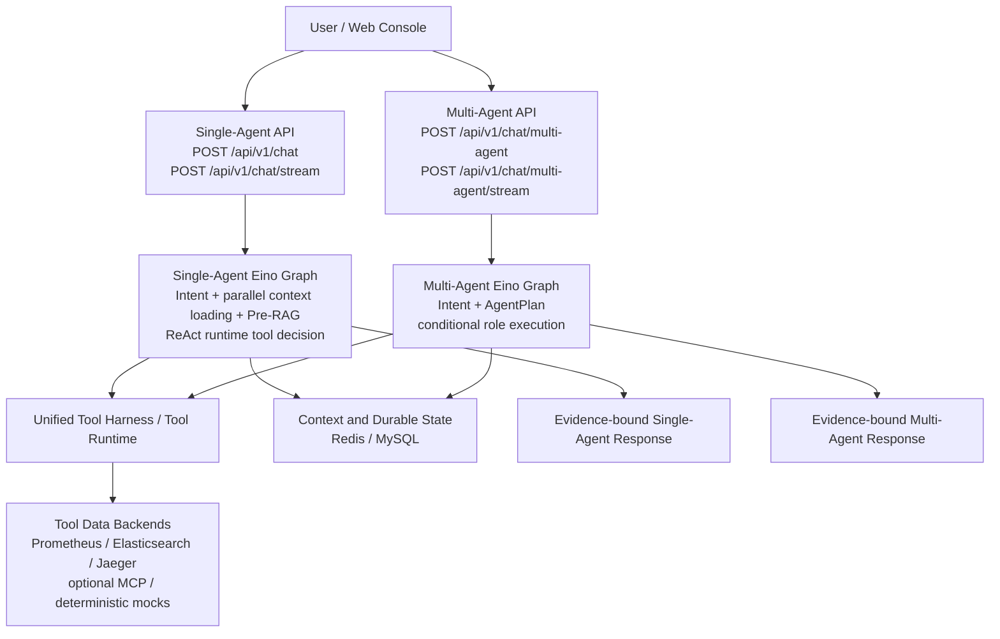
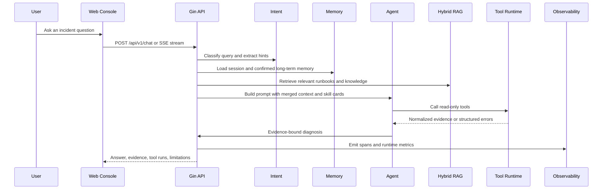
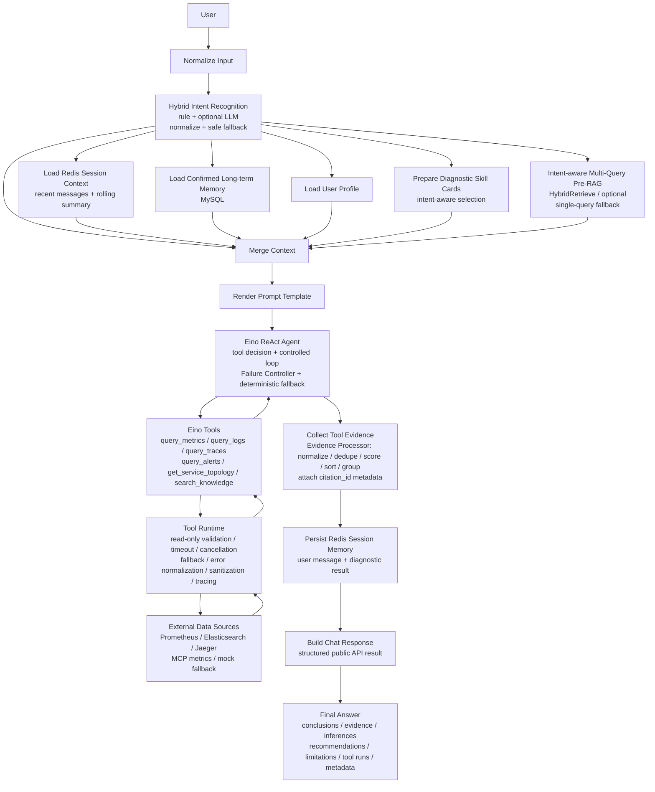
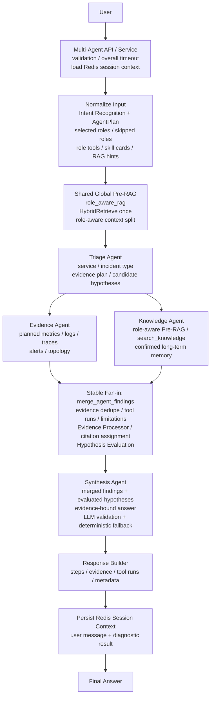
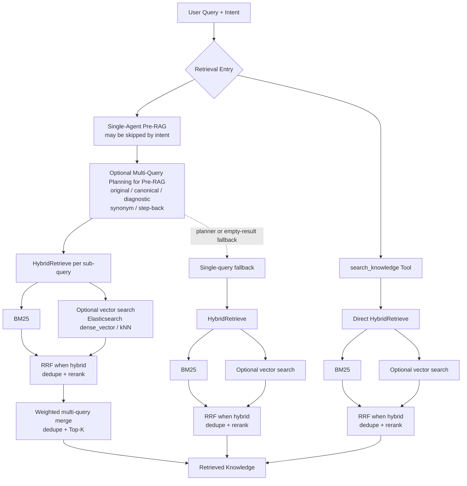
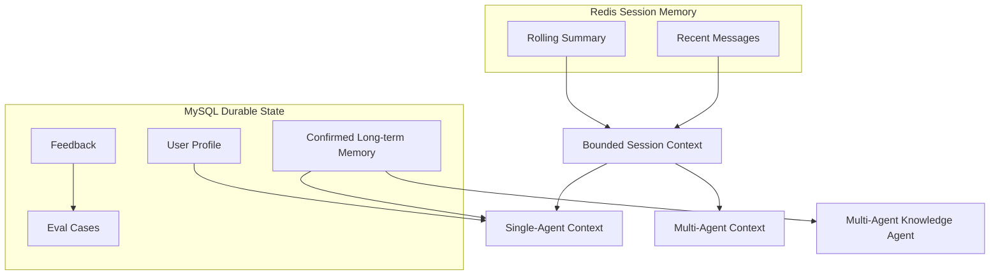
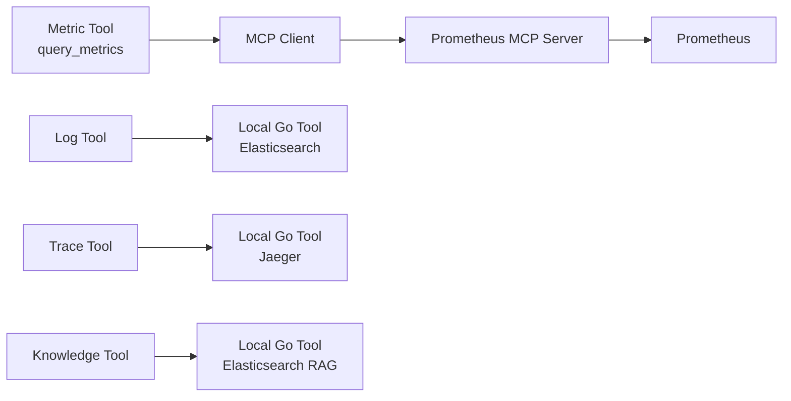
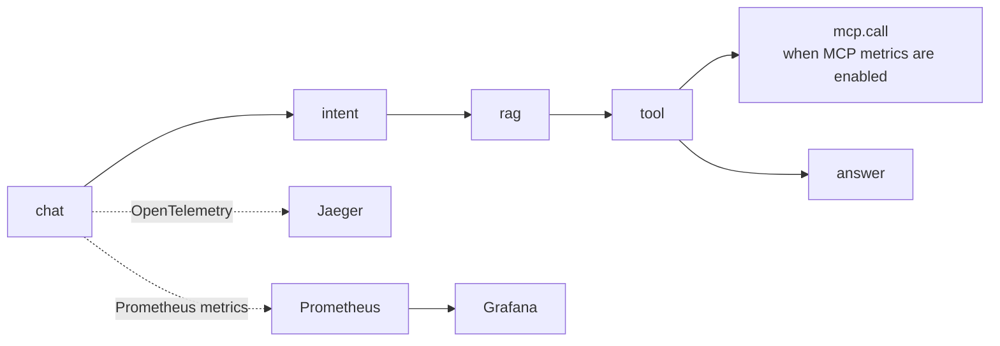
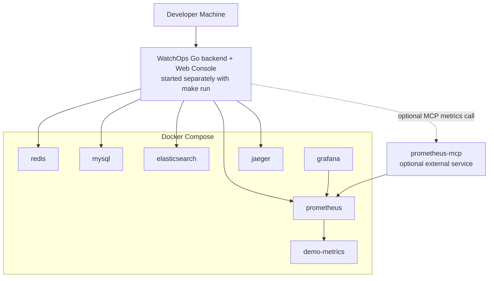

# WatchOps-Lite

> An evidence-driven Agentic RAG console for OnCall troubleshooting, built with Go, Eino, Gin, Redis, MySQL, Elasticsearch, Prometheus, Jaeger, Grafana, OpenTelemetry, and optional MCP-backed metrics.

WatchOps-Lite turns an incident question into a structured reliability investigation. It can inspect metrics, logs, traces, alerts, service topology, runbooks, short-term session context, and long-term troubleshooting memory, then produce an answer with evidence, recommendations, and explicit limitations.

It is designed as a GitHub showcase and interview-friendly project: small enough to understand, complete enough to run locally, and observable enough to explain how the Agent behaves.

---

## Table of Contents

- [Project Overview](#project-overview)
- [Architecture](#architecture)
- [Core Features](#core-features)
- [System Workflow](#system-workflow)
- [Single-Agent Workflow](#single-agent-workflow)
- [Multi-Agent Workflow](#multi-agent-workflow)
- [Hybrid RAG Pipeline](#hybrid-rag-pipeline)
- [Memory Architecture](#memory-architecture)
- [MCP Integration](#mcp-integration)
- [Observability](#observability)
- [Docker Compose](#docker-compose)
- [Quick Start](#quick-start)
- [Screenshots](#screenshots)
- [Project Structure](#project-structure)
- [Future Roadmap](#future-roadmap)
- [License](#license)

---

## Project Overview

During an incident, an on-call engineer often has to jump between Prometheus, Elasticsearch, Jaeger, runbooks, previous cases, and chat history. WatchOps-Lite compresses that workflow into one controlled Agent pipeline:

```text
Incident question
  -> intent recognition
  -> context and memory loading
  -> hybrid knowledge retrieval
  -> read-only tool calls
  -> evidence normalization
  -> evidence-bound final answer
```

The project intentionally avoids auto-remediation. Every tool is read-only, every answer is expected to cite evidence, and missing data is surfaced as a limitation instead of being hidden behind a confident guess.

---

## Architecture

### Overall Architecture



Single-Agent and Multi-Agent are separate execution modes exposed through different API endpoints and the web console. Intent recognition does not choose between the two modes. Inside Single-Agent, the Eino ReAct Agent makes the final runtime tool decision. Inside Multi-Agent, an intent-derived `AgentPlan` selects which bounded diagnostic roles execute or return skipped steps.

The Agent-facing tool contract remains stable across both modes. Provider details, including Prometheus HTTP versus optional MCP metrics, stay behind Eino Tools and the unified Tool Runtime.

---

## Core Features

| Feature | User Value |
|---|---|
| Evidence-driven diagnosis | The Agent explains what it observed, what it inferred, and what still needs verification. |
| Hybrid Retrieval | Combines keyword retrieval, optional vector retrieval, fusion, and reranking to improve runbook recall. |
| Role-aware Multi-Agent | Triage, Evidence, Knowledge, and Synthesis roles focus on different parts of the investigation. |
| Short-term and long-term memory | Redis keeps session context while MySQL stores reusable feedback, cases, profiles, and memory. |
| MCP-based Metrics | The Metric Tool can use either native Prometheus HTTP or a Prometheus MCP provider without changing the Agent contract. |
| Tool Runtime safety | Tool calls use schema validation, timeouts, fallback, structured errors, output normalization, and tracing. |
| Local observability stack | OpenTelemetry, Jaeger, Prometheus, and Grafana make Agent execution inspectable. |
| Demo-ready workflow | Docker Compose and scripts seed knowledge, logs, metrics, traces, feedback, eval cases, and benchmark data. |

---

## System Workflow



---

## Single-Agent Workflow

The default Chat API uses one fixed Eino Graph around an Eino ReAct Agent. The graph loads bounded context, renders the prompt, runs the controlled ReAct loop, processes evidence, persists Redis session memory, and then builds the public response.



Single-Agent uses a fixed Eino Graph. After hybrid intent recognition, session memory, confirmed long-term memory, user profile, diagnostic skill cards, and optional Multi-Query Pre-RAG are loaded as parallel context branches. The graph then merges the context and renders the prompt before invoking the Eino ReAct Agent.

The ReAct Agent selects tools dynamically, but every Tool Call is executed through an Eino Tool and the unified Tool Runtime. The tool harness applies read-only validation, timeout and cancellation handling, fallback, error normalization, output sanitization, and tracing before accessing Prometheus, Elasticsearch, Jaeger, MCP, or deterministic mock providers. Tool observations are returned to the Agent for the next controlled iteration.

After Agent execution, the `collect_tool_evidence` node processes the unified Evidence collection and attaches generated `citation_id` metadata to matching evidence items. Original evidence IDs remain the allowlist used by conclusions, inferences, and recommendations. WatchOps then persists the bounded Redis session context and builds the public structured response.

Execution boundaries:

- Intent Recognition identifies the request type and suggests tools, but the ReAct Agent makes the final runtime tool decision.
- Pre-RAG supplies background knowledge before Agent execution and may be skipped by intent.
- Tools are atomic read-only capabilities; the Agent does not directly access external systems.
- The tool harness governs each atomic call with validation, read-only constraints, timeout and cancellation handling, fallback, error normalization, sanitization, and tracing.
- Failure Controller governs the overall Agent loop with iteration and tool-call limits, consecutive-failure and repeated-call detection, a total execution deadline, one bounded JSON repair attempt, and Agent-level deterministic fallback.
- Evidence Processor runs inside `collect_tool_evidence`; it formalizes tool results and attaches `citation_id` metadata without replacing original evidence IDs.
- The system performs diagnosis only and does not automatically restart services, change configuration, or execute remediation.

Single-Agent is best for quick investigation demos and normal chat-style troubleshooting.

---

## Multi-Agent Workflow

Multi-Agent mode keeps the same tool contracts but runs a bounded, role-based diagnostic graph. It uses a fixed Eino Graph topology plus an intent-derived `AgentPlan` to decide which roles execute and which roles return skipped steps.



Multi-Agent uses a fixed Eino Graph topology and an intent-derived AgentPlan to decide which roles execute or return skipped steps. Shared Global Pre-RAG retrieves knowledge once before role execution and distributes bounded context by role. Triage creates the investigation scope, evidence plan, and candidate hypotheses. Evidence and Knowledge execute as native fan-out branches, then merge_agent_findings performs deterministic fan-in, evidence deduplication, limitation merging, citation assignment, and hypothesis evaluation. Synthesis consumes only the merged findings and evaluated hypotheses, validates every evidence reference, and produces an evidence-bound answer without inventing new evidence or calling new observability tools.

Intent recognition and AgentPlan creation are conceptual substages inside the `normalize_multi_agent_input` Graph node rather than separate Eino Graph nodes.

The Multi-Agent orchestrator first builds the structured result. The service then attempts to persist the user message and diagnostic response to Redis before returning the public result. A persistence failure is exposed through response metadata without replacing the completed diagnosis.

Role boundaries:

- Triage defines the investigation scope, evidence plan, and candidate hypotheses, but does not declare the final root cause.
- Evidence executes the bounded observability plan and reports verifiable runtime signals from metrics, logs, traces, alerts, and topology.
- Knowledge retrieves role-aware RAG context, runbooks, and confirmed long-term memory as guidance, not proof of the current incident.
- Merge performs deterministic fan-in, evidence deduplication, limitation merging, evidence processing, citation assignment, and hypothesis evaluation.
- Synthesis is the only role allowed to produce final conclusions, and every cited evidence ID must exist in the merged evidence allowlist.
- Response Builder converts the completed role outputs into the public Multi-Agent result without adding new diagnostic claims.

### Routing behavior

- Incident Triage: Triage + Evidence + Knowledge + Synthesis.
- Trace Analysis: Triage + Evidence + Synthesis.
- Metrics / Logs Query: Evidence + Synthesis.
- Knowledge / Mitigation: Knowledge + Synthesis.
- Status Summary: Synthesis only.
- Low-confidence or general intent: fall back to all roles.

Routing behavior describes role selection inside the fixed graph. Actual tool execution remains bounded by the generated `TriagePlan`, including its `EvidencePlan`, and by each role's implementation constraints. Selecting a role does not by itself guarantee that every tool associated with that role will be called.

The routing table documents the current role-selection policy in `routing.go`; it should not be interpreted as a guarantee of a specific tool-call sequence for every request.

Routing does not rebuild the graph. Unselected roles remain in the static Eino Graph and return skipped steps, allowing the fan-in and response-building stages to keep a stable typed contract.

This is a bounded, domain-specific 3+1 diagnostic architecture rather than a general autonomous multi-agent platform. The roles do not hold free-form conversations with each other. Evidence and Knowledge return typed findings through the shared graph state, and Synthesis consumes only the deterministic merged result.

---

## Hybrid RAG Pipeline

Knowledge retrieval is centered on `HybridRetrieve()`. It is the main knowledge path for both pre-RAG context and `search_knowledge` tool calls.



The current implementation supports:

- Optional Multi-Query Planning only on the Single-Agent Pre-RAG path; intent can skip Pre-RAG entirely.
- Per-sub-query `HybridRetrieve()` calls followed by weighted merge, deduplication, and Top-K selection.
- Single-query fallback when query planning fails or the multi-query path produces no usable result.
- Direct `HybridRetrieve()` calls from the `search_knowledge` tool without mandatory query rewriting.
- BM25-only mode.
- Optional vector search when embeddings are configured.
- Hybrid fusion with reciprocal-rank-style scoring.
- Deduplication at retrieval time to handle historical duplicate chunks.
- Reranking with a rule-based default and an optional external model provider.
- BM25 fallback when embeddings or vector search are unavailable.

### Optional model-based reranking

The local demo uses a deterministic rule-based reranker so the project can run without paid model calls. Production or showcase environments can switch reranking to an external model provider without changing the Agent, Tool Runtime, or API contracts.

```bash
export WATCHOPS_RERANK_ENABLED=true
export WATCHOPS_RERANK_PROVIDER=external
export WATCHOPS_RERANK_BASE_URL=https://your-rerank-provider.example/v1
export WATCHOPS_RERANK_MODEL=your-rerank-model
export WATCHOPS_RERANK_API_KEY=replace-me
```

The configured base URL receives a `/rerank` suffix. WatchOps-Lite sends a bounded request with `model`, `query`, `documents`, and `top_n`, and expects ranked results with `index` and `relevance_score`. Timeout, invalid output, empty output, missing credentials, or provider failure falls back to the rule-based reranker and records `rerank_fallback_reason` in retrieval metadata.

---

## Memory Architecture

WatchOps-Lite keeps short-lived conversation state and durable troubleshooting memory separate.



Redis stores bounded conversational state, including recent messages and the rolling summary. Request-time context and prompts are assembled in memory and are not persisted as separate Redis structures.

Confirmed long-term memory is stored in MySQL and can be injected into both diagnostic modes through their respective execution paths. User Profile is currently injected only into Single-Agent and is not wired into Multi-Agent.

---

## MCP Integration

MCP is currently introduced only for metrics. The Metric Tool can route to either the existing local Prometheus HTTP implementation or an MCP-backed Prometheus provider.



Why MCP is useful:

- It decouples the Agent-facing tool contract from monitoring platform integrations.
- It allows local Go tools and MCP tools to coexist.
- It prepares the project for future providers such as Grafana, Kubernetes, Jira, or incident-management systems.

Configuration:

```bash
WATCHOPS_MCP_ENABLED=false
WATCHOPS_MCP_SERVER_URL=http://localhost:8081
WATCHOPS_MCP_TIMEOUT=10s
```

Unprefixed aliases are also accepted:

```bash
MCP_ENABLED=false
MCP_SERVER_URL=http://localhost:8081
MCP_TIMEOUT=10s
```

When MCP is disabled, behavior is identical to the native Prometheus HTTP path. When MCP is enabled, `query_metrics` calls MCP tool `query_prometheus`. Tool metadata includes `metric_provider: "mcp"` or `metric_provider: "http"` so the UI and traces can show the active provider.

---

## Observability

The project is observable by design. A normal Chat request emits both distributed traces and runtime metrics.



Observability stack:

- OpenTelemetry records spans for chat, intent, retrieval, tool execution, MCP calls, model calls, memory, eval, and fallback boundaries.
- Jaeger visualizes request-level traces and role/tool timing.
- Prometheus scrapes WatchOps-Lite runtime metrics from `/metrics`.
- Grafana provides a starter dashboard for HTTP, chat, tool, RAG, memory, fallback, summary, and eval metrics.
- Metric provider metadata distinguishes native HTTP metrics from MCP-backed metrics.

---

## Docker Compose

### Architecture via Docker Compose

The current Docker Compose stack starts the local infrastructure and observability dependencies. The WatchOps Go API is started separately with `make run`. The optional Prometheus MCP Server is not part of this Compose stack and must be deployed or started independently when the MCP metrics provider is enabled.



Compose service ports:

| Service | URL | Purpose |
|---|---|---|
| Redis | `localhost:6379` | Short-term session memory |
| MySQL | `localhost:3306` | Long-term memory, feedback, eval cases |
| Elasticsearch | `http://localhost:9200` | Knowledge and logs |
| Prometheus | `http://localhost:9090` | Metrics backend and runtime metric scraping |
| Grafana | `http://localhost:3000` | Runtime dashboard |
| Jaeger | `http://localhost:16686` | Trace visualization |
| demo-metrics | `http://localhost:9108` | Demo checkout/payment metrics |

`docker compose up -d` starts only the services present in `docker-compose.yml`: Redis, MySQL, Elasticsearch, Jaeger, the demo metrics exporter, Prometheus, and Grafana. Run the WatchOps backend separately with `make run`; it listens on `http://localhost:8080` by default. When MCP is disabled, `query_metrics` continues to use the native Prometheus HTTP provider. An MCP Server is optional, external to this Compose stack, and uses `http://localhost:8081` by default when independently started.

---

## Quick Start

### 1. Default deterministic mode

The example configuration defaults to the deterministic Agent runner and does not require an LLM API key.

```bash
cp configs/config.example.json configs/config.local.json
docker compose up -d --wait
docker compose ps
make run CONFIG=configs/config.local.json
```

The Compose commands start the infrastructure services. The `make run` command starts the WatchOps Go backend and embedded Web Console.

### 2. Enable the Eino ReAct LLM path

To use a live OpenAI-compatible model, update the corresponding sections in `configs/config.local.json`:

```json
{
  "agent": {
    "mode": "eino_react"
  },
  "llm": {
    "enabled": true,
    "provider": "openai_compatible",
    "base_url": "https://your-openai-compatible-endpoint/v1",
    "api_key_env": "WATCHOPS_LLM_API_KEY",
    "model": "your-model-name"
  }
}
```

Then export the key using the environment variable named by `llm.api_key_env` and start the backend:

```bash
export WATCHOPS_LLM_API_KEY="your-api-key"
make run CONFIG=configs/config.local.json
```

Setting an API key alone does not change `agent.mode`, enable `llm.enabled`, or provide a valid `base_url` and `model`. If model configuration is incomplete, initialization fails, a call times out, model output is invalid, or the Failure Controller stops the Agent loop, WatchOps uses its deterministic fallback. Never commit real API keys.

Open the Web Console after the backend starts:

```text
http://localhost:8080/
```

### 3. Seed demo data

```bash
./scripts/demo_seed_knowledge.sh
./scripts/demo_seed_logs.sh
./scripts/demo_metrics.sh
```

### 4. Run demo checks

```bash
make e2e-demo
make e2e-demo-zh
make e2e-demo-multi
make e2e-demo-multi-zh
```

### 5. Run developer verification

```bash
make fmt
go mod tidy
go test ./...
go vet ./...
git diff --check
make verify
```

Recommended demo question:

```text
Why did the checkout service error rate increase in the last 20 minutes?
Use metrics, logs, traces, alerts, and runbook evidence.
```

---

## Screenshots

The screenshots below were captured from the local demo environment. They focus on the main engineering story: console readiness, evidence-bound diagnosis, multi-agent collaboration, observability, and the feedback/eval loop.

### Console Overview


### Single-Agent Diagnosis


### Multi-Agent Workflow


### Evidence Panel


### Jaeger Trace


### Feedback and Eval Loop


---

## API Examples

### Chat

```bash
curl --fail-with-body http://localhost:8080/api/v1/chat \
  -H 'Content-Type: application/json' \
  -d '{
    "session_id": "demo-checkout-session",
    "user_id": "optional-oncall-user",
    "message": "Why did checkout errors increase? Check metrics, logs, alerts, and the runbook."
  }'
```

### Streaming Chat

```bash
curl -N --fail-with-body http://localhost:8080/api/v1/chat/stream \
  -H 'Content-Type: application/json' \
  -d '{
    "session_id": "demo-checkout-session",
    "message": "Why did checkout errors increase? Check metrics, logs, alerts, and the runbook."
  }'
```

### Knowledge Search

```bash
curl --fail-with-body http://localhost:8080/api/v1/knowledge/search \
  -H 'Content-Type: application/json' \
  -d '{
    "query": "checkout payment upstream timeout",
    "limit": 5,
    "filters": {"service": "checkout"}
  }'
```

### Feedback

```bash
curl --fail-with-body http://localhost:8080/api/v1/feedback \
  -H 'Content-Type: application/json' \
  -d '{
    "request_id": "replace-with-chat-request-id",
    "session_id": "demo-checkout-session",
    "rating": "down",
    "reason_tags": ["needs_trace_confirmation"],
    "comment": "The hypothesis still needs real trace confirmation."
  }'
```

---

## Project Structure

```text
.
├── cmd/
│   ├── server/                 # Application entrypoint
│   ├── demo-metrics/           # Demo Prometheus metric exporter
│   ├── log-generator/          # Demo log generator
│   ├── retrieval-eval/         # Retrieval eval CLI
│   └── agent-benchmark/        # Local Agent benchmark CLI
├── configs/                    # App config, Prometheus config, Grafana provisioning
├── demo/                       # Demo runbooks and log data
├── docs/                       # Architecture docs, ADRs, API docs, verification notes
├── scripts/                    # Seed, demo, eval, and verification scripts
├── web/                        # Vanilla Web Console served by the Go backend
└── internal/
    ├── transport/http/         # Gin router, middleware, DTOs, handlers
    ├── application/chat/       # Chat workflow and graph orchestration
    ├── agent/                  # Eino ReAct Agent, prompts, fallback, skills
    ├── multiagent/             # Triage, Evidence, Knowledge, Synthesis roles
    ├── intent/                 # Hybrid intent recognition and tool hints
    ├── diagnosis/              # Hypothesis and evidence evaluation helpers
    ├── evidence/               # Evidence normalization, dedupe, scoring, grouping
    ├── tool/                   # Tool Runtime and guardrails
    ├── tools/                  # Domain tools: metrics, logs, traces, knowledge, alerts, topology
    ├── retrieval/              # Knowledge, logs, metrics, traces, embeddings, rerank
    ├── memory/                 # Redis session memory and MySQL long-term memory
    ├── mcp/                    # MCP client abstraction for optional provider integrations
    ├── observability/          # OpenTelemetry tracing and Prometheus runtime metrics
    ├── platform/               # Infrastructure adapters such as MySQL and Elasticsearch
    ├── feedback/               # Feedback storage and API support
    ├── eval/                   # Eval cases, runner, and result persistence
    ├── profile/                # User profile context
    ├── bootstrap/              # Composition root and lifecycle wiring
    └── config/                 # Config loading, environment overrides, validation
```

Module responsibilities:

- `internal/agent`: Agent-facing orchestration, prompts, skills, ReAct runner, and deterministic fallback.
- `internal/multiagent`: Role-based diagnostic flow with bounded responsibilities.
- `internal/intent`: Query classification, hints, and role/tool routing signals.
- `internal/retrieval`: Search and retrieval backends, including Hybrid RAG.
- `internal/memory`: Redis short-term memory and MySQL durable memory.
- `internal/mcp`: Provider-neutral MCP client abstraction.
- `internal/observability`: Tracing and runtime metrics.
- `web`: Build-free console for demo and interview walkthroughs.

---

## Demo Checklist

For a polished walkthrough:

1. Open the Web Console at `http://localhost:8080/`.
2. Ask the recommended checkout incident question.
3. Show Single-Agent output: evidence, tool calls, limitations, and trace ID.
4. Switch to Multi-Agent and show role-level execution.
5. Open Prometheus targets and verify `watchops-lite` and `watchops-demo`.
6. Open Grafana and show HTTP/chat/tool/RAG/fallback metrics.
7. Open Jaeger and inspect the request trace.
8. Mention MCP metrics as an optional provider path under the same `query_metrics` tool.

---

## Current Boundaries

- This is a local showcase and interview project, not a production AIOps platform.
- Tool calls are read-only. The system does not restart, scale, deploy, rollback, or mutate external systems.
- MCP is currently optional and only implemented for metrics.
- Logs, traces, knowledge, Redis, and MySQL remain local Go integrations.
- Grafana dashboards are starter dashboards for demos, not production SRE dashboards.
- Rule-based eval is included; LLM-as-judge and large-scale A/B testing are future work.

---

## Future Roadmap

- Kubernetes Deployment: add manifests or Helm charts for a realistic deployment story.
- Streaming UX Enhancements: add finer-grained public progress events, reconnection handling, event replay or resume support, improved frontend progress visualization, and clearer degraded or fallback states.
- Multi-modal Incident Analysis: support screenshots, charts, and incident artifacts as future inputs.
- More MCP Providers: add optional Grafana, Kubernetes, Jira, or incident-management MCP integrations.
- Auto Evaluation Pipeline: expand feedback-to-eval automation and regression reporting.
- Stronger Reranking: plug in external/cross-encoder rerankers when model access is available.

---

## Design Documents

- [Project Blueprint](docs/PROJECT_BLUEPRINT.md)
- [Architecture](docs/ARCHITECTURE.md)
- [HTTP API](docs/API.md)
- [Roadmap](docs/ROADMAP.md)
- [Project Structure](docs/STRUCTURE.md)
- [Demo Verification](docs/demo-verification.md)
- [Retrieval Evaluation](docs/retrieval-evaluation.md)
- [Performance Report](docs/performance-report.md)

Key ADRs:

- [ADR 0001: Framework and Stack](docs/adr/0001-framework-and-stack.md)
- [ADR 0008: Eino ReAct Agent](docs/adr/0008-eino-react-agent.md)
- [ADR 0010: Elasticsearch-backed Logs Tool](docs/adr/0010-elasticsearch-logs-tool.md)
- [ADR 0011: Prometheus-backed Metrics Tool](docs/adr/0011-prometheus-metrics-tool.md)
- [ADR 0012: Jaeger-backed Traces Tool](docs/adr/0012-jaeger-traces-tool.md)
- [ADR 0014: Hybrid Knowledge Retrieval](docs/adr/0014-hybrid-knowledge-retrieval.md)
- [ADR 0015: Rule-based Eval Runner](docs/adr/0015-eval-runner.md)
- [ADR 0016: Runtime Prometheus Metrics](docs/adr/0016-runtime-prometheus-metrics.md)
- [ADR 0017: Grafana Dashboard](docs/adr/0017-grafana-dashboard.md)
- [ADR 0018: Eino Multi-Agent Demo](docs/adr/0018-eino-multi-agent-demo.md)

---

## Originality

WatchOps-Lite is an independently designed and implemented portfolio project.

It demonstrates a bounded, evidence-driven OnCall diagnostic architecture built with Go and CloudWeGo Eino.

---

## License

Licensed under the Apache License 2.0. See [LICENSE](LICENSE).
