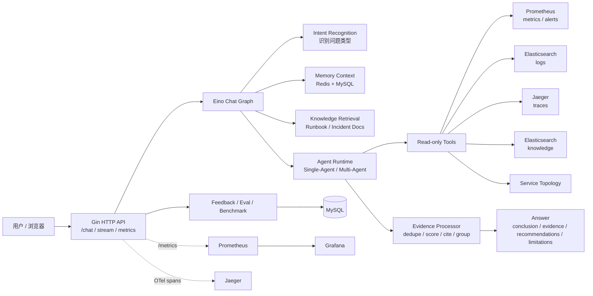
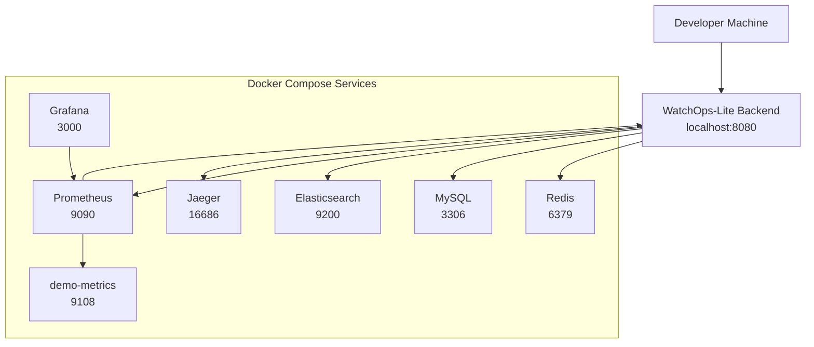
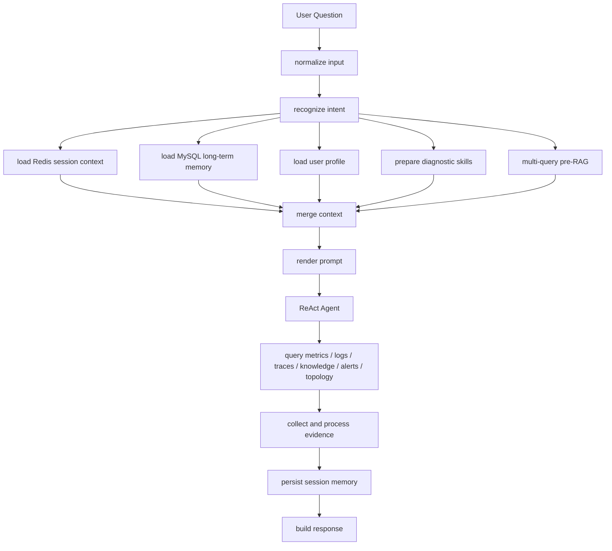
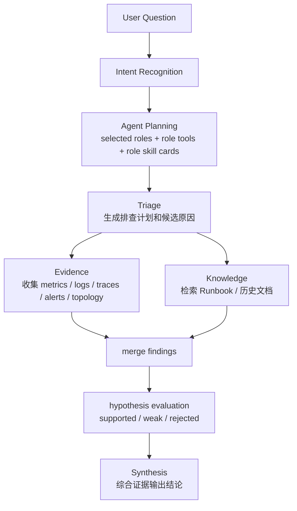
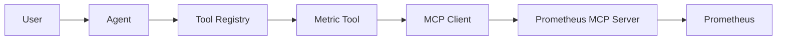

# WatchOps-Lite｜OnCall 智能排障 Agent

> A Go + Agent project for OnCall troubleshooting. It turns an incident question into a structured investigation with metrics, logs, traces, alerts, topology, runbooks, evidence citations, and runtime observability.

WatchOps-Lite 是一个面向 OnCall 排障场景的智能辅助系统。用户用自然语言描述线上问题后，系统会自动查询指标、日志、链路追踪、告警、服务拓扑和知识库 Runbook，整理故障证据，并生成排查结论、处理建议和当前证据不足的局限性。

它不是单纯聊天机器人，也不是普通监控面板，而是一套可以本地复现、可以演示、可以观测的 Agent 排障后端系统。

---

## 1. 项目展示重点

| 展示内容 | 说明 |
|---|---|
| Agent Console | 展示自然语言提问、诊断结论、证据、工具调用和 limitations |
| Docker Compose | 展示 Redis、MySQL、Elasticsearch、Prometheus、Grafana、Jaeger 等依赖如何一键启动 |
| Prometheus Targets | 展示 `watchops-lite` 和 `watchops-demo` 均为 UP，证明后端 metrics 和 demo 指标可采集 |
| Grafana Dashboard | 展示请求量、工具调用次数、工具耗时、错误和降级情况 |
| Jaeger Trace | 展示一次请求中 intent、RAG、tool call、LLM call、evidence processing 等链路耗时 |
| E2E Demo | 展示健康检查、知识库 seed、日志 seed、Chat、SSE、Eval、Benchmark 均可通过 |

---

## 2. 项目解决什么问题

传统排障通常需要人工在多个平台之间切换：

```text
Prometheus 看指标
  ↓
Elasticsearch 查日志
  ↓
Jaeger 看 Trace
  ↓
翻 Runbook / 历史文档
  ↓
人工对齐时间窗口和证据
  ↓
整理结论和处理建议
```

WatchOps-Lite 把这些步骤整合成一条可追踪的 Agent 诊断链路：

```text
用户描述问题
  ↓
识别问题类型
  ↓
查询指标 / 日志 / Trace / 告警 / 拓扑 / 知识库
  ↓
整理多源证据
  ↓
输出诊断结论、建议和 limitations
  ↓
通过 Grafana / Jaeger 观察 Agent 运行过程
```

核心目标是减少人工在多个系统之间反复检索和对比信息的成本，同时避免 Agent 在缺少证据时直接下结论。

---

## 3. 技术栈

Go、Gin、CloudWeGo Eino、Redis、MySQL、Elasticsearch、Prometheus、Grafana、Jaeger、OpenTelemetry、Docker Compose。

这些组件不是为了堆技术栈，而是围绕排障链路各司其职：

| 组件 | 在项目中的作用 |
|---|---|
| Go / Gin | 提供 Chat API、SSE、健康检查、metrics 和本地 Web Console |
| CloudWeGo Eino | 编排 Agent Graph、ReAct tool calling 和 Prompt 渲染 |
| Redis | 保存当前会话的近期消息和滚动摘要 |
| MySQL | 保存长期记忆、用户画像、反馈和评估用例 |
| Elasticsearch | 支撑日志检索和知识库 Runbook 检索 |
| Prometheus | 提供业务指标查询，并采集后端 runtime metrics |
| Grafana | 展示请求量、工具调用、延迟、错误和降级情况 |
| Jaeger | 展示单次请求的 OpenTelemetry Trace |
| Docker Compose | 一键启动完整本地演示环境 |

---

## 4. 总体架构



---

## 5. Docker Compose 本地环境

项目通过 Docker Compose 编排完整本地依赖环境，方便面试或 Review 时一键复现。



| 服务 | 端口 | 作用 |
|---|---:|---|
| WatchOps-Lite Backend | 8080 | Chat API、Web Console、`/healthz`、`/metrics` |
| Redis | 6379 | 短期会话记忆 |
| MySQL | 3306 | 长期记忆、用户画像、feedback、eval |
| Elasticsearch | 9200 | 日志和知识库检索 |
| Prometheus | 9090 | 指标采集和查询 |
| Grafana | 3000 | 运行时监控看板 |
| Jaeger | 16686 | Trace 可视化 |
| demo-metrics | 9108 | checkout/payment 模拟业务指标 |

启动依赖：

```bash
docker compose up -d --wait
docker compose ps
```

创建本地配置：

```bash
cp configs/config.example.json configs/config.local.json
```

启动后端：

```bash
make run CONFIG=configs/config.local.json
```

健康检查：

```bash
curl --fail-with-body http://localhost:8080/healthz
```

检查后端 Prometheus metrics：

```bash
curl http://localhost:8080/metrics | head
```

停止依赖：

```bash
docker compose down
```

---

## 6. Agent 调用链路

### 6.1 Single-Agent 主链路

默认 `/api/v1/chat` 使用 Single-Agent 链路。一个 ReAct Agent 会在完整上下文中选择工具、收集证据并生成回答。



这个链路适合普通对话和快速排障。它的重点是：一个 Agent 看到较完整的上下文，并通过工具调用拿到真实证据。

### 6.2 Multi-Agent 诊断链路

复杂排障可以切换到 Multi-Agent 模式，把任务拆成多个角色。



Multi-Agent 当前支持 per-role skill cards。不同角色不会看到完全一样的工具提示，而是根据职责获得不同指导：

| 角色 | 看到的重点 |
|---|---|
| Triage | 服务、症状、时间窗口、排查计划、候选原因 |
| Evidence | 指标、日志、Trace、告警、拓扑证据 |
| Knowledge | Runbook、历史文档、缓解建议 |
| Synthesis | findings、processed evidence、hypothesis evaluation、limitations |

---

## 7. 核心能力说明

### 问题意图识别

系统会先判断用户是在查指标、查日志、查 Trace、查知识库，还是在做综合故障排查。识别结果会影响后续工具选择、知识检索和 Multi-Agent 角色路由。

例如用户问“checkout 服务错误率为什么升高”，系统会优先推荐查询指标、日志、告警和 Runbook，而不是盲目调用所有工具。

### 工具调用与真实观测数据

项目将常见排障动作封装成只读工具：

- `query_metrics`：查询错误率、延迟、超时数等指标。
- `query_logs`：查询 timeout、context deadline exceeded、error 等日志。
- `query_traces`：查询慢 span 和依赖调用路径。
- `search_knowledge`：检索 Runbook 和历史排障文档。
- `query_alerts`：读取当前告警。
- `get_service_topology`：获取上下游服务依赖关系。

这些工具统一经过参数校验、超时控制、只读边界、错误标准化和敏感字段处理，避免 Agent 随意访问后端资源。

## MCP Integration

WatchOps-Lite now supports a hybrid tool architecture for metrics:



MCP is introduced only as an implementation path under the existing Metric Tool. The Agent still sees one `query_metrics` tool, while the tool can route to either the local Prometheus HTTP client or a Prometheus MCP Server.

Why MCP is useful here:

- It decouples the Agent-facing tool contract from the monitoring platform integration.
- It keeps the Tool Registry stable while allowing local Go tools and MCP-backed tools to coexist.
- It prepares the project for future MCP integrations such as Grafana, Kubernetes, Jira, or incident-management systems.

Configuration:

```bash
WATCHOPS_MCP_ENABLED=false
WATCHOPS_MCP_SERVER_URL=http://localhost:8081
WATCHOPS_MCP_TIMEOUT=10s
```

For convenience, the unprefixed aliases `MCP_ENABLED`, `MCP_SERVER_URL`, and `MCP_TIMEOUT` are also accepted.

When `WATCHOPS_MCP_ENABLED=false`, metrics keep using the existing local Go Prometheus HTTP implementation. When enabled, `query_metrics` calls the MCP tool `query_prometheus`; responses include `metric_provider: "mcp"` or `metric_provider: "http"` metadata so the UI can show the active metric source.

All other integrations remain local Go tools in this phase:

- Logs: Elasticsearch-backed local Go tool.
- Traces: Jaeger-backed local Go tool.
- Knowledge: Elasticsearch RAG local Go tool.
- Redis and MySQL: local Go storage adapters.

### 知识库辅助排障

同一个故障可能被描述成“500 增多”“错误率升高”“支付超时”“checkout 不稳定”。项目会对用户问题生成多种查询表达，从知识库中召回相关 Runbook，再对结果进行去重、加权和排序，提升命中率。

知识库提供排查步骤和处理建议，但不会替代真实证据。最终结论仍需要结合指标、日志、告警或 Trace。

### 证据链整理

工具结果不会直接拼进回答。系统会对 metrics、logs、alerts、topology、knowledge 等证据进行统一处理：

- 去重。
- 打分和排序。
- 编号为 E1、E2、E3。
- 按来源分组。
- 在证据不足时输出 limitations。

这样最终回答能够说明“结论基于哪些证据，还有哪些证据缺失”。

### 记忆与数据分层

项目把不同类型数据分开存储：

- Redis：当前会话近期消息和滚动摘要，支持 TTL 自动过期。
- MySQL：长期记忆、用户画像、反馈和评估用例。
- Elasticsearch：日志和知识库文档。

这样可以避免把会话、文档、日志和评估数据混在一起，后续维护和扩展更清晰。

---

## 8. 演示入口

启动 Compose 和后端后，可以打开：

| 页面 | 地址 | 演示重点 |
|---|---|---|
| Agent Console | `http://localhost:8080/` | 对话、证据、工具调用、limitations、Single/Multi-Agent 切换 |
| Prometheus Targets | `http://localhost:9090/targets` | `watchops-lite` 和 `watchops-demo` 是否为 UP |
| Grafana Dashboard | `http://localhost:3000/d/watchops-lite/watchops-lite-runtime` | 请求量、工具调用、延迟、错误、fallback |
| Jaeger | `http://localhost:16686` | 单次请求 Trace |

推荐演示问题：

```text
checkout 服务错误率为什么升高？请结合指标、日志、告警和 runbook 给出有证据的诊断。
```

演示顺序建议：

1. 打开 README，看总体架构图和 Docker Compose 环境。
2. 运行 `docker compose ps`，展示依赖服务已启动。
3. 打开 Agent Console，发送推荐问题。
4. 展示回答里的 evidence、tool runs、limitations、trace_id。
5. 打开 Prometheus Targets，展示 `watchops-lite` 和 `watchops-demo` 为 UP。
6. 打开 Grafana，展示请求量、工具调用和延迟。
7. 打开 Jaeger，用 trace_id 查看单次请求链路。
8. 展示 `make e2e-demo-zh` 的 PASS 输出。

---

## 9. 一键 Demo 验证

英文演示链路：

```bash
make e2e-demo
```

中文演示链路：

```bash
make e2e-demo-zh
```

Multi-Agent 演示链路：

```bash
make e2e-demo-multi
make e2e-demo-multi-zh
```

这些命令会验证：

- 依赖服务和端口。
- 后端健康检查。
- 知识库 seed。
- 日志 seed。
- Prometheus demo metrics。
- 普通 Chat。
- SSE Chat。
- Retrieval Eval。
- Agent Eval。
- Agent Benchmark。

演示通过时会看到类似结果：

```text
End-to-end demo check passed
Retrieval eval: passed
Agent eval: passed
Agent benchmark: successful
```

---

## 10. Grafana 演示流量

如果 Grafana 上请求太少，可以运行一段轻量 demo load，用来制造可观测流量。它不是生产压测，只是为了让 request rate、tool calls 和 latency 图表更明显。

```bash
for i in {1..10}; do
  echo "request $i"
  curl -s http://localhost:8080/api/v1/chat \
    -H "Content-Type: application/json" \
    -d "{
      \"message\":\"checkout 服务错误率为什么升高？请结合指标、日志、告警和 runbook 给出有证据的诊断。\",
      \"session_id\":\"grafana-demo-session-$i\",
      \"user_id\":\"demo-user\"
    }" > /tmp/watchops-chat-$i.json
  sleep 2
done
```

展示 Grafana 时建议把右上角时间范围调成 `Last 15 minutes` 或 `Last 30 minutes`。

---

## 11. API 示例

### Chat

```bash
curl --fail-with-body http://localhost:8080/api/v1/chat \
  -H 'Content-Type: application/json' \
  -d '{
    "session_id": "demo-checkout-session",
    "user_id": "optional-oncall-user",
    "message": "Why did checkout errors increase? Check metrics, logs, alerts, and the runbook."
  }'
```

### Streaming Chat

```bash
curl -N --fail-with-body http://localhost:8080/api/v1/chat/stream \
  -H 'Content-Type: application/json' \
  -d '{
    "session_id": "demo-checkout-session",
    "message": "Why did checkout errors increase? Check metrics, logs, alerts, and the runbook."
  }'
```

SSE 会返回受控的执行进度，例如图节点状态、工具调用状态、证据数量和最终结构化回答。它不会暴露 chain-of-thought、原始 Prompt、原始工具参数或未脱敏工具输出。

### Chat History

```bash
curl --fail-with-body \
  'http://localhost:8080/api/v1/chat/history?session_id=demo-checkout-session&limit=20'
```

清理当前 Redis 会话历史：

```bash
curl --fail-with-body -X DELETE \
  'http://localhost:8080/api/v1/chat/history?session_id=demo-checkout-session'
```

这不会删除 MySQL 长期记忆、Elasticsearch 知识库、反馈或评估数据。

### Knowledge Search

```bash
curl --fail-with-body http://localhost:8080/api/v1/knowledge/search \
  -H 'Content-Type: application/json' \
  -d '{
    "query": "checkout payment upstream timeout",
    "limit": 5,
    "filters": {"service": "checkout"}
  }'
```

### Feedback

```bash
curl --fail-with-body http://localhost:8080/api/v1/feedback \
  -H 'Content-Type: application/json' \
  -d '{
    "request_id": "replace-with-chat-request-id",
    "session_id": "demo-checkout-session",
    "rating": "down",
    "reason_tags": ["needs_trace_confirmation"],
    "comment": "The hypothesis still needs real trace confirmation."
  }'
```

---

## 12. 开发与验证

```bash
make fmt
go mod tidy
go test ./...
go vet ./...
git diff --check
```

组合验证：

```bash
make verify
```

本地 Agent benchmark：

```bash
make benchmark-agent
```

benchmark 用于本地回归观察延迟、工具调用次数、证据数量和 fallback 信号，不代表生产容量压测。

---

## 13. 项目结构

```text
.
├── cmd/
│   ├── server/                 # 服务入口
│   ├── demo-metrics/           # 本地 Prometheus 模拟指标源
│   └── agent-benchmark/        # 本地 Agent benchmark CLI
├── configs/                    # 配置、Prometheus、Grafana provisioning
├── demo/                       # 演示 Runbook 和日志数据
├── docs/                       # 架构、API、ADR、Roadmap
├── scripts/                    # Demo、seed、验证脚本
├── web/                        # 无构建本地演示控制台
└── internal/
    ├── transport/http/         # Gin 路由、中间件、DTO、Handler
    ├── application/chat/       # Chat Graph 编排
    ├── agent/eino/             # ReAct、Prompt、工具适配、fallback
    ├── intent/                 # 意图识别、skills、RAG hints、工具建议
    ├── multiagent/             # Triage / Evidence / Knowledge / Synthesis
    ├── diagnosis/              # 假设生成与证据评估
    ├── evidence/               # 证据去重、打分、编号、分组
    ├── tools/                  # 工具契约和实现
    ├── retrieval/              # 知识、日志、指标、Trace 检索
    ├── memory/                 # Redis 短期记忆和 MySQL 长期记忆
    ├── profile/                # 用户画像
    ├── feedback/               # 用户反馈
    ├── eval/                   # 评估用例和执行
    ├── observability/          # OpenTelemetry 和日志
    ├── platform/               # MySQL、Elasticsearch 等基础设施适配
    ├── bootstrap/              # 依赖装配和生命周期
    └── config/                 # 配置加载与校验
```

---

## 14. 当前边界

- 这是本地面试和项目演示环境，不是生产级 AIOps 平台。
- 不包含自动修复、自动扩缩容、生产告警派单或权限系统。
- 工具调用保持只读边界，不执行变更操作。
- Grafana dashboard 偏演示用途，不是完整生产 SRE 看板。
- Trace、日志、指标后端在不可用时会给出明确 fallback 或 limitation。
- Eval 当前偏规则化回归验证，LLM-as-judge 和大规模 A/B 评估未作为当前目标。
- MCP 当前只作为 Metric Tool 的可选底层实现；动态插件发现、自动策略学习不是当前项目范围。

---

## 15. Roadmap

- 扩充检索评估集和更多 Runbook 场景。
- 增强 Trace 关键路径分析和服务依赖图分析。
- 增加 Eval 对比报告和可选 LLM judge。
- 优化 Grafana dashboard，增加更多工具延迟、fallback 和 evidence 指标。
- 将 Multi-Agent per-role skill cards 与前端角色卡展示进一步打通。

---

## 16. Design Documents

- [Project Blueprint](docs/PROJECT_BLUEPRINT.md)
- [Architecture](docs/ARCHITECTURE.md)
- [HTTP API](docs/API.md)
- [Roadmap](docs/ROADMAP.md)
- [Project Structure](docs/STRUCTURE.md)
- [ADR 0008: Eino ReAct Agent](docs/adr/0008-eino-react-agent.md)
- [ADR 0009: MVP Demo Packaging](docs/adr/0009-mvp-demo-packaging.md)
- [ADR 0010: Elasticsearch-backed Logs Tool](docs/adr/0010-elasticsearch-logs-tool.md)
- [ADR 0011: Prometheus-backed Metrics Tool](docs/adr/0011-prometheus-metrics-tool.md)
- [ADR 0012: Jaeger-backed Traces Tool](docs/adr/0012-jaeger-traces-tool.md)
- [ADR 0013: LLM Session Summary](docs/adr/0013-llm-session-summary.md)
- [ADR 0014: Hybrid Knowledge Retrieval](docs/adr/0014-hybrid-knowledge-retrieval.md)
- [ADR 0015: Rule-based Eval Runner](docs/adr/0015-eval-runner.md)
- [ADR 0016: Runtime Prometheus Metrics](docs/adr/0016-runtime-prometheus-metrics.md)
- [ADR 0017: Grafana Dashboard](docs/adr/0017-grafana-dashboard.md)

---

## Originality

WatchOps-Lite is independently designed from its product requirements. It does not copy Pilot or training-camp project source code, structure, prompts, comments, or documentation.

## License

Apache-2.0 is planned. A `LICENSE` file will be added before the first release.
