# WatchOps-Lite

> An evidence-driven Agentic RAG console for OnCall troubleshooting, built with Go, Eino, Gin, Redis, MySQL, Elasticsearch, Prometheus, Jaeger, Grafana, OpenTelemetry, and optional MCP-backed metrics.

WatchOps-Lite turns an incident question into a structured reliability investigation. It can inspect metrics, logs, traces, alerts, service topology, runbooks, short-term session context, and long-term troubleshooting memory, then produce an answer with evidence, recommendations, and explicit limitations.

It is designed as a GitHub showcase and interview-friendly project: small enough to understand, complete enough to run locally, and observable enough to explain how the Agent behaves.

---

## Table of Contents

- [Project Overview](#project-overview)
- [Architecture](#architecture)
- [Core Features](#core-features)
- [System Workflow](#system-workflow)
- [Single-Agent Workflow](#single-agent-workflow)
- [Multi-Agent Workflow](#multi-agent-workflow)
- [Hybrid RAG Pipeline](#hybrid-rag-pipeline)
- [Memory Architecture](#memory-architecture)
- [MCP Integration](#mcp-integration)
- [Observability](#observability)
- [Docker Compose](#docker-compose)
- [Quick Start](#quick-start)
- [Screenshots](#screenshots)
- [Project Structure](#project-structure)
- [Future Roadmap](#future-roadmap)
- [License](#license)

---

## Project Overview

During an incident, an on-call engineer often has to jump between Prometheus, Elasticsearch, Jaeger, runbooks, previous cases, and chat history. WatchOps-Lite compresses that workflow into one controlled Agent pipeline:

```text
Incident question
  -> intent recognition
  -> context and memory loading
  -> hybrid knowledge retrieval
  -> read-only tool calls
  -> evidence normalization
  -> evidence-bound final answer
```

The project intentionally avoids auto-remediation. Every tool is read-only, every answer is expected to cite evidence, and missing data is surfaced as a limitation instead of being hidden behind a confident guess.

---

## Architecture

### Overall Architecture

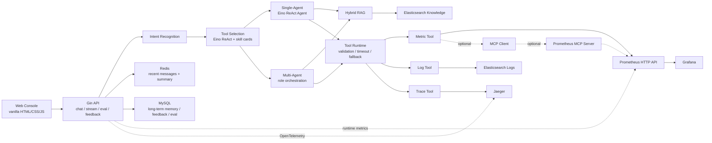

Key design boundary:

- The Agent sees stable tool names such as `query_metrics`, `query_logs`, `query_traces`, and `search_knowledge`.
- Tool implementation details, including Prometheus HTTP vs MCP, stay below the Tool Runtime layer.
- Logs, traces, knowledge, Redis, and MySQL remain local Go integrations in the current project.

---

## Core Features

| Feature | User Value |
|---|---|
| Evidence-driven diagnosis | The Agent explains what it observed, what it inferred, and what still needs verification. |
| Hybrid Retrieval | Combines keyword retrieval, optional vector retrieval, fusion, and reranking to improve runbook recall. |
| Role-aware Multi-Agent | Triage, Evidence, Knowledge, and Synthesis roles focus on different parts of the investigation. |
| Short-term and long-term memory | Redis keeps session context while MySQL stores reusable feedback, cases, profiles, and memory. |
| MCP-based Metrics | The Metric Tool can use either native Prometheus HTTP or a Prometheus MCP provider without changing the Agent contract. |
| Tool Runtime safety | Tool calls use schema validation, timeouts, fallback, structured errors, output normalization, and tracing. |
| Local observability stack | OpenTelemetry, Jaeger, Prometheus, and Grafana make Agent execution inspectable. |
| Demo-ready workflow | Docker Compose and scripts seed knowledge, logs, metrics, traces, feedback, eval cases, and benchmark data. |

---

## System Workflow

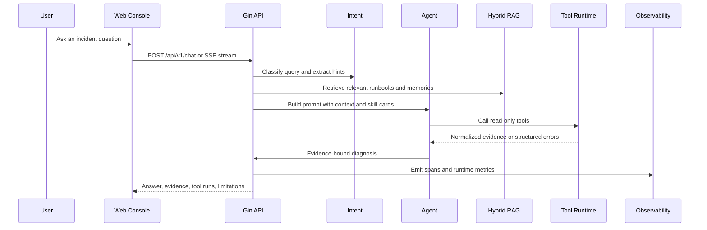

---

## Single-Agent Workflow

The default Chat API uses one Eino ReAct Agent. It sees the full context and decides which tools to call while staying behind the Tool Runtime guardrails.

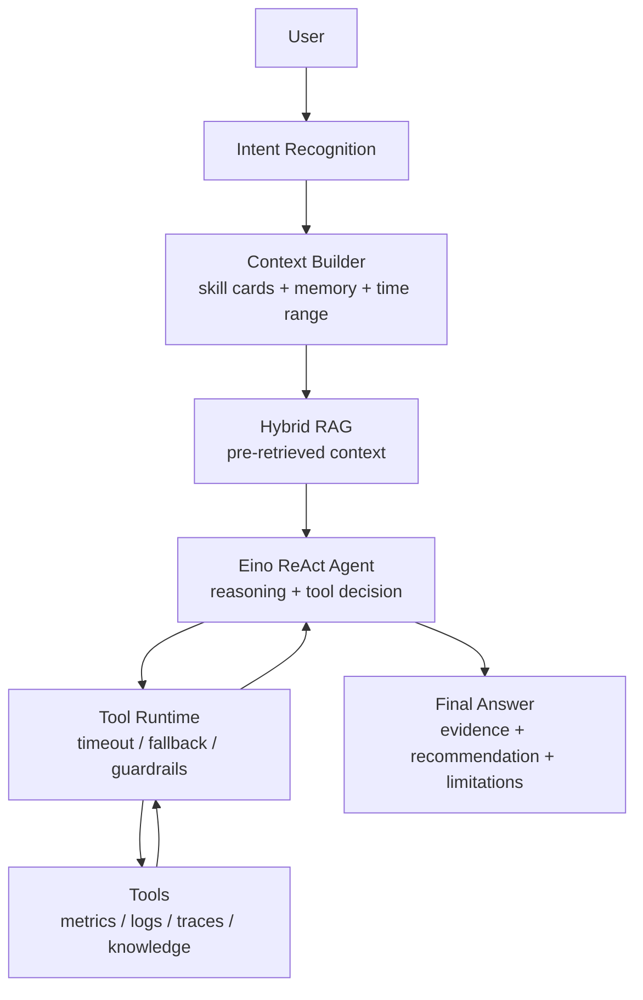

Single-Agent is best for quick investigation demos and normal chat-style troubleshooting.

---

## Multi-Agent Workflow

Multi-Agent mode keeps the same tool contracts but splits the reasoning work by role. Each role receives different role skill cards, so the system can demonstrate clear responsibility boundaries without adding a heavy planner or policy engine.

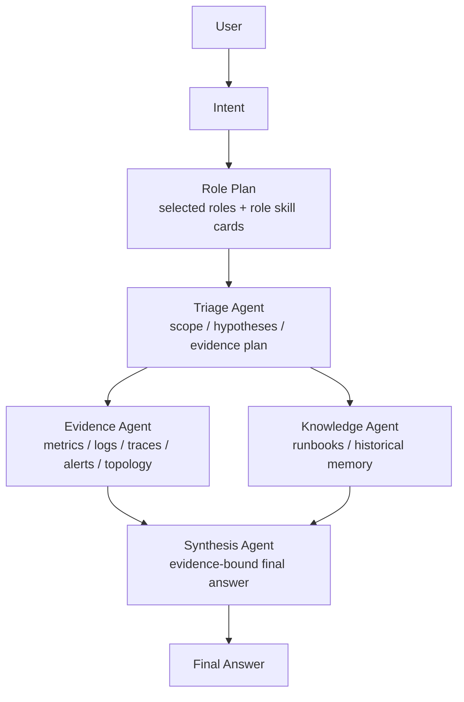

Role boundaries:

- Triage does not claim the final root cause.
- Evidence analyzes observed signals.
- Knowledge treats runbooks and memory as guidance, not current facts.
- Synthesis combines findings and must preserve evidence boundaries.

---

## Hybrid RAG Pipeline

Knowledge retrieval is centered on `HybridRetrieve()`. It is the main knowledge path for both pre-RAG context and `search_knowledge` tool calls.

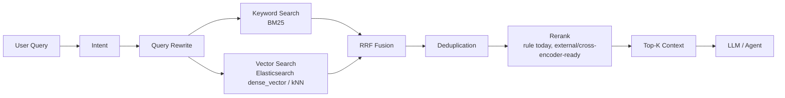

The current implementation supports:

- BM25-only mode.
- Optional vector search when embeddings are configured.
- Hybrid fusion with reciprocal-rank-style scoring.
- Deduplication at retrieval time to handle historical duplicate chunks.
- Reranking with a rule-based default and extension points for stronger rerankers.
- BM25 fallback when embeddings or vector search are unavailable.

---

## Memory Architecture

WatchOps-Lite keeps short-lived conversation state and durable troubleshooting memory separate.

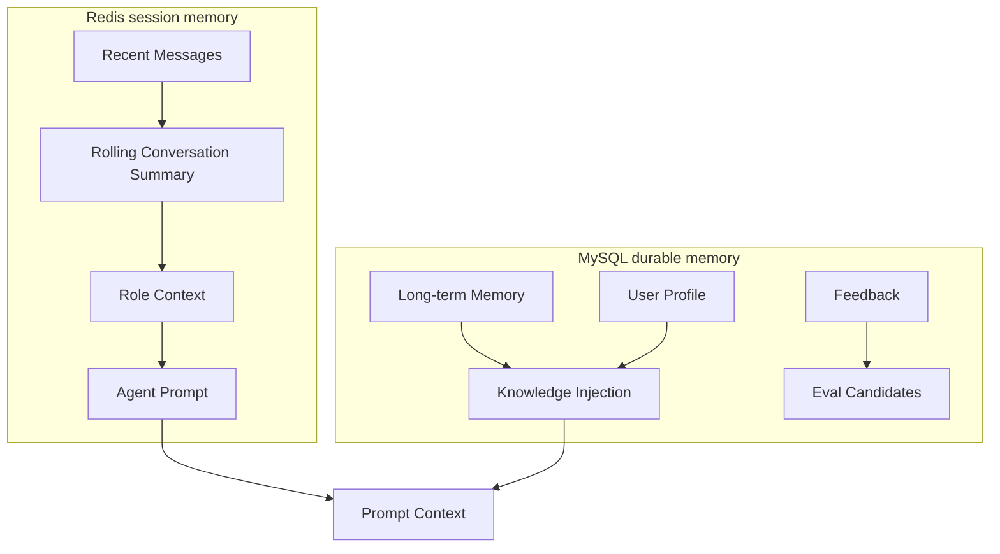

Redis is optimized for bounded session continuity. MySQL stores durable records such as long-term memory, feedback, eval seeds, user profiles, and audit-friendly metadata.

---

## MCP Integration

MCP is currently introduced only for metrics. The Metric Tool can route to either the existing local Prometheus HTTP implementation or an MCP-backed Prometheus provider.

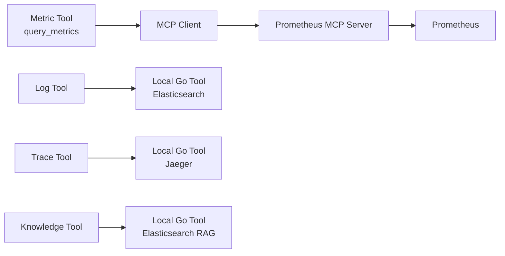

Why MCP is useful:

- It decouples the Agent-facing tool contract from monitoring platform integrations.
- It allows local Go tools and MCP tools to coexist.
- It prepares the project for future providers such as Grafana, Kubernetes, Jira, or incident-management systems.

Configuration:

```bash
WATCHOPS_MCP_ENABLED=false
WATCHOPS_MCP_SERVER_URL=http://localhost:8081
WATCHOPS_MCP_TIMEOUT=10s
```

Unprefixed aliases are also accepted:

```bash
MCP_ENABLED=false
MCP_SERVER_URL=http://localhost:8081
MCP_TIMEOUT=10s
```

When MCP is disabled, behavior is identical to the native Prometheus HTTP path. When MCP is enabled, `query_metrics` calls MCP tool `query_prometheus`. Tool metadata includes `metric_provider: "mcp"` or `metric_provider: "http"` so the UI and traces can show the active provider.

---

## Observability

The project is observable by design. A normal Chat request emits both distributed traces and runtime metrics.

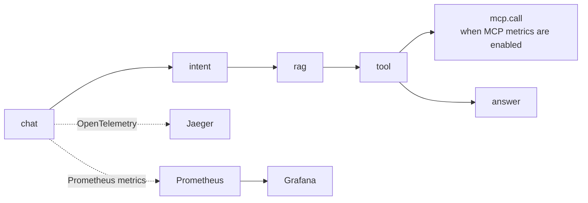

Observability stack:

- OpenTelemetry records spans for chat, intent, retrieval, tool execution, MCP calls, model calls, memory, eval, and fallback boundaries.
- Jaeger visualizes request-level traces and role/tool timing.
- Prometheus scrapes WatchOps-Lite runtime metrics from `/metrics`.
- Grafana provides a starter dashboard for HTTP, chat, tool, RAG, memory, fallback, summary, and eval metrics.
- Metric provider metadata distinguishes native HTTP metrics from MCP-backed metrics.

---

## Docker Compose

### Architecture via Docker Compose

The default Docker Compose environment starts the local infrastructure needed for the showcase demo:

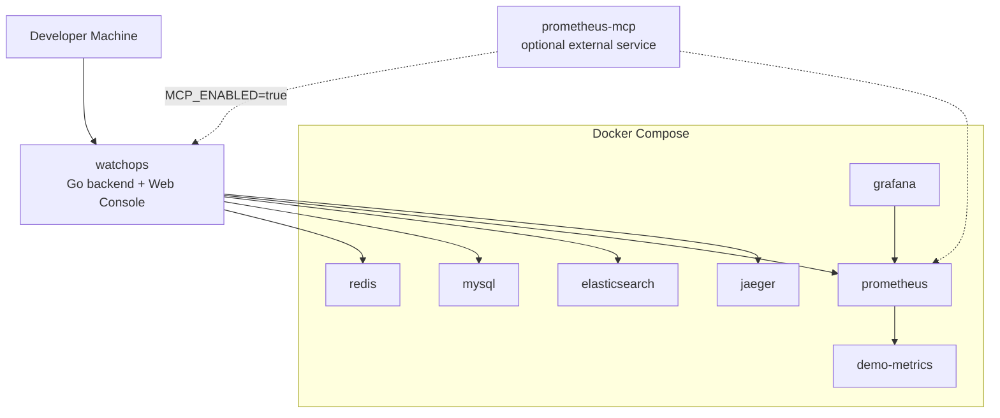

Ports:

| Service | URL | Purpose |
|---|---|---|
| WatchOps-Lite | `http://localhost:8080` | Web Console, Chat API, SSE, health, runtime metrics |
| Redis | `localhost:6379` | Short-term session memory |
| MySQL | `localhost:3306` | Long-term memory, feedback, eval cases |
| Elasticsearch | `http://localhost:9200` | Knowledge and logs |
| Prometheus | `http://localhost:9090` | Metrics backend and runtime metric scraping |
| Grafana | `http://localhost:3000` | Runtime dashboard |
| Jaeger | `http://localhost:16686` | Trace visualization |
| demo-metrics | `http://localhost:9108` | Demo checkout/payment metrics |
| Prometheus MCP Server | `http://localhost:8081` | Optional metrics provider when MCP is enabled |

The current compose file includes the core local stack. A Prometheus MCP Server can be run beside it and enabled through MCP configuration.

---

## Quick Start

### 1. Start local infrastructure

```bash
docker compose up -d --wait
docker compose ps
```

### 2. Prepare local configuration

```bash
cp configs/config.example.json configs/config.local.json
```

Set an LLM key only when you want live LLM execution:

```bash
export WATCHOPS_LLM_API_KEY=your_api_key
```

### 3. Run the backend and Web Console

```bash
make run CONFIG=configs/config.local.json
```

Open:

```text
http://localhost:8080/
```

### 4. Seed demo data

```bash
./scripts/demo_seed_knowledge.sh
./scripts/demo_seed_logs.sh
./scripts/demo_metrics.sh
```

### 5. Run demo checks

```bash
make e2e-demo
make e2e-demo-zh
make e2e-demo-multi
make e2e-demo-multi-zh
```

### 6. Run developer verification

```bash
make fmt
go mod tidy
go test ./...
go vet ./...
git diff --check
make verify
```

Recommended demo question:

```text
Why did the checkout service error rate increase in the last 20 minutes?
Use metrics, logs, traces, alerts, and runbook evidence.
```

---

## Screenshots

The screenshots below were captured from the local demo environment. They focus on the main engineering story: console readiness, evidence-bound diagnosis, multi-agent collaboration, observability, and the feedback/eval loop.

### Console Overview

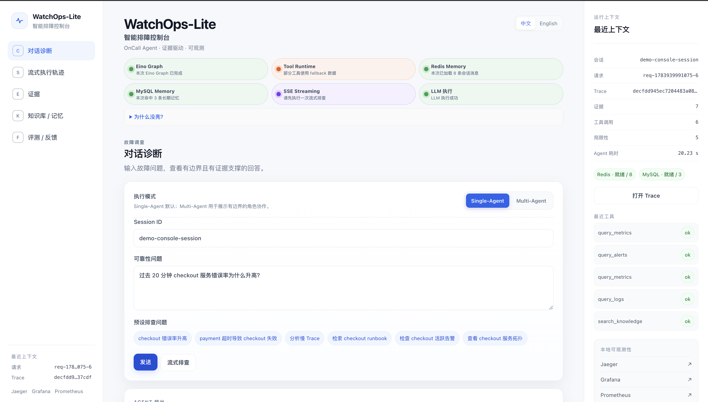

### Single-Agent Diagnosis

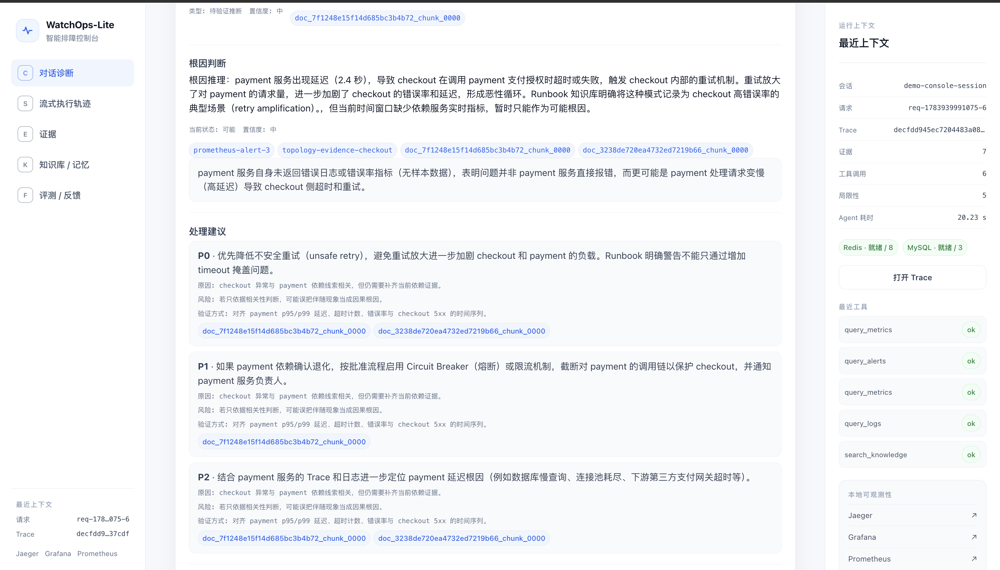

### Multi-Agent Workflow

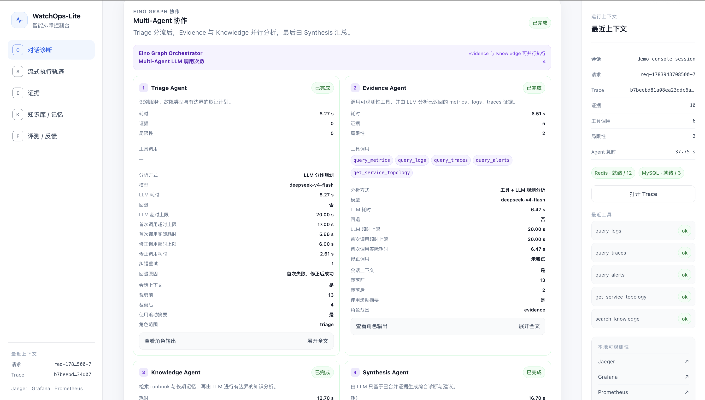

### Evidence Panel

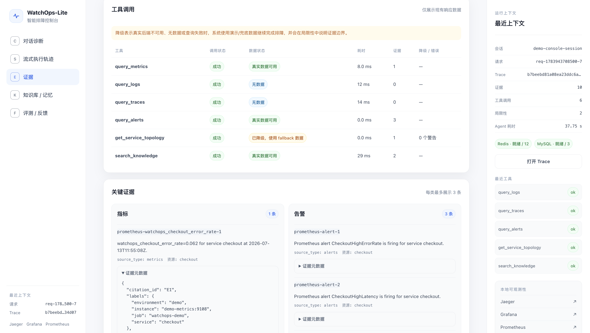

### Jaeger Trace

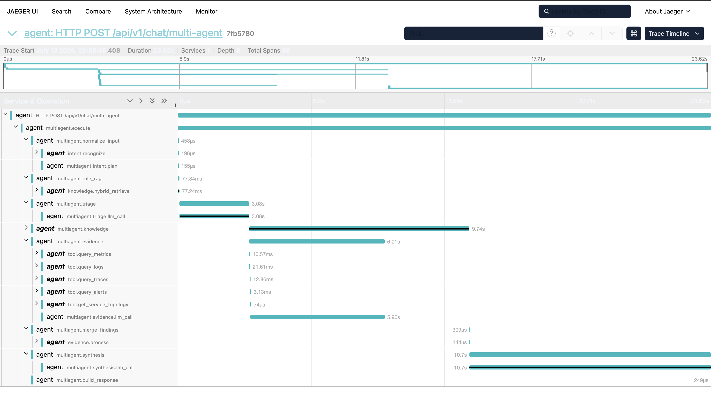

### Feedback and Eval Loop

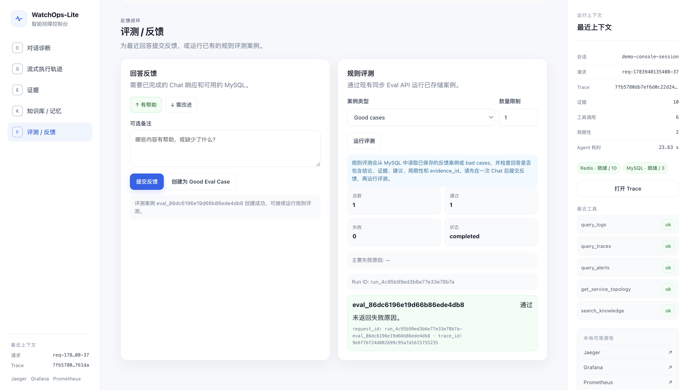

---

## API Examples

### Chat

```bash
curl --fail-with-body http://localhost:8080/api/v1/chat \
  -H 'Content-Type: application/json' \
  -d '{
    "session_id": "demo-checkout-session",
    "user_id": "optional-oncall-user",
    "message": "Why did checkout errors increase? Check metrics, logs, alerts, and the runbook."
  }'
```

### Streaming Chat

```bash
curl -N --fail-with-body http://localhost:8080/api/v1/chat/stream \
  -H 'Content-Type: application/json' \
  -d '{
    "session_id": "demo-checkout-session",
    "message": "Why did checkout errors increase? Check metrics, logs, alerts, and the runbook."
  }'
```

### Knowledge Search

```bash
curl --fail-with-body http://localhost:8080/api/v1/knowledge/search \
  -H 'Content-Type: application/json' \
  -d '{
    "query": "checkout payment upstream timeout",
    "limit": 5,
    "filters": {"service": "checkout"}
  }'
```

### Feedback

```bash
curl --fail-with-body http://localhost:8080/api/v1/feedback \
  -H 'Content-Type: application/json' \
  -d '{
    "request_id": "replace-with-chat-request-id",
    "session_id": "demo-checkout-session",
    "rating": "down",
    "reason_tags": ["needs_trace_confirmation"],
    "comment": "The hypothesis still needs real trace confirmation."
  }'
```

---

## Project Structure

```text
.
├── cmd/
│   ├── server/                 # Application entrypoint
│   ├── demo-metrics/           # Demo Prometheus metric exporter
│   ├── log-generator/          # Demo log generator
│   ├── retrieval-eval/         # Retrieval eval CLI
│   └── agent-benchmark/        # Local Agent benchmark CLI
├── configs/                    # App config, Prometheus config, Grafana provisioning
├── demo/                       # Demo runbooks and log data
├── docs/                       # Architecture docs, ADRs, API docs, verification notes
├── scripts/                    # Seed, demo, eval, and verification scripts
├── web/                        # Vanilla Web Console served by the Go backend
└── internal/
    ├── transport/http/         # Gin router, middleware, DTOs, handlers
    ├── application/chat/       # Chat workflow and graph orchestration
    ├── agent/                  # Eino ReAct Agent, prompts, fallback, skills
    ├── multiagent/             # Triage, Evidence, Knowledge, Synthesis roles
    ├── intent/                 # Hybrid intent recognition and tool hints
    ├── diagnosis/              # Hypothesis and evidence evaluation helpers
    ├── evidence/               # Evidence normalization, dedupe, scoring, grouping
    ├── tool/                   # Tool Runtime and guardrails
    ├── tools/                  # Domain tools: metrics, logs, traces, knowledge, alerts, topology
    ├── retrieval/              # Knowledge, logs, metrics, traces, embeddings, rerank
    ├── memory/                 # Redis session memory and MySQL long-term memory
    ├── mcp/                    # MCP client abstraction for optional provider integrations
    ├── observability/          # OpenTelemetry tracing and Prometheus runtime metrics
    ├── platform/               # Infrastructure adapters such as MySQL and Elasticsearch
    ├── feedback/               # Feedback storage and API support
    ├── eval/                   # Eval cases, runner, and result persistence
    ├── profile/                # User profile context
    ├── bootstrap/              # Composition root and lifecycle wiring
    └── config/                 # Config loading, environment overrides, validation
```

Module responsibilities:

- `internal/agent`: Agent-facing orchestration, prompts, skills, ReAct runner, and deterministic fallback.
- `internal/multiagent`: Role-based diagnostic flow with bounded responsibilities.
- `internal/intent`: Query classification, hints, and role/tool routing signals.
- `internal/retrieval`: Search and retrieval backends, including Hybrid RAG.
- `internal/memory`: Redis short-term memory and MySQL durable memory.
- `internal/mcp`: Provider-neutral MCP client abstraction.
- `internal/observability`: Tracing and runtime metrics.
- `web`: Build-free console for demo and interview walkthroughs.

---

## Demo Checklist

For a polished walkthrough:

1. Open the Web Console at `http://localhost:8080/`.
2. Ask the recommended checkout incident question.
3. Show Single-Agent output: evidence, tool calls, limitations, and trace ID.
4. Switch to Multi-Agent and show role-level execution.
5. Open Prometheus targets and verify `watchops-lite` and `watchops-demo`.
6. Open Grafana and show HTTP/chat/tool/RAG/fallback metrics.
7. Open Jaeger and inspect the request trace.
8. Mention MCP metrics as an optional provider path under the same `query_metrics` tool.

---

## Current Boundaries

- This is a local showcase and interview project, not a production AIOps platform.
- Tool calls are read-only. The system does not restart, scale, deploy, rollback, or mutate external systems.
- MCP is currently optional and only implemented for metrics.
- Logs, traces, knowledge, Redis, and MySQL remain local Go integrations.
- Grafana dashboards are starter dashboards for demos, not production SRE dashboards.
- Rule-based eval is included; LLM-as-judge and large-scale A/B testing are future work.

---

## Future Roadmap

- Kubernetes Deployment: add manifests or Helm charts for a realistic deployment story.
- Streaming Response: further polish front-end streaming summaries and role progress.
- Multi-modal Incident Analysis: support screenshots, charts, and incident artifacts as future inputs.
- More MCP Providers: add optional Grafana, Kubernetes, Jira, or incident-management MCP integrations.
- Auto Evaluation Pipeline: expand feedback-to-eval automation and regression reporting.
- Stronger Reranking: plug in external/cross-encoder rerankers when model access is available.

---

## Design Documents

- [Project Blueprint](docs/PROJECT_BLUEPRINT.md)
- [Architecture](docs/ARCHITECTURE.md)
- [HTTP API](docs/API.md)
- [Roadmap](docs/ROADMAP.md)
- [Project Structure](docs/STRUCTURE.md)
- [Demo Verification](docs/demo-verification.md)
- [Retrieval Evaluation](docs/retrieval-evaluation.md)
- [Performance Report](docs/performance-report.md)

Key ADRs:

- [ADR 0001: Framework and Stack](docs/adr/0001-framework-and-stack.md)
- [ADR 0008: Eino ReAct Agent](docs/adr/0008-eino-react-agent.md)
- [ADR 0010: Elasticsearch-backed Logs Tool](docs/adr/0010-elasticsearch-logs-tool.md)
- [ADR 0011: Prometheus-backed Metrics Tool](docs/adr/0011-prometheus-metrics-tool.md)
- [ADR 0012: Jaeger-backed Traces Tool](docs/adr/0012-jaeger-traces-tool.md)
- [ADR 0014: Hybrid Knowledge Retrieval](docs/adr/0014-hybrid-knowledge-retrieval.md)
- [ADR 0015: Rule-based Eval Runner](docs/adr/0015-eval-runner.md)
- [ADR 0016: Runtime Prometheus Metrics](docs/adr/0016-runtime-prometheus-metrics.md)
- [ADR 0017: Grafana Dashboard](docs/adr/0017-grafana-dashboard.md)
- [ADR 0018: Eino Multi-Agent Demo](docs/adr/0018-eino-multi-agent-demo.md)

---

## Originality

WatchOps-Lite is independently designed from its product requirements. It does not copy Pilot or training-camp project source code, structure, prompts, comments, or documentation.

---

## License

Apache-2.0 is planned. A `LICENSE` file will be added before the first release.
