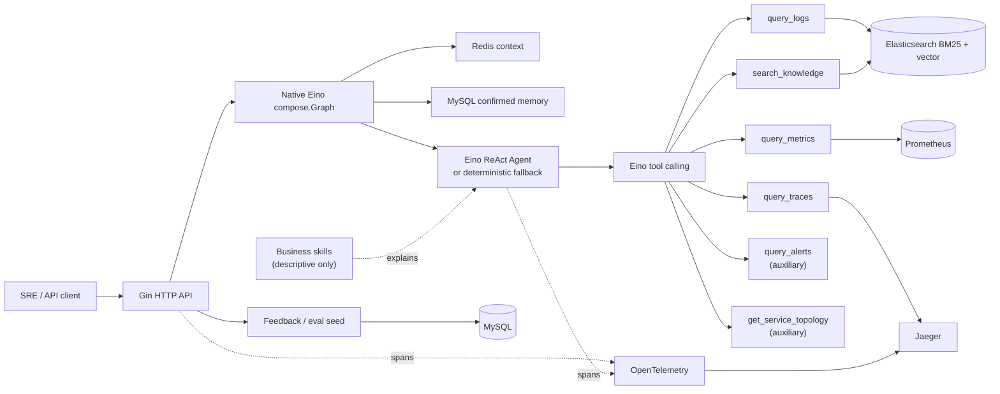

# WatchOps-Lite: Agentic RAG for Service Reliability

A Go-based Agentic RAG assistant for service reliability analysis, combining Eino ReAct tool calling, Elasticsearch RAG and logs, Prometheus metrics, Redis session memory, confirmed MySQL long-term memory, feedback/eval, and OpenTelemetry tracing.

WatchOps-Lite turns an incident question into a bounded investigation: it builds session context, selects read-only tools, gathers normalized evidence, and returns conclusions, inferences, recommendations, limitations, and tool-run metadata without treating unsupported model output as fact.

## Architecture



The local demo uses deterministic Agent routing, Prometheus-backed metrics, Elasticsearch-backed logs and knowledge, and Jaeger-backed traces. Redis session memory, MySQL feedback/eval persistence, and OpenTelemetry tracing are real local integrations. An OpenAI-compatible Eino `ChatModel` can be enabled separately.

## MVP Features

- Gin HTTP API with thin handlers, structured errors, request IDs, and graceful shutdown
- Eino ReAct Agent with versioned PromptTemplate and optional OpenAI-compatible model
- Lightweight Agent Failure Controller for parse repair, empty-evidence limitations, repeated failure boundaries, and deterministic fallback
- Compiled native Eino Graph for Chat context, prompt, Agent, evidence, memory, and response orchestration
- Lightweight on-call Skills rendered into the Agent prompt as bounded diagnostic guidance
- Deterministic Agent fallback that requires no API key
- Core evidence tools: `query_logs`, `query_metrics`, `query_traces`, and `search_knowledge`
- Auxiliary OnCall context tools: `query_alerts` and `get_service_topology`
- Shared `ToolResult`, evidence, warning, and structured `ToolError` contracts
- Tool Guard allowlist, read-only boundary, parameter validation, and sensitive metadata redaction
- Tool schema validation, timeout boundaries, safe error normalization, and tracing
- Evidence-aware output parsing that rejects invented evidence IDs
- Redis recent-message sliding window with optional LLM rolling summary and deterministic fallback
- MySQL cross-session incident memory created only from evidence-backed positive feedback or explicit trusted sources
- Elasticsearch BM25, optional vector retrieval, and RRF hybrid fusion with BM25 fallback
- Elasticsearch-backed `query_logs` with bounded filters and explicit mock fallback
- Prometheus-backed `query_metrics` with allowlisted queries and explicit mock fallback
- Prometheus runtime metrics at `GET /metrics` for HTTP, Chat, tools, RAG, memory, fallbacks, and eval runs
- Jaeger-backed `query_traces` with trace-ID or bounded service/time search and explicit mock fallback
- MySQL upvote/downvote feedback, good/bad eval cases, and synchronous rule-based eval runs
- OpenTelemetry spans, W3C trace propagation, response `trace_id`, and Jaeger visualization
- Reproducible Docker Compose and scripted demo flow
- Repeatable local Agent benchmark for latency, tool/evidence cost, fallback signals, and trace visibility

## Orchestration, Tools, and Skills

The Chat application path is a compiled native `compose.Graph[Command, Result]`:

```text
load session context -> load optional long-term memory -> build prompt input
-> render Eino PromptTemplate -> run Eino ReAct -> collect evidence
-> persist session memory -> build response
```

The graph uses typed Eino Lambda nodes and Eino callbacks for OpenTelemetry node spans. When MySQL is enabled, `load_long_term_memory` retrieves at most `long_term_memory.top_k` concise confirmed memories before prompt rendering. Search failure adds a limitation and Chat continues. Eino PromptTemplate performs prompt assembly; Eino ReAct and Eino Tool Calling remain responsible for deciding and invoking tools.

A **Tool** is an atomic external capability such as Prometheus metrics, Elasticsearch logs, Jaeger traces, knowledge search, alert lookup, or service topology lookup. A **Skill** is a named business-level diagnostic routine that explains when one or more existing tools are useful. Skills are rendered into the Eino PromptTemplate as concise diagnostic cards; they do not register tools, discover plugins, execute code, or alter ReAct behavior.

Eino ReAct performs tool selection and tool calling. Tool Guard validates the allowlist, read-only boundary, common parameters, and sensitive output redaction before evidence reaches the Agent. Tool Runtime owns timeout, fallback, structured errors, normalization, and tracing for both core and auxiliary tools. The four core evidence tools remain the main reliability-analysis story; `query_alerts` and `get_service_topology` provide optional OnCall context. WatchOps-Lite intentionally avoids a second policy/planner or correlation engine, as well as MCP, UEM, policy learning, and dynamic skill discovery.

The Agent Failure Controller is a safety layer around the existing Agent execution. It tracks tool-call counts, consecutive failures, repeated tool patterns, evidence count, limitations, elapsed time, and JSON parse status. It can attempt one local JSON repair pass and can trigger the existing deterministic fallback when the LLM crosses a failure boundary. It does not plan, rank, select, or execute tools.

See [the native Eino refactor plan](docs/eino-native-refactor-plan.md) for the pinned API audit and migration boundaries.

## Memory and Knowledge Boundaries

- **Redis session memory** keeps the current conversation's recent messages and rolling summary with TTL.
- **MySQL long-term memory** carries bounded, evidence-backed incident knowledge across sessions. Positive feedback can create it; negative feedback never does.
- **Elasticsearch knowledge RAG** stores and retrieves documents, runbooks, and chunks. It is not used as a conversation-memory database.

Long-term memory stores short summaries and evidence IDs, not raw model output or full prompt metadata. With MySQL disabled, Chat simply runs without cross-session memory.

## Quick Start

Requirements:

- Go 1.23+
- Docker with Docker Compose
- `curl`
- Python 3 for JSON-safe demo-file loading and response ID extraction

Start Redis, Elasticsearch, Prometheus, the demo metrics exporter, MySQL, Jaeger, and Grafana:

```bash
docker compose up -d --wait
docker compose ps
```

Create an ignored local configuration from the committed example:

```bash
cp configs/config.example.json configs/config.local.json
```

Start WatchOps-Lite:

```bash
make run CONFIG=configs/config.local.json
```

Equivalent direct command:

```bash
go run ./cmd/server -config configs/config.local.json
```

Check readiness from another terminal:

```bash
curl --fail-with-body http://localhost:8080/healthz
```

Open the local Agent demo console:

```text
http://localhost:8080/
```

The build-free HTML/CSS/JavaScript console provides normal Chat, a safe SSE execution timeline, grouped evidence and tool runs, knowledge search, and existing feedback/eval actions. It also links request traces to local Jaeger and provides Grafana and Prometheus shortcuts. This is a local interview/demo surface, not a production frontend; no npm install or frontend build is required.

Open the provisioned runtime dashboard at `http://localhost:3000/d/watchops-lite/watchops-lite-runtime`. Anonymous viewer access is enabled only for this loopback-bound local demo.

The local config enables Redis, Elasticsearch, MySQL, and OpenTelemetry, while keeping `llm.enabled=false` and `agent.mode=deterministic`. No LLM key is required.

To stop the dependencies:

```bash
docker compose down
```

Add `--volumes` only when you intentionally want to remove all local demo data.

## Reproducible Demo

With the application running, execute:

```bash
./scripts/demo_seed_knowledge.sh
./scripts/demo_seed_logs.sh
./scripts/demo_metrics.sh
./scripts/demo_chat.sh
./scripts/demo_traces.sh
./scripts/demo_feedback.sh
./scripts/demo_eval_case.sh
./scripts/demo_eval_run.sh
```

The flow demonstrates:

1. A checkout runbook and deterministic checkout log events are indexed in Elasticsearch.
2. Prometheus scrapes four checkout reliability signals from the Go demo exporter.
3. Chat loads Redis context and invokes real metrics, logs, knowledge, and Jaeger trace tools.
4. The trace demo reuses a fresh Chat trace ID and verifies all four evidence sources together.
5. The response exposes evidence, limitations, `tool_runs`, and `trace_id`.
6. A downvote is stored in MySQL.
7. The feedback record seeds a reusable `bad_case`, which is executed by the rule-based eval runner.

Open [Jaeger](http://localhost:16686), select the `watchops-lite` service, and search for the trace ID returned by Chat. Demo response state is stored under `/tmp/watchops-lite-demo` by default. Override the API or state location with:

```bash
export WATCHOPS_API_BASE_URL=http://localhost:8080
export WATCHOPS_DEMO_STATE_DIR=/tmp/watchops-lite-demo
```

The log seed uses stable IDs, shifts fixture timestamps into the current 20-minute demo window, and safely replaces its events on rerun. The Chat script generates the matching time range so Prometheus and Elasticsearch evidence can be correlated. Knowledge, feedback, and eval scripts create additional records.

`configs/config.example.json` selects Elasticsearch logs, Prometheus metrics, and Jaeger traces with explicit mock fallback. If a backend is unavailable, Chat continues with `LOGS_FALLBACK`, `METRICS_FALLBACK`, or `TRACES_FALLBACK` warning metadata. The dependency-light `configs/config.json` keeps all three observability tools in mock mode.

Runtime Prometheus instrumentation is enabled by default and exposed at `http://localhost:8080/metrics`. Set `WATCHOPS_RUNTIME_METRICS_ENABLED=false` to omit the endpoint. The local Prometheus configuration scrapes this endpoint separately from the demo service signals consumed by `query_metrics`.

Evaluate local knowledge retrieval quality after seeding the demo runbook:

```bash
make eval-retrieval
```

See [Retrieval Evaluation](docs/retrieval-evaluation.md) for the case format, report fields, and empty-recall behavior.

Query the demo Prometheus signal directly:

```bash
./scripts/demo_metrics.sh
```

## API Examples

### Health

```bash
curl --fail-with-body http://localhost:8080/healthz
```

### Chat

```bash
curl --fail-with-body http://localhost:8080/api/v1/chat \
  -H 'Content-Type: application/json' \
  -d '{
    "session_id": "demo-checkout-session",
    "message": "Why did checkout errors increase? Check metrics, logs, and the runbook.",
    "time_context": {
      "from": "2026-06-30T00:00:00Z",
      "to": "2026-06-30T00:20:00Z"
    }
  }'
```

### Streaming Chat

```bash
curl -N --fail-with-body http://localhost:8080/api/v1/chat/stream \
  -H 'Content-Type: application/json' \
  -d '{
    "session_id": "demo-checkout-session",
    "message": "Why did checkout errors increase? Check metrics, logs, and the runbook.",
    "time_context": {
      "from": "2026-06-30T00:00:00Z",
      "to": "2026-06-30T00:20:00Z"
    }
  }'
```

`POST /api/v1/chat/stream` uses Server-Sent Events to expose bounded workflow progress such as graph node lifecycle, tool-call status, evidence count, and the final structured answer. The `final_answer` event uses the same JSON shape as `POST /api/v1/chat`, followed by `workflow_completed`. Streaming never exposes chain-of-thought, raw prompts, raw tool arguments, or unredacted tool output.

### Ingest Knowledge

Use the JSON-safe seed script:

```bash
./scripts/demo_seed_knowledge.sh
```

Or call `POST /api/v1/knowledge/documents` with `title`, `source`, `content`, and optional `metadata`.

### Search Knowledge

```bash
curl --fail-with-body http://localhost:8080/api/v1/knowledge/search \
  -H 'Content-Type: application/json' \
  -d '{
    "query": "checkout payment upstream timeout",
    "limit": 5,
    "filters": {"service": "checkout"}
  }'
```

### Create Feedback

```bash
curl --fail-with-body http://localhost:8080/api/v1/feedback \
  -H 'Content-Type: application/json' \
  -d '{
    "request_id": "replace-with-chat-request-id",
    "session_id": "demo-checkout-session",
    "rating": "down",
    "reason_tags": ["needs_trace_confirmation"],
    "comment": "The hypothesis still needs real trace confirmation."
  }'
```

### Create and List Eval Cases

```bash
curl --fail-with-body http://localhost:8080/api/v1/eval/cases \
  -H 'Content-Type: application/json' \
  -d '{
    "feedback_id": "replace-with-feedback-id",
    "case_type": "bad_case",
    "input_message": "Why did checkout errors increase?",
    "expected_behavior": "Cite evidence and state missing trace confirmation.",
    "forbidden_patterns": ["The payment service is definitely the root cause."]
  }'

curl --fail-with-body \
  'http://localhost:8080/api/v1/eval/cases?case_type=bad_case&limit=5'
```

See [docs/API.md](docs/API.md) for complete request, response, failure, and Agent-mode contracts.

## Optional Eino ReAct Mode

WatchOps-Lite supports OpenAI-compatible tool-calling models through Eino:

```bash
export WATCHOPS_AGENT_MODE=eino_react
export WATCHOPS_LLM_ENABLED=true
export WATCHOPS_LLM_BASE_URL=https://api.openai.com/v1
export WATCHOPS_LLM_MODEL=your-tool-calling-model
export WATCHOPS_LLM_API_KEY=replace-me
make run CONFIG=configs/config.local.json
```

`WATCHOPS_LLM_API_KEY_ENV` defaults to `WATCHOPS_LLM_API_KEY`; configuration stores the environment-variable name, not the secret. Missing startup configuration selects the deterministic runner. A request-time model failure also falls back cleanly and returns `AGENT_LLM_FALLBACK`.

## Configuration Modes

Configuration precedence is:

```text
defaults < JSON configuration file < WATCHOPS_* environment variables
```

- `configs/config.json`: dependency-light default; optional services and telemetry disabled
- `configs/config.example.json`: full local Compose demo; LLM disabled
- `configs/config.local.json`: ignored developer copy
- `.env.example`: complete environment-variable reference; not loaded automatically

The application remains runnable when optional Elasticsearch, MySQL, telemetry, or LLM integrations are disabled. Redis failures degrade Chat to single-turn behavior; enabled-but-unavailable MySQL adds a long-term-memory limitation without failing Chat.

## Development

```bash
make fmt
go mod tidy
go test ./...
go vet ./...
git diff --check
```

Run the combined gate:

```bash
make verify
```

`scripts/verify.sh` checks formatting, confirms `go mod tidy` is stable, runs all tests and vet checks, and validates the Git diff.

Run the small local Agent benchmark against a running server:

```bash
make benchmark-agent
```

It prints a summary and writes ignored JSON and Markdown reports under `tmp/`. This is a local regression aid, not a production load test. See [the performance report guide](docs/performance-report.md).

## Project Layout

```text
.
├── cmd/
│   ├── server/                 # Application process entry point
│   ├── demo-metrics/           # Static local Prometheus scrape target
│   └── agent-benchmark/        # Local black-box Agent benchmark CLI
├── configs/                    # Default and local-demo configuration
├── demo/                       # Safe runbook and deterministic log events
├── docs/                       # Architecture, API, roadmap, and ADRs
├── scripts/                    # Reproducible demo and verification scripts
├── web/                        # Embedded build-free local demo console
└── internal/
    ├── agent/eino/             # ReAct, prompt/parser, tools, and fallback
    ├── application/chat/       # Chat use-case orchestration
    ├── bootstrap/              # Dependency wiring and lifecycle
    ├── config/                 # Configuration loading and validation
    ├── eval/                   # Eval-case policy and MySQL store
    ├── feedback/               # Feedback policy and MySQL store
    ├── memory/longterm/        # Confirmed MySQL cross-session memory
    ├── memory/session/         # Redis context and rolling summary
    ├── observability/          # Structured logs and OpenTelemetry
    ├── platform/               # Elasticsearch and MySQL clients
    ├── retrieval/embedding/    # Optional embedding provider abstraction
    ├── retrieval/knowledge/    # Chunking, BM25/vector policy, RRF, and ES store
    ├── retrieval/logs/         # Bounded logs search and Elasticsearch store
    ├── retrieval/metrics/      # Allowlisted metrics policy and Prometheus client
    ├── retrieval/traces/       # Bounded trace policy and Jaeger Query API client
    ├── tools/                  # WatchOps tool contracts and implementations
    └── transport/http/         # Gin router, middleware, DTOs, handlers
```

## Current Limitations

- Embeddings are optional; reranking remains deferred.
- LLM session summarization is optional and uses the configured OpenAI-compatible model; deterministic mode remains the dependency-light default.
- Logs, metrics, and traces have real backends with explicit deterministic fallback.
- Eval cases are executed by deterministic rules; LLM-as-judge and prompt A/B testing remain deferred.
- The included Grafana dashboard is intentionally demo-focused, not a production SRE dashboard.
- The LLM Agent is optional and disabled by default.
- Long-term memories use bounded SQL keyword search; semantic memory retrieval and automatic model-authored memory remain intentionally unsupported.

## Roadmap

- Evaluation-driven reranking and retrieval tuning
- Advanced trace critical-path and service-graph analytics
- Eval release comparison reports and optional LLM judge
- Production alerting, recording rules, and expanded SRE dashboards

## Design Documents

- [Project Blueprint](docs/PROJECT_BLUEPRINT.md)
- [Architecture](docs/ARCHITECTURE.md)
- [HTTP API](docs/API.md)
- [Roadmap](docs/ROADMAP.md)
- [Project Structure](docs/STRUCTURE.md)
- [ADR 0008: Eino ReAct Agent](docs/adr/0008-eino-react-agent.md)
- [ADR 0009: MVP Demo Packaging](docs/adr/0009-mvp-demo-packaging.md)
- [ADR 0010: Elasticsearch-backed Logs Tool](docs/adr/0010-elasticsearch-logs-tool.md)
- [ADR 0011: Prometheus-backed Metrics Tool](docs/adr/0011-prometheus-metrics-tool.md)
- [ADR 0012: Jaeger-backed Traces Tool](docs/adr/0012-jaeger-traces-tool.md)
- [ADR 0013: LLM Session Summary](docs/adr/0013-llm-session-summary.md)
- [ADR 0014: Hybrid Knowledge Retrieval](docs/adr/0014-hybrid-knowledge-retrieval.md)
- [ADR 0015: Rule-based Eval Runner](docs/adr/0015-eval-runner.md)
- [ADR 0016: Runtime Prometheus Metrics](docs/adr/0016-runtime-prometheus-metrics.md)
- [ADR 0017: Grafana Dashboard](docs/adr/0017-grafana-dashboard.md)

## Originality

WatchOps-Lite is independently designed from its product requirements. It does not copy Pilot or training-camp project source code, structure, prompts, comments, or documentation.

## License

Apache-2.0 is planned. A `LICENSE` file will be added before the first release.
