# WatchOps-Lite

[English](README.md) | [简体中文](README_CN.md)

**Evidence-driven OnCall Troubleshooting Agent**

`CONTROLLED · GROUNDED · EVALUATED`

WatchOps-Lite turns an incident question into a bounded troubleshooting workflow that combines context governance, hybrid retrieval, controlled tool execution, and evidence-bound diagnosis.

`Go` · `Eino` · `RAG` · `Tool Calling` · `Multi-Agent` · `Evaluation`

[Architecture](#architecture) · [Quick Start](#quick-start) · [Agent Design](#deep-dive) · [Evaluation](#evaluation) · [Observability](#observability) · [Documentation](#documentation)

---

## Why WatchOps-Lite

OnCall Agents fail in engineering details that a larger model or a stronger prompt does not solve:

- ambiguous intent and missing parameters;
- stale multi-turn context overriding the current request;
- uncontrolled ReAct loops and repeated tool calls;
- noisy retrieval and unsupported conclusions;
- unsafe or slow integrations with operational systems;
- failures that cannot be reproduced, compared, or evaluated.

WatchOps-Lite treats these as governance, runtime, grounding, and evaluation problems. It performs diagnosis only: tools are read-only, unsupported claims become explicit limitations, and no remediation is executed automatically.

---

## Core Design

<table>
  <tr>
    <td width="50%" valign="top">
      <h3>Turn Governance</h3>
      <p><code>Intent · Slot · Session Focus · Clarify</code></p>
      <p>The current turn takes precedence over historical Focus. Missing or ambiguous critical slots return Clarify before RAG, Agent, or Tool execution.</p>
    </td>
    <td width="50%" valign="top">
      <h3>Agent Harness</h3>
      <p><code>Schema · Read-only · Timeout · Budget · StopReason</code></p>
      <p>ReAct execution is bounded by step, tool-call, retry, repeated-call, and total-time budgets. Every tool result uses a normalized success, degradation, or failure contract.</p>
    </td>
  </tr>
  <tr>
    <td width="50%" valign="top">
      <h3>Evidence Grounding</h3>
      <p><code>Hybrid RAG · Evidence Processor · Citation Allowlist</code></p>
      <p>Conditional Single/Multi-Query retrieval combines BM25, optional Vector search, fusion, and reranking. Conclusions can cite only Evidence produced by the executed workflow.</p>
    </td>
    <td width="50%" valign="top">
      <h3>Evaluation</h3>
      <p><code>Intent · Retrieval · Agent E2E · Replay</code></p>
      <p>Deterministic evaluation layers measure routing, slots, retrieval, tool use, Evidence, and fallbacks. Failed checks become replayable Bad Cases for regression comparison.</p>
    </td>
  </tr>
</table>

---

## Diagnosis Preview

The local Web Console exposes the diagnosis, supporting citations, recommendations, limitations, tool execution, and request/trace context in one result.

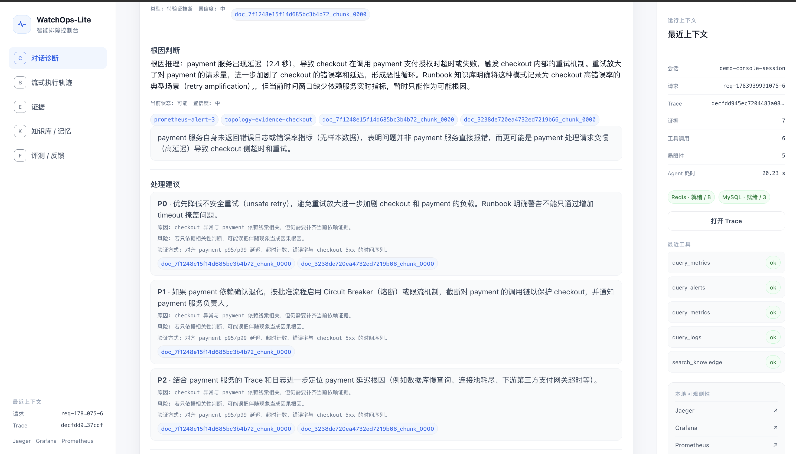

---

## Architecture

### Overall Architecture

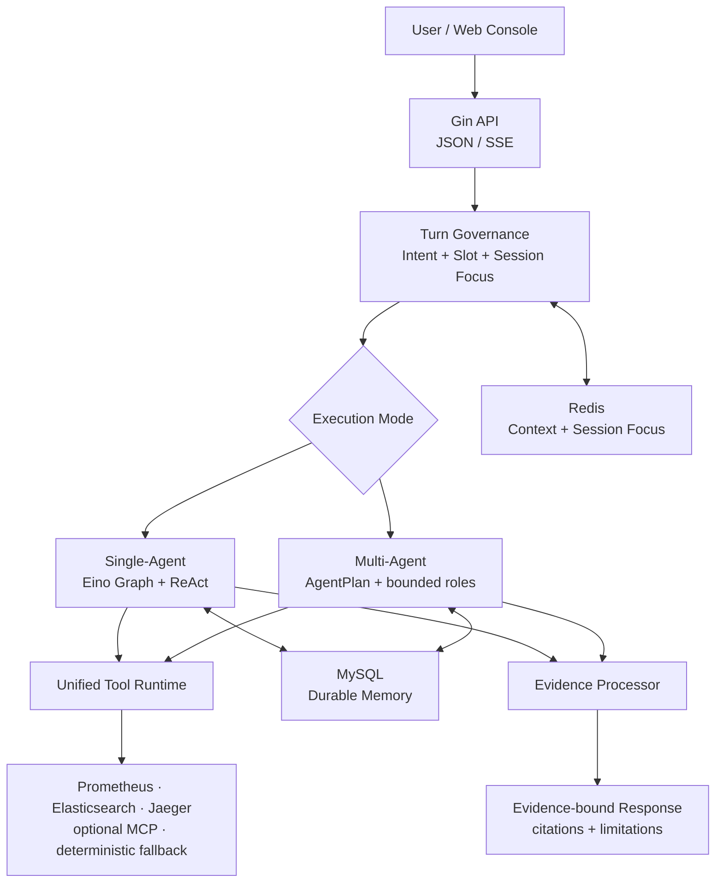
```mermaid
flowchart TB
    U["User / Web Console"]
    U --> API["Gin API<br/>JSON / SSE"]
    API --> GOV["Turn Governance<br/>Intent + Slot + Session Focus"]
    GOV --> MODE{"Execution Mode"}
    MODE --> SA["Single-Agent<br/>Eino Graph + ReAct"]
    MODE --> MA["Multi-Agent<br/>AgentPlan + bounded roles"]
    SA --> TH["Unified Tool Runtime"]
    MA --> TH
    TH --> DATA["Prometheus · Elasticsearch · Jaeger<br/>optional MCP · deterministic fallback"]
    GOV <--> REDIS["Redis<br/>Context + Session Focus"]
    SA <--> MYSQL["MySQL<br/>Durable Memory"]
    MA <--> MYSQL
    SA --> EP["Evidence Processor"]
    MA --> EP
    EP --> OUT["Evidence-bound Response<br/>citations + limitations"]
```

Single-Agent and Multi-Agent are separate execution modes exposed through different API endpoints and the Web Console; intent recognition does not choose between them. Single-Agent lets the Eino ReAct Agent make bounded runtime tool decisions. Multi-Agent derives an `AgentPlan` that selects diagnostic roles, while unselected roles return typed `skipped` steps.

Both modes use the same Agent-facing tool contract, Evidence processing rules, and Redis Focus semantics. Provider details—including Prometheus HTTP versus optional MCP metrics—remain behind Eino Tools and the unified Tool Runtime.

---

## Governed Agent Workflow

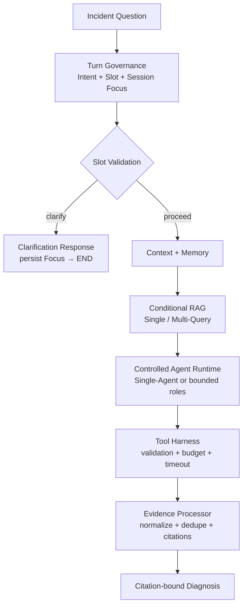
```mermaid
flowchart TB
    Q["Incident Question"] --> G["Turn Governance<br/>Intent + Slot + Session Focus"]
    G --> V{"Slot Validation"}
    V -->|"clarify"| C["Clarification Response<br/>persist Focus → END"]
    V -->|"proceed"| M["Context + Memory"]
    M --> R["Conditional RAG<br/>Single / Multi-Query"]
    R --> A["Controlled Agent Runtime<br/>Single-Agent or bounded roles"]
    A --> T["Tool Harness<br/>validation + budget + timeout"]
    T --> E["Evidence Processor<br/>normalize + dedupe + citations"]
    E --> D["Citation-bound Diagnosis"]
```

OpenTelemetry spans and Prometheus metrics cover request, graph, model, retrieval, tool, fallback, and role execution without becoming a decision step in the workflow.

---

## Quick Start

The default configuration uses the deterministic Agent runner and requires no LLM API key.

### 1. Clone and configure

```bash
git clone https://github.com/jiawei-wang-dev/WatchOps-Lite.git
cd WatchOps-Lite
cp configs/config.example.json configs/config.local.json
```

### 2. Start dependencies and the API

```bash
docker compose up -d --wait
docker compose ps
make run CONFIG=configs/config.local.json
```

The Compose stack starts Redis, MySQL, Elasticsearch, Jaeger, Prometheus, Grafana, and demo metrics. The Go API and embedded Web Console start separately at `http://localhost:8080/`.

Verify the backend from another terminal:

```bash
curl --fail http://localhost:8080/healthz
```

### 3. Seed and exercise the local demo

```bash
./scripts/demo_seed_knowledge.sh
./scripts/demo_seed_logs.sh
./scripts/demo_metrics.sh
make e2e-demo
make e2e-demo-multi
```

To enable the Eino ReAct path, set `agent.mode` to `eino_react`, enable the OpenAI-compatible `llm` block in `configs/config.local.json`, and export the environment variable named by `llm.api_key_env`. Incomplete configuration, timeout, or invalid model output uses the deterministic fallback; never commit a real key.

---

## Evaluation

| Layer | What it measures | Primary command |
|---|---|---|
| Intent | Intent accuracy, slot-field accuracy, joint intent + slot match, Clarify decisions | `make eval-intent` |
| Retrieval | BM25 and optional Hybrid retrieval, Recall@5, MRR, Multi-Query value | `make eval` |
| Agent | Tool selection/arguments, Evidence coverage, citation allowlist, fallback, deterministic Agent E2E | `make eval` / `make eval-agent` |
| Regression | Stable failed checks, baseline comparison, targeted replay | `make eval-replay` |

`make eval` runs the deterministic offline harness without external LLMs, embeddings, Prometheus, Elasticsearch, or Jaeger. Real-model Agent evaluation is explicitly opt-in through `WATCHOPS_EVAL_LLM_ENABLED=true` and a configured API key. `make e2e-demo` and `make e2e-demo-multi` exercise the Single-Agent and Multi-Agent HTTP paths against an already running local stack.

Failed scenarios are converted into stable, replayable Bad Cases instead of remaining one-off demo failures. Reports compare baseline and current behavior and record fixed, still-failing, and newly discovered cases. See [Agent Evaluation Harness](docs/evaluation-harness.md) for datasets, boundaries, and commands.

---

## Deep Dive

### Single-Agent Workflow

The default Chat API uses one fixed Eino Graph around an Eino ReAct Agent. The graph loads bounded context, renders the prompt, runs the controlled ReAct loop, processes evidence, persists Redis session memory, and then builds the public response.

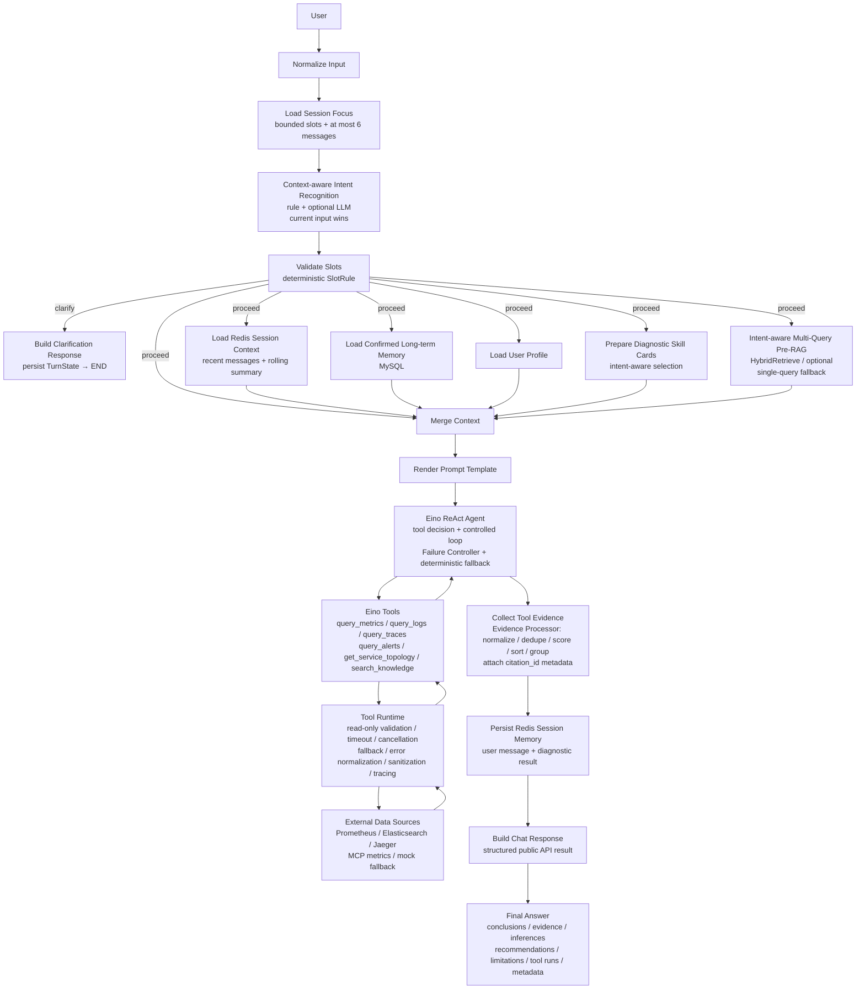
```mermaid
flowchart TB
    U["User"] --> N["Normalize Input"]
    N --> SF["Load Session Focus<br/>bounded slots + at most 6 messages"]
    SF --> I["Context-aware Intent Recognition<br/>rule + optional LLM<br/>current input wins"]
    I --> VS["Validate Slots<br/>deterministic SlotRule"]
    VS -->|"clarify"| CR["Build Clarification Response<br/>persist TurnState → END"]

    VS -->|"proceed"| SC["Load Redis Session Context<br/>recent messages + rolling summary"]
    VS -->|"proceed"| LM["Load Confirmed Long-term Memory<br/>MySQL"]
    VS -->|"proceed"| PF["Load User Profile"]
    VS -->|"proceed"| SK["Prepare Diagnostic Skill Cards<br/>intent-aware selection"]
    VS -->|"proceed"| RAG["Intent-aware Multi-Query Pre-RAG<br/>HybridRetrieve / optional<br/>single-query fallback"]

    VS -->|"proceed"| MC["Merge Context"]
    SC --> MC
    LM --> MC
    PF --> MC
    SK --> MC
    RAG --> MC

    MC --> PR["Render Prompt Template"]

    PR --> A["Eino ReAct Agent<br/>tool decision + controlled loop<br/>Failure Controller + deterministic fallback"]

    A --> ET["Eino Tools<br/>query_metrics / query_logs / query_traces<br/>query_alerts / get_service_topology / search_knowledge"]

    ET --> RT["Tool Runtime<br/>read-only validation / timeout / cancellation<br/>fallback / error normalization / sanitization / tracing"]

    RT --> DS["External Data Sources<br/>Prometheus / Elasticsearch / Jaeger<br/>MCP metrics / mock fallback"]

    DS --> RT
    RT --> ET
    ET --> A

    A --> CE["Collect Tool Evidence<br/>Evidence Processor: normalize / dedupe / score / sort / group<br/>attach citation_id metadata"]

    CE --> PS["Persist Redis Session Memory<br/>user message + diagnostic result"]

    PS --> BR["Build Chat Response<br/>structured public API result"]

    BR --> F["Final Answer<br/>conclusions / evidence / inferences<br/>recommendations / limitations / tool runs / metadata"]
```

Key execution rules:

1. Session Focus is loaded before Intent Recognition and is bounded to confirmed slots, clarification state, a short summary, and at most six recent non-tool messages.
2. Slot validation is deterministic: the current turn overrides command values, which override confirmed Focus. Missing or ambiguous critical slots return Clarify and terminate before RAG, ReAct, or tools.
3. Full Redis context, confirmed MySQL memory, profile, skill cards, and optional Pre-RAG load only after the turn is safe to execute; independent branches run in parallel.
4. The Eino ReAct Agent makes runtime tool decisions, while every atomic call passes through the unified Tool Runtime.
5. The Agent harness bounds steps, tool calls, retries, repeated calls, consecutive failures, and total execution time; one JSON repair and deterministic fallback are available.
6. `collect_tool_evidence` normalizes and groups Evidence, assigns `citation_id` metadata, and retains original Evidence IDs as the claim allowlist.
7. Redis context and Focus are persisted only after the result is built; persistence failure is reported as a safe degradation rather than replacing the diagnosis.

Execution boundaries remain explicit: Intent suggests tools but does not execute them; Pre-RAG provides background rather than current-incident proof; tools are atomic and read-only; the Tool Runtime governs a single call, while the Failure Controller governs the full Agent loop.

### Multi-Agent Workflow

Multi-Agent mode keeps the same tool contracts but runs a bounded, role-based diagnostic graph. Before that graph, it uses the same Turn Governance implementation as Single-Agent: bounded Session Focus, context-aware Intent Recognition and natural-language slot extraction, deterministic `SlotRule` validation, ambiguous-reference detection, and a tool-free Clarification branch.

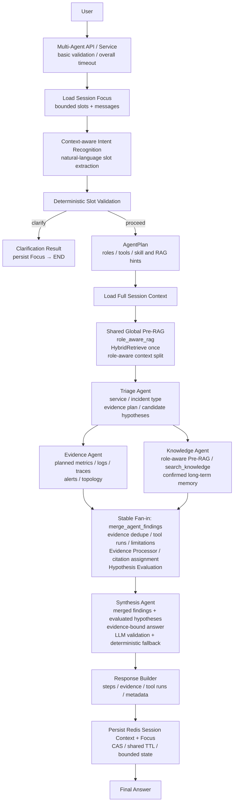
```mermaid
flowchart TB
    U["User"] --> API["Multi-Agent API / Service<br/>basic validation / overall timeout"]
    API --> F["Load Session Focus<br/>bounded slots + messages"]
    F --> I["Context-aware Intent Recognition<br/>natural-language slot extraction"]
    I --> V["Deterministic Slot Validation"]
    V -->|"clarify"| C["Clarification Result<br/>persist Focus → END"]
    V -->|"proceed"| P["AgentPlan<br/>roles / tools / skill and RAG hints"]
    P --> SC["Load Full Session Context"]
    SC --> R["Shared Global Pre-RAG<br/>role_aware_rag<br/>HybridRetrieve once<br/>role-aware context split"]

    R --> T["Triage Agent<br/>service / incident type<br/>evidence plan / candidate hypotheses"]

    T --> E["Evidence Agent<br/>planned metrics / logs / traces<br/>alerts / topology"]

    T --> K["Knowledge Agent<br/>role-aware Pre-RAG / search_knowledge<br/>confirmed long-term memory"]

    E --> M["Stable Fan-in: merge_agent_findings<br/>evidence dedupe / tool runs / limitations<br/>Evidence Processor / citation assignment<br/>Hypothesis Evaluation"]

    K --> M

    M --> S["Synthesis Agent<br/>merged findings + evaluated hypotheses<br/>evidence-bound answer<br/>LLM validation + deterministic fallback"]

    S --> B["Response Builder<br/>steps / evidence / tool runs / metadata"]

    B --> PS["Persist Redis Session Context + Focus<br/>CAS / shared TTL / bounded state"]

    PS --> FA["Final Answer"]
```

Single-Agent and Multi-Agent share `internal/application/turngovernance` for Focus loading, budgets and redaction, RecognitionInput construction, command/Focus slot precedence, relative-time resolution, and versioned Focus persistence. Both modes continue to use the one `internal/intent` implementation for recognizers, `IntentDecision`, `SlotRule`, `ValidateSlots`, and clarification reason codes. They do not maintain separate governance rules.

On `clarify`, the service returns the existing Multi-Agent response shape with empty steps, selected agents, evidence, tool runs, and recommendations. It persists `TurnStatus=clarify` and ends before AgentPlan, full Context, Role-aware RAG, Triage, agents, tools, evidence, or synthesis. JSON and SSE call the same service path; SSE emits intent/slot/clarification lifecycle events but no execution events.

On `proceed`, the validated `IntentDecision.Result` is the only executable task truth passed to the Orchestrator. Because `Input.Intent` is populated, the Orchestrator normalizes it without calling the Recognizer again, then creates AgentPlan. Full Session Context is loaded only after validation. Shared Global Pre-RAG retrieves knowledge once before role execution and distributes bounded context by role.

Intent Governance decides the task, confirmed parameters, and whether execution is safe. AgentPlan only selects roles, allowed tools, and role hints. TriagePlan only adds investigation steps, hypotheses, and an evidence plan. A Triage planner service/time conflict is recorded as discrepancy metadata, while the validated service and time remain authoritative.

After successful execution, Multi-Agent persists ordinary messages and the same `session:{id}:focus` record used by Single-Agent. The Redis Store retains the shared TTL and WATCH/MULTI version CAS. Focus persistence failures and version conflicts are safe degradations and never replace a completed clarification or diagnosis.

Role boundaries:

- Intent Governance identifies the task, extracts/merges slots, and decides Clarify or Proceed.
- AgentPlan selects roles and role capabilities; it cannot recognize intent, change validated slots, or decide clarification.
- Triage defines investigation steps, evidence plan, and candidate hypotheses, but cannot override the validated service/time or declare the final root cause.
- Evidence executes the bounded observability plan and reports verifiable runtime signals from metrics, logs, traces, alerts, and topology.
- Knowledge retrieves role-aware RAG context, runbooks, and confirmed long-term memory as guidance, not proof of the current incident.
- Merge performs deterministic fan-in, evidence deduplication, limitation merging, evidence processing, citation assignment, and hypothesis evaluation.
- Synthesis is the only role allowed to produce final conclusions, and every cited evidence ID must exist in the merged evidence allowlist.
- Response Builder converts the completed role outputs into the public Multi-Agent result without adding new diagnostic claims.

#### Routing behavior

- Incident Triage: Triage + Evidence + Knowledge + Synthesis.
- Trace Analysis: Triage + Evidence + Synthesis.
- Metrics / Logs Query: Evidence + Synthesis.
- Knowledge / Mitigation: Knowledge + Synthesis.
- Status Summary: Synthesis only.
- Low-confidence or general intent: fall back to all roles.

Routing behavior describes role selection inside the fixed graph. Actual tool execution remains bounded by the generated `TriagePlan`, including its `EvidencePlan`, and by each role's implementation constraints. Selecting a role does not by itself guarantee that every tool associated with that role will be called.

The routing table documents the current role-selection policy in `routing.go`; it should not be interpreted as a guarantee of a specific tool-call sequence for every request.

Routing does not rebuild the graph. Unselected roles remain in the static Eino Graph and return skipped steps, allowing the fan-in and response-building stages to keep a stable typed contract.

This is a bounded, domain-specific 3+1 diagnostic architecture rather than a general autonomous multi-agent platform. The roles do not hold free-form conversations with each other. Evidence and Knowledge return typed findings through the shared graph state, and Synthesis consumes only the deterministic merged result.

---

### Hybrid RAG Pipeline

Knowledge retrieval is centered on `HybridRetrieve()`. It is the main knowledge path for both pre-RAG context and `search_knowledge` tool calls.

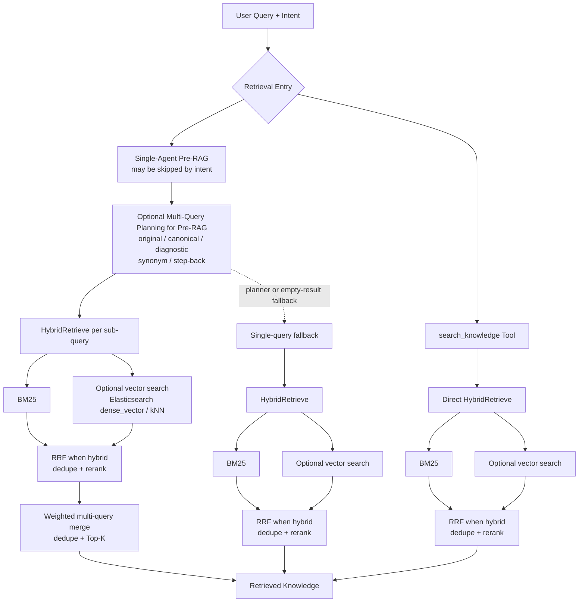
```mermaid
flowchart TB
    Q["User Query + Intent"] --> ENTRY{"Retrieval Entry"}

    ENTRY --> PR["Single-Agent Pre-RAG<br/>may be skipped by intent"]
    ENTRY --> KT["search_knowledge Tool"]

    PR --> MQ["Optional Multi-Query Planning for Pre-RAG<br/>original / canonical / diagnostic<br/>synonym / step-back"]
    MQ --> HR1["HybridRetrieve per sub-query"]
    MQ -. planner or empty-result fallback .-> SQ["Single-query fallback"]
    SQ --> HR2["HybridRetrieve"]

    KT --> HR3["Direct HybridRetrieve"]

    HR1 --> BM1["BM25"]
    HR1 --> VE1["Optional vector search<br/>Elasticsearch dense_vector / kNN"]
    BM1 --> PIPE1["RRF when hybrid<br/>dedupe + rerank"]
    VE1 --> PIPE1

    HR2 --> BM2["BM25"]
    HR2 --> VE2["Optional vector search"]
    BM2 --> PIPE2["RRF when hybrid<br/>dedupe + rerank"]
    VE2 --> PIPE2

    HR3 --> BM3["BM25"]
    HR3 --> VE3["Optional vector search"]
    BM3 --> PIPE3["RRF when hybrid<br/>dedupe + rerank"]
    VE3 --> PIPE3

    PIPE1 --> MERGE["Weighted multi-query merge<br/>dedupe + Top-K"]
    PIPE2 --> OUT["Retrieved Knowledge"]
    PIPE3 --> OUT
    MERGE --> OUT
```

The current implementation supports:

- Deterministic Single/Multi-Query selection on the Single-Agent Pre-RAG path; intent can skip Pre-RAG entirely.
- Single Query for explicit metrics/logs/trace requests, simple knowledge lookup, parameter correction, and simple incidents.
- Multi-Query only for incident triage with dependency or causal chains, multiple symptoms, explicit error chains, or long compound descriptions.
- Per-sub-query `HybridRetrieve()` calls followed by weighted merge, deduplication, and Top-K selection.
- Single-query fallback when query planning fails or the multi-query path produces no usable result.
- Direct `HybridRetrieve()` calls from the `search_knowledge` tool without mandatory query rewriting.
- BM25-only mode.
- Optional vector search when embeddings are configured.
- Hybrid fusion with reciprocal-rank-style scoring.
- Deduplication at retrieval time to handle historical duplicate chunks.
- Reranking with a rule-based default and an optional external model provider.
- BM25 fallback when embeddings or vector search are unavailable.

#### Optional model-based reranking

The local demo uses a deterministic rule-based reranker so the project can run without paid model calls. External-model environments can switch reranking providers without changing the Agent, Tool Runtime, or API contracts.

```bash
export WATCHOPS_RERANK_ENABLED=true
export WATCHOPS_RERANK_PROVIDER=external
export WATCHOPS_RERANK_BASE_URL=https://your-rerank-provider.example/v1
export WATCHOPS_RERANK_MODEL=your-rerank-model
export WATCHOPS_RERANK_API_KEY=replace-me
```

The configured base URL receives a `/rerank` suffix. WatchOps-Lite sends a bounded request with `model`, `query`, `documents`, and `top_n`, and expects ranked results with `index` and `relevance_score`. Timeout, invalid output, empty output, missing credentials, or provider failure falls back to the rule-based reranker and records `rerank_fallback_reason` in retrieval metadata.

---

### Memory Architecture

WatchOps-Lite separates recent conversation, compressed history, current task state, and durable confirmed memory.

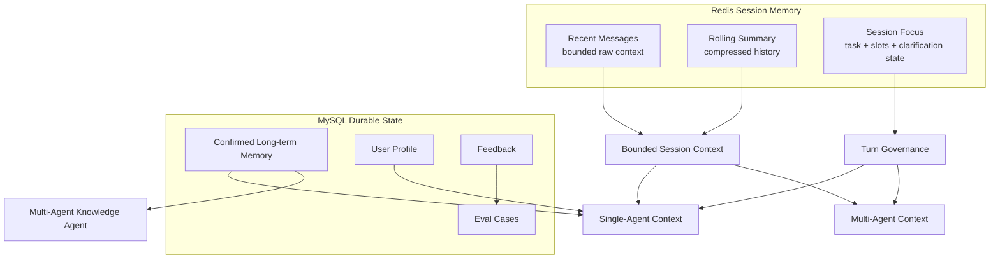
```mermaid
flowchart TB
    subgraph RedisMemory["Redis Session Memory"]
        RM["Recent Messages<br/>bounded raw context"]
        RS["Rolling Summary<br/>compressed history"]
        SF["Session Focus<br/>task + slots + clarification state"]
    end

    subgraph MySQLState["MySQL Durable State"]
        LM["Confirmed Long-term Memory"]
        PF["User Profile"]
        FB["Feedback"]
        EV["Eval Cases"]
    end

    RM --> SC["Bounded Session Context"]
    RS --> SC
    SF --> GOV["Turn Governance"]

    SC --> SA["Single-Agent Context"]
    GOV --> SA
    LM --> SA
    PF --> SA

    SC --> MA["Multi-Agent Context"]
    GOV --> MA
    LM --> KA["Multi-Agent Knowledge Agent"]

    FB --> EV
```

`Recent Messages` preserve a bounded raw window; `Rolling Summary` compresses older history; `Session Focus` carries the active task, confirmed slots, missing slots, and clarification state into the next turn. Current-turn values always override historical Focus, so a correction such as “not checkout, use payment” cannot be silently replaced by stale context.

All Redis session structures use the configured TTL. Summary and Focus updates carry monotonically increasing versions and use Redis `WATCH` / `MULTI` CAS, preventing an older request that finishes later from overwriting newer session state. Version conflicts degrade memory persistence without replacing an already completed diagnosis.

Confirmed long-term memory is stored in MySQL and can be injected into both diagnostic modes through their respective execution paths. User Profile is currently injected only into Single-Agent and is not wired into Multi-Agent.

---

### Tool Runtime / Agent Harness

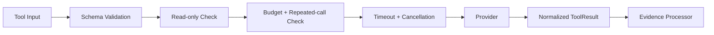
```mermaid
flowchart LR
    IN["Tool Input"] --> SV["Schema Validation"]
    SV --> RO["Read-only Check"]
    RO --> BG["Budget + Repeated-call Check"]
    BG --> TO["Timeout + Cancellation"]
    TO --> PR["Provider"]
    PR --> TR["Normalized ToolResult"]
    TR --> EP["Evidence Processor"]
```

The **Tool Runtime** governs one atomic call: allowlisted schema and input validation, read-only constraints, timeout/cancellation, provider fallback, sanitization, tracing, and a normalized `ToolResult` envelope.

The **Agent Harness / Failure Controller** governs the whole loop: maximum steps and tool calls, retry count, repeated-call detection, consecutive tool failures, total execution deadline, a bounded JSON repair, deterministic fallback, and a stable `StopReason`. The distinction keeps provider failures local while preventing a degraded Agent from looping indefinitely.

---

### MCP Integration

MCP is currently introduced only for metrics. The Metric Tool can route to either the existing local Prometheus HTTP implementation or an MCP-backed Prometheus provider.

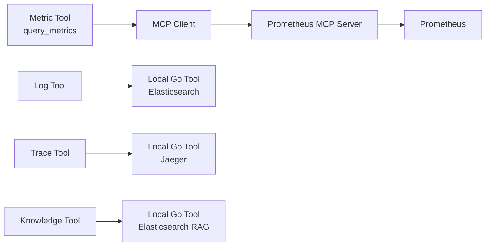
```mermaid
flowchart LR
    MT["Metric Tool<br/>query_metrics"] --> MC["MCP Client"]
    MC --> PMS["Prometheus MCP Server"]
    PMS --> P["Prometheus"]

    LT["Log Tool"] --> LG["Local Go Tool<br/>Elasticsearch"]
    TT["Trace Tool"] --> JG["Local Go Tool<br/>Jaeger"]
    KT["Knowledge Tool"] --> KG["Local Go Tool<br/>Elasticsearch RAG"]
```

Why MCP is useful:

- It decouples the Agent-facing tool contract from monitoring platform integrations.
- It allows local Go tools and MCP tools to coexist.
- It prepares the project for future providers such as Grafana, Kubernetes, Jira, or incident-management systems.

Configuration:

```bash
WATCHOPS_MCP_ENABLED=false
WATCHOPS_MCP_SERVER_URL=http://localhost:8081
WATCHOPS_MCP_TIMEOUT=10s
```

Unprefixed aliases are also accepted:

```bash
MCP_ENABLED=false
MCP_SERVER_URL=http://localhost:8081
MCP_TIMEOUT=10s
```

When MCP is disabled, behavior is identical to the native Prometheus HTTP path. When MCP is enabled, `query_metrics` calls MCP tool `query_prometheus`. Tool metadata includes `metric_provider: "mcp"` or `metric_provider: "http"` so the UI and traces can show the active provider.

---

## Observability

OpenTelemetry traces request, graph, intent, retrieval, model, memory, tool, Evidence, fallback, evaluation, and Multi-Agent role boundaries. Jaeger shows request-level timing and fan-out/fan-in behavior.

Prometheus exposes HTTP and Agent latency, tool success/failure, retrieval, fallback, summary, evaluation, and role-execution metrics at `/metrics`; Grafana provisions a starter local dashboard. Tool metadata also distinguishes native Prometheus HTTP from optional MCP-backed metrics.

---

## Docker Compose

### Architecture via Docker Compose

The current Docker Compose stack starts the local infrastructure and observability dependencies. The WatchOps Go API is started separately with `make run`. The optional Prometheus MCP Server is not part of this Compose stack and must be deployed or started independently when the MCP metrics provider is enabled.

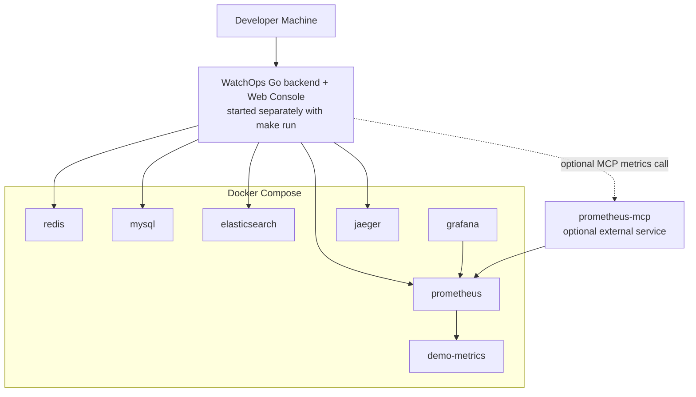
```mermaid
flowchart TB
    DEV["Developer Machine"] --> W["WatchOps Go backend + Web Console<br/>started separately with make run"]

    subgraph Compose["Docker Compose"]
        REDIS["redis"]
        MYSQL["mysql"]
        ES["elasticsearch"]
        PROM["prometheus"]
        GRAF["grafana"]
        JAEGER["jaeger"]
        DEMO["demo-metrics"]
    end

    W --> REDIS
    W --> MYSQL
    W --> ES
    W --> PROM
    W --> JAEGER
    PROM --> DEMO
    GRAF --> PROM

    W -. "optional MCP metrics call" .-> PMCP["prometheus-mcp<br/>optional external service"]
    PMCP --> PROM
```

Compose service ports:

| Service | URL | Purpose |
|---|---|---|
| Redis | `localhost:6379` | Short-term session memory |
| MySQL | `localhost:3306` | Long-term memory, feedback, eval cases |
| Elasticsearch | `http://localhost:9200` | Knowledge and logs |
| Prometheus | `http://localhost:9090` | Metrics backend and runtime metric scraping |
| Grafana | `http://localhost:3000` | Runtime dashboard |
| Jaeger | `http://localhost:16686` | Trace visualization |
| demo-metrics | `http://localhost:9108` | Demo checkout/payment metrics |

`docker compose up -d` starts only the services present in `docker-compose.yml`: Redis, MySQL, Elasticsearch, Jaeger, the demo metrics exporter, Prometheus, and Grafana. Run the WatchOps backend separately with `make run`; it listens on `http://localhost:8080` by default. When MCP is disabled, `query_metrics` continues to use the native Prometheus HTTP provider. An MCP Server is optional, external to this Compose stack, and uses `http://localhost:8081` by default when independently started.

---

## Additional Screenshots

These existing screenshots were captured from the local demo environment and provide supporting views of the console, bounded role collaboration, Evidence, tracing, and evaluation.

### Console Overview

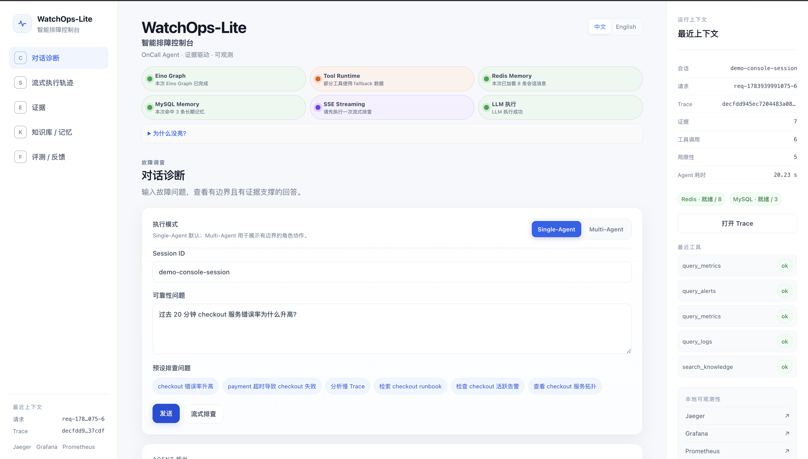

### Multi-Agent Workflow

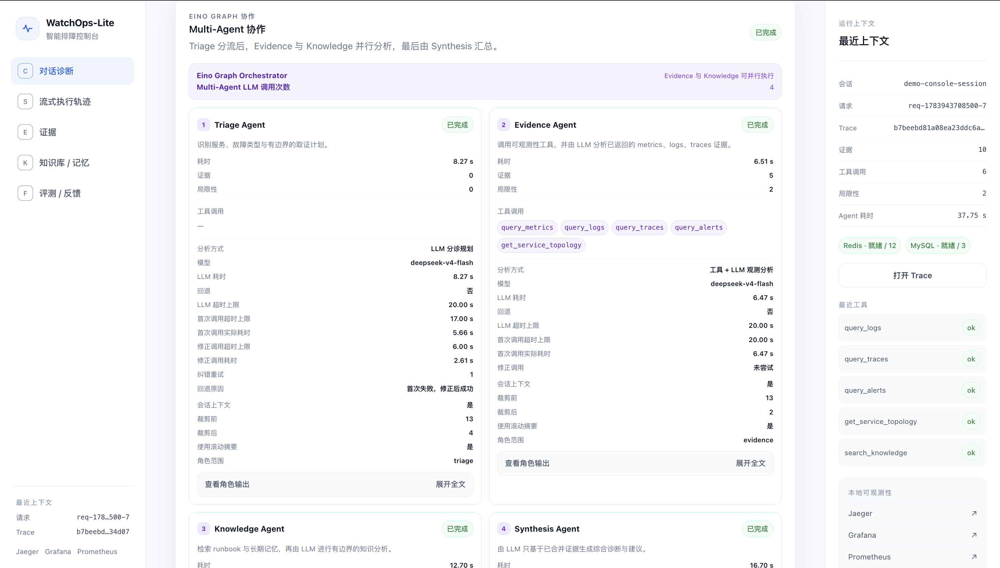

### Evidence Panel

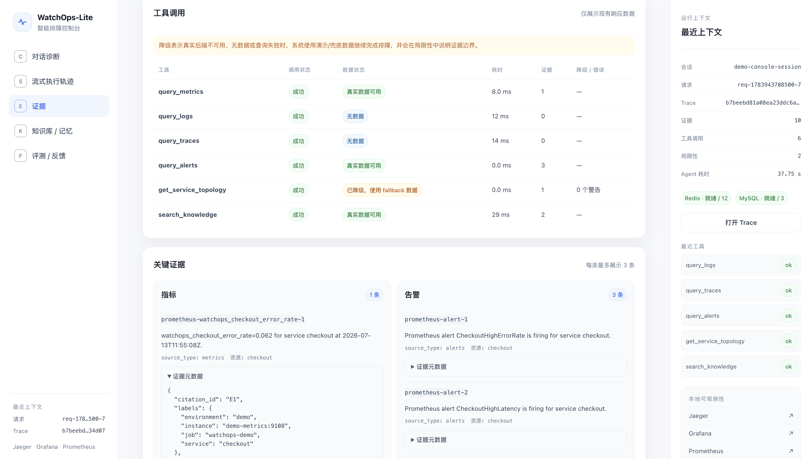

### Jaeger Trace

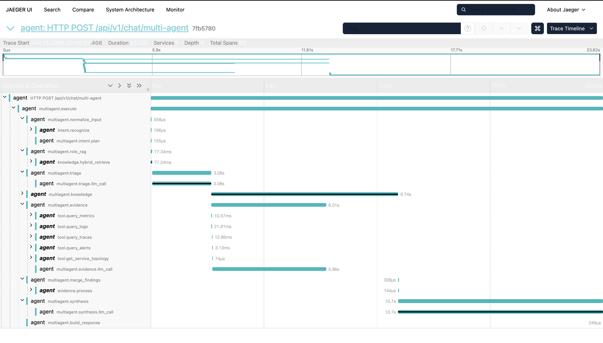

### Feedback and Eval Loop

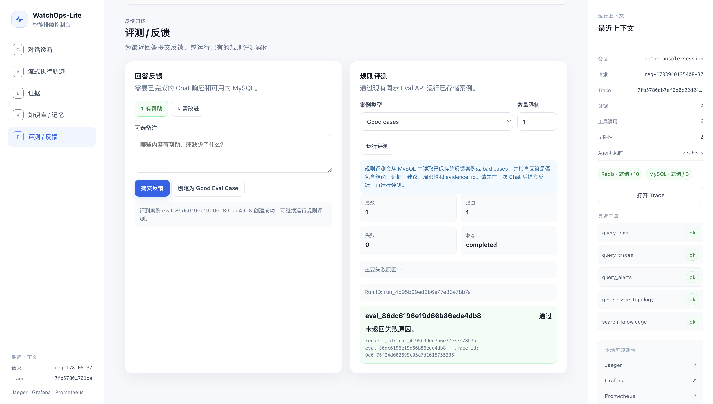

---

## API Examples

### Chat

```bash
curl --fail-with-body http://localhost:8080/api/v1/chat \
  -H 'Content-Type: application/json' \
  -d '{
    "session_id": "demo-checkout-session",
    "user_id": "optional-oncall-user",
    "message": "Why did checkout errors increase? Check metrics, logs, alerts, and the runbook."
  }'
```

### Streaming Chat

```bash
curl -N --fail-with-body http://localhost:8080/api/v1/chat/stream \
  -H 'Content-Type: application/json' \
  -d '{
    "session_id": "demo-checkout-session",
    "message": "Why did checkout errors increase? Check metrics, logs, alerts, and the runbook."
  }'
```

### Knowledge Search

```bash
curl --fail-with-body http://localhost:8080/api/v1/knowledge/search \
  -H 'Content-Type: application/json' \
  -d '{
    "query": "checkout payment upstream timeout",
    "limit": 5,
    "filters": {"service": "checkout"}
  }'
```

### Feedback

```bash
curl --fail-with-body http://localhost:8080/api/v1/feedback \
  -H 'Content-Type: application/json' \
  -d '{
    "request_id": "replace-with-chat-request-id",
    "session_id": "demo-checkout-session",
    "rating": "down",
    "reason_tags": ["needs_trace_confirmation"],
    "comment": "The hypothesis still needs real trace confirmation."
  }'
```

---

## Project Structure

```text
.
├── cmd/
│   ├── server/                 # Application entrypoint
│   ├── eval-harness/           # Deterministic layered evaluation
│   ├── agent-eval/             # Opt-in real-model Agent evaluation
│   ├── intent-eval/            # Intent and slot evaluation
│   ├── demo-metrics/           # Demo Prometheus metric exporter
│   ├── log-generator/          # Demo log generator
│   ├── retrieval-eval/         # Retrieval eval CLI
│   └── agent-benchmark/        # Local Agent benchmark CLI
├── configs/                    # App config, Prometheus config, Grafana provisioning
├── demo/                       # Demo runbooks and log data
├── docs/                       # Architecture docs, ADRs, API docs, verification notes
├── scripts/                    # Seed, demo, eval, and verification scripts
├── web/                        # Vanilla Web Console served by the Go backend
└── internal/
    ├── transport/http/         # Gin router, middleware, DTOs, handlers
    ├── application/chat/       # Chat workflow and graph orchestration
    ├── agent/                  # Eino ReAct Agent, prompts, fallback, skills
    ├── multiagent/             # Triage, Evidence, Knowledge, Synthesis roles
    ├── intent/                 # Hybrid intent recognition and tool hints
    ├── diagnosis/              # Hypothesis and evidence evaluation helpers
    ├── evidence/               # Evidence normalization, dedupe, scoring, grouping
    ├── tool/                   # Tool Runtime and guardrails
    ├── tools/                  # Domain tools: metrics, logs, traces, knowledge, alerts, topology
    ├── retrieval/              # Knowledge, logs, metrics, traces, embeddings, rerank
    ├── memory/                 # Redis session memory and MySQL long-term memory
    ├── mcp/                    # MCP client abstraction for optional provider integrations
    ├── observability/          # OpenTelemetry tracing and Prometheus runtime metrics
    ├── platform/               # Infrastructure adapters such as MySQL and Elasticsearch
    ├── feedback/               # Feedback storage and API support
    ├── eval/                   # Layered harness, Bad Cases, replay, and persisted eval runs
    ├── profile/                # User profile context
    ├── bootstrap/              # Composition root and lifecycle wiring
    └── config/                 # Config loading, environment overrides, validation
```

Module responsibilities:

- `internal/agent`: Agent-facing orchestration, prompts, skills, ReAct runner, and deterministic fallback.
- `internal/multiagent`: Role-based diagnostic flow with bounded responsibilities.
- `internal/intent`: Query classification, hints, and role/tool routing signals.
- `internal/retrieval`: Search and retrieval backends, including Hybrid RAG.
- `internal/memory`: Redis short-term memory and MySQL durable memory.
- `internal/mcp`: Provider-neutral MCP client abstraction.
- `internal/observability`: Tracing and runtime metrics.
- `web`: Build-free console for local diagnosis and workflow inspection.

---

## Demo Checklist

For a local workflow check:

1. Open the Web Console at `http://localhost:8080/`.
2. Ask the recommended checkout incident question.
3. Show Single-Agent output: evidence, tool calls, limitations, and trace ID.
4. Switch to Multi-Agent and show role-level execution.
5. Open Prometheus targets and verify `watchops-lite` and `watchops-demo`.
6. Open Grafana and show HTTP/chat/tool/RAG/fallback metrics.
7. Open Jaeger and inspect the request trace.
8. Mention MCP metrics as an optional provider path under the same `query_metrics` tool.

---

## Current Boundaries

- This is a locally reproducible troubleshooting system, not a production AIOps platform.
- Tool calls are read-only. The system does not restart, scale, deploy, rollback, or mutate external systems.
- MCP is currently optional and only implemented for metrics.
- Logs, traces, knowledge, Redis, and MySQL remain local Go integrations.
- Grafana dashboards are starter dashboards for demos, not production SRE dashboards.
- Rule-based eval is included; LLM-as-judge and large-scale A/B testing are future work.

---

## Future Roadmap

- Kubernetes Deployment: add manifests or Helm charts for a realistic deployment story.
- Streaming UX Enhancements: add finer-grained public progress events, reconnection handling, event replay or resume support, improved frontend progress visualization, and clearer degraded or fallback states.
- Multi-modal Incident Analysis: support screenshots, charts, and incident artifacts as future inputs.
- More MCP Providers: add optional Grafana, Kubernetes, Jira, or incident-management MCP integrations.
- Auto Evaluation Pipeline: expand feedback-to-eval automation and regression reporting.
- Stronger Reranking: plug in external/cross-encoder rerankers when model access is available.

---

## Documentation

- [Project Blueprint](docs/PROJECT_BLUEPRINT.md)
- [Architecture](docs/ARCHITECTURE.md)
- [HTTP API](docs/API.md)
- [Roadmap](docs/ROADMAP.md)
- [Project Structure](docs/STRUCTURE.md)
- [Demo Verification](docs/demo-verification.md)
- [Agent Evaluation Harness](docs/evaluation-harness.md)
- [Retrieval Evaluation](docs/retrieval-evaluation.md)
- [Performance Report](docs/performance-report.md)

Key ADRs:

- [ADR 0001: Framework and Stack](docs/adr/0001-framework-and-stack.md)
- [ADR 0008: Eino ReAct Agent](docs/adr/0008-eino-react-agent.md)
- [ADR 0010: Elasticsearch-backed Logs Tool](docs/adr/0010-elasticsearch-logs-tool.md)
- [ADR 0011: Prometheus-backed Metrics Tool](docs/adr/0011-prometheus-metrics-tool.md)
- [ADR 0012: Jaeger-backed Traces Tool](docs/adr/0012-jaeger-traces-tool.md)
- [ADR 0014: Hybrid Knowledge Retrieval](docs/adr/0014-hybrid-knowledge-retrieval.md)
- [ADR 0015: Rule-based Eval Runner](docs/adr/0015-eval-runner.md)
- [ADR 0016: Runtime Prometheus Metrics](docs/adr/0016-runtime-prometheus-metrics.md)
- [ADR 0017: Grafana Dashboard](docs/adr/0017-grafana-dashboard.md)
- [ADR 0018: Eino Multi-Agent Demo](docs/adr/0018-eino-multi-agent-demo.md)

---

## License

Licensed under the Apache License 2.0. See [LICENSE](LICENSE).
