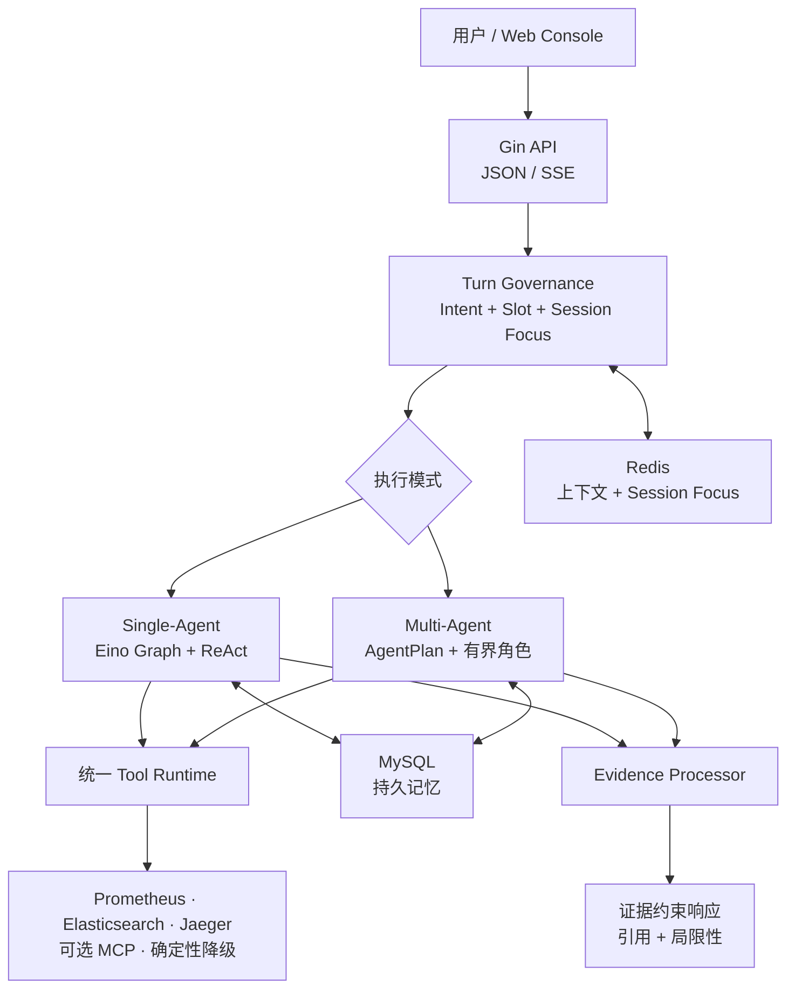
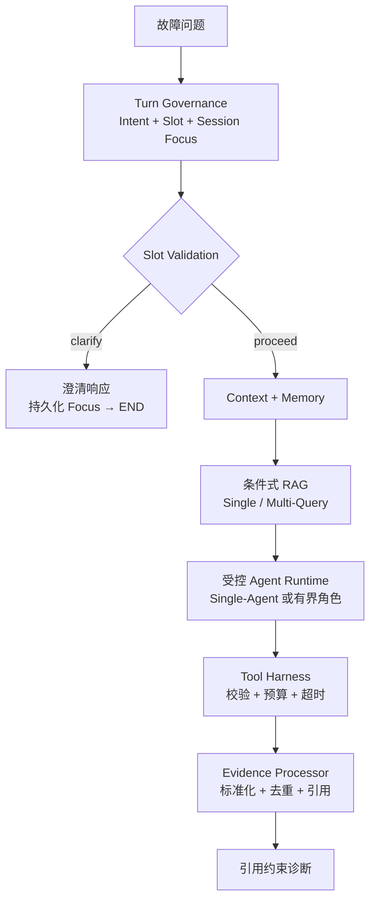
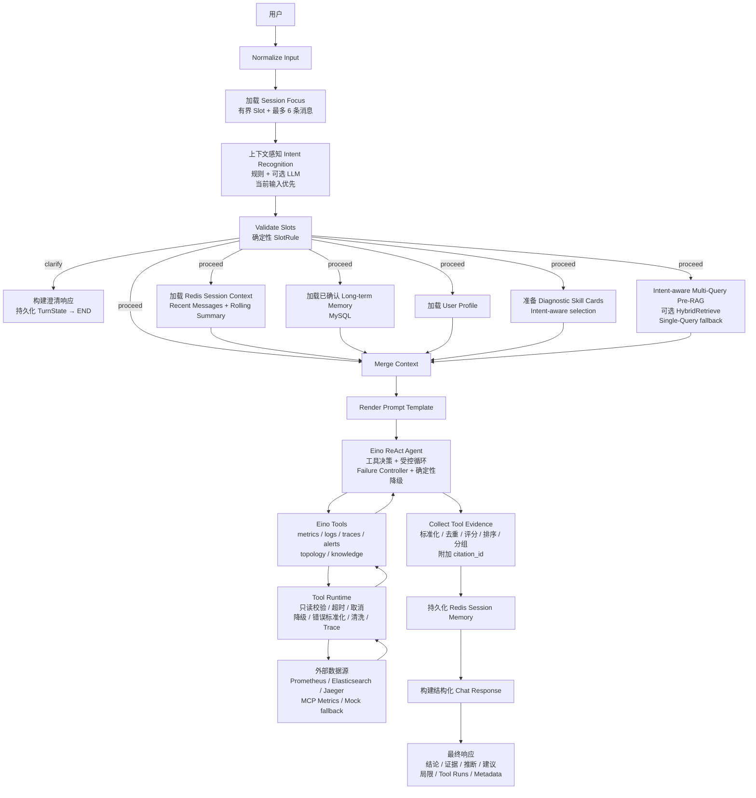
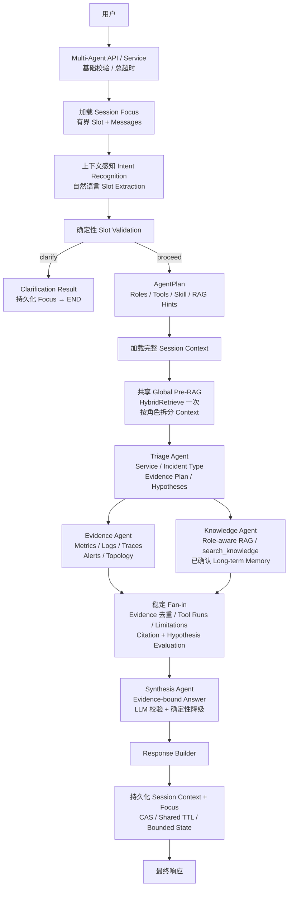
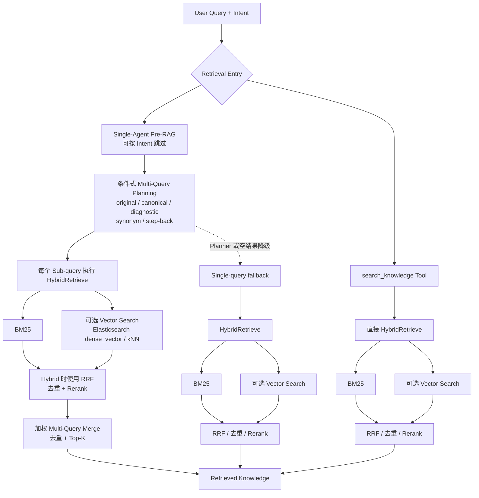
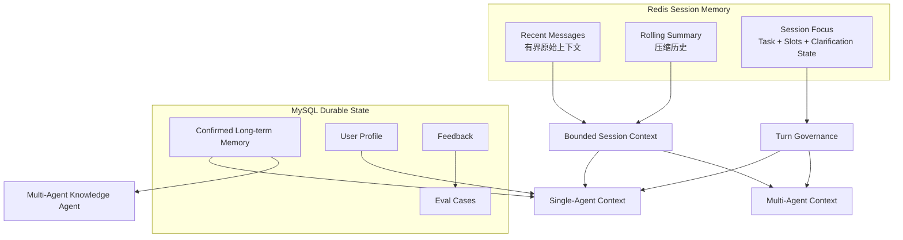
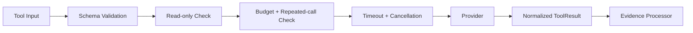
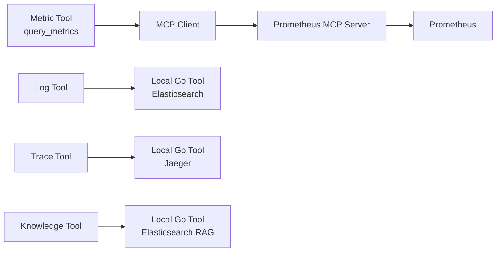
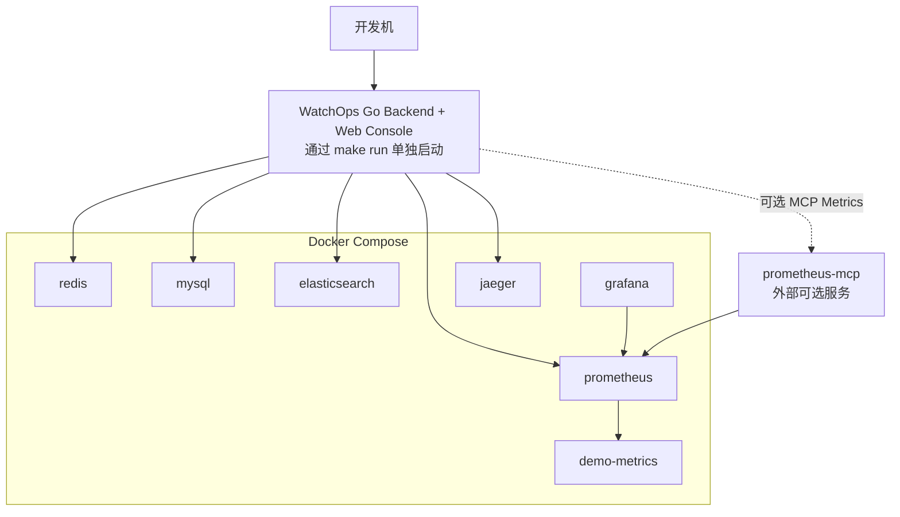

# WatchOps-Lite

[English](README.md) | [简体中文](README_CN.md)

**证据驱动的 OnCall 故障排查 Agent**

`CONTROLLED · GROUNDED · EVALUATED`

WatchOps-Lite 将一次故障提问转化为有边界的排查工作流，结合上下文治理、混合检索、受控工具执行与证据约束诊断。

`Go` · `Eino` · `RAG` · `Tool Calling` · `Multi-Agent` · `Evaluation`

[架构](#架构) · [快速开始](#快速开始) · [Agent 设计](#深入设计) · [评测](#评测) · [可观测性](#可观测性) · [文档](#文档)

---

## 为什么是 WatchOps-Lite

OnCall Agent 的工程难点，并不能只靠更大的模型或更强的 Prompt 解决：

- 意图模糊、关键参数缺失；
- 过期的多轮上下文覆盖当前请求；
- ReAct 循环失控或重复调用工具；
- 检索噪声导致结论缺少支撑；
- 运维系统接入不安全、响应过慢或发生降级；
- 失败场景无法复现、比较和评测。

WatchOps-Lite 将这些问题作为治理、运行时、证据约束和评测问题处理。系统只执行诊断：所有工具只读，缺少支撑的判断会转化为显式局限，不会自动执行修复操作。

---

## 核心设计

<table>
  <tr>
    <td width="50%" valign="top">
      <h3>Turn Governance</h3>
      <p><code>Intent · Slot · Session Focus · Clarify</code></p>
      <p>当前轮输入优先于历史 Focus。关键参数缺失或存在歧义时，在 RAG、Agent 和工具执行前直接返回 Clarify。</p>
    </td>
    <td width="50%" valign="top">
      <h3>Agent Harness</h3>
      <p><code>Schema · Read-only · Timeout · Budget · StopReason</code></p>
      <p>ReAct 执行受到步骤、工具调用、重试、重复调用和总耗时预算约束。每次工具调用都返回统一的成功、降级或失败结果。</p>
    </td>
  </tr>
  <tr>
    <td width="50%" valign="top">
      <h3>Evidence Grounding</h3>
      <p><code>Hybrid RAG · Evidence Processor · Citation Allowlist</code></p>
      <p>条件式 Single/Multi-Query 检索组合 BM25、可选 Vector、融合与重排。结论只能引用本次工作流真实产生的 Evidence。</p>
    </td>
    <td width="50%" valign="top">
      <h3>Evaluation</h3>
      <p><code>Intent · Retrieval · Agent E2E · Replay</code></p>
      <p>分层确定性评测覆盖路由、Slot、检索、工具、Evidence 和降级。失败检查会沉淀为可重放的 Bad Case。</p>
    </td>
  </tr>
</table>

---

## 诊断预览

本地 Web Console 在同一结果中展示诊断结论、引用证据、处理建议、局限性、工具执行以及请求和 Trace 上下文。


---

## 架构

### 总体架构



Single-Agent 与 Multi-Agent 是两个独立执行模式，通过不同 API 和 Web Console 入口暴露；意图识别不会在两种模式之间自动切换。Single-Agent 由 Eino ReAct Agent 在预算内决定工具调用，Multi-Agent 则根据 `AgentPlan` 选择受限诊断角色，未选角色返回类型稳定的 `skipped` 步骤。

两种模式使用相同的 Agent 工具契约、Evidence 处理规则与 Redis Focus 语义。Prometheus HTTP 与可选 MCP Metrics 等 Provider 细节都隐藏在 Eino Tools 和统一 Tool Runtime 之后。

---

## 受治理的 Agent 工作流



OpenTelemetry Span 与 Prometheus Metrics 横向覆盖请求、Graph、模型、检索、工具、降级和角色执行，但不会成为诊断主流程中的决策节点。

---

## 快速开始

默认配置使用确定性 Agent Runner，不需要 LLM API Key。

### 1. 克隆与配置

```bash
git clone https://github.com/jiawei-wang-dev/WatchOps-Lite.git
cd WatchOps-Lite
cp configs/config.example.json configs/config.local.json
```

### 2. 启动依赖和 API

```bash
docker compose up -d --wait
docker compose ps
make run CONFIG=configs/config.local.json
```

Compose 会启动 Redis、MySQL、Elasticsearch、Jaeger、Prometheus、Grafana 和 Demo Metrics。Go API 与内嵌 Web Console 由 `make run` 单独启动，默认地址为 `http://localhost:8080/`。

在另一个终端验证后端：

```bash
curl --fail http://localhost:8080/healthz
```

### 3. 写入并验证本地 Demo 数据

```bash
./scripts/demo_seed_knowledge.sh
./scripts/demo_seed_logs.sh
./scripts/demo_metrics.sh
make e2e-demo
make e2e-demo-multi
```

如需启用 Eino ReAct 路径，在 `configs/config.local.json` 中将 `agent.mode` 设置为 `eino_react`，启用 OpenAI-compatible `llm` 配置，并导出 `llm.api_key_env` 指定的环境变量。配置不完整、调用超时或模型输出无效时会使用确定性降级；不要提交真实密钥。

---

## 评测

| 层级 | 评测内容 | 主要命令 |
|---|---|---|
| Intent | 意图准确率、Slot 字段准确率、Intent + Slot 联合匹配、Clarify 决策 | `make eval-intent` |
| Retrieval | BM25 与可选 Hybrid 检索、Recall@5、MRR、Multi-Query 价值 | `make eval` |
| Agent | 工具选择和参数、Evidence 覆盖、Citation Allowlist、降级与确定性 Agent E2E | `make eval` / `make eval-agent` |
| Regression | 稳定失败记录、基线对比、定向 Replay | `make eval-replay` |

`make eval` 运行确定性离线 Harness，不调用外部 LLM、Embedding、Prometheus、Elasticsearch 或 Jaeger。真实模型 Agent 评测必须显式设置 `WATCHOPS_EVAL_LLM_ENABLED=true` 并配置 API Key。`make e2e-demo` 与 `make e2e-demo-multi` 用于验证已经启动的本地 Single-Agent 与 Multi-Agent HTTP 路径。

失败场景会被转换为稳定、可重放的 Bad Case，而不是停留为一次性的 Demo 失败。报告会对比基线与当前行为，记录已修复、仍失败和新增的问题。数据集、边界与完整命令见 [Agent Evaluation Harness](docs/evaluation-harness.md)。

---

## 深入设计

### Single-Agent 工作流

默认 Chat API 使用围绕 Eino ReAct Agent 构建的固定 Eino Graph。Graph 加载有界上下文、渲染 Prompt、运行受控 ReAct 循环、处理 Evidence、持久化 Redis 会话记忆，最后构建公共响应。



关键执行规则：

1. Intent Recognition 前只加载有界 Session Focus：已确认 Slot、澄清状态、短摘要以及最多 6 条非 Tool 消息。
2. Slot Validation 为确定性逻辑：当前轮值覆盖 Command 值，Command 值覆盖已确认 Focus。缺失或歧义的关键 Slot 会返回 Clarify，并在 RAG、ReAct 和 Tools 前终止。
3. 完整 Redis Context、MySQL Memory、Profile、Skill Cards 与可选 Pre-RAG 只在请求可安全执行后加载，互不依赖的分支并行运行。
4. Eino ReAct Agent 负责运行时工具决策，每个原子调用都必须经过统一 Tool Runtime。
5. Agent Harness 限制步骤、工具调用、重试、重复调用、连续失败与总耗时，并提供一次 JSON 修复和确定性降级。
6. `collect_tool_evidence` 标准化和分组 Evidence，附加 `citation_id`，同时保留原始 Evidence ID 作为 Claim Allowlist。
7. 结果构建后才持久化 Redis Context 与 Focus；持久化失败只记录为安全降级，不会替换已经完成的诊断。

边界保持清晰：Intent 只建议工具，不直接执行；Pre-RAG 提供背景知识，不等同于当前事故事实；Tools 是原子只读能力；Tool Runtime 管理单次调用，Failure Controller 管理完整 Agent Loop。

### Multi-Agent 工作流

Multi-Agent 使用相同的工具契约，但运行有界、角色化的诊断 Graph。进入 Graph 前，它与 Single-Agent 使用同一套 Turn Governance：Session Focus、上下文感知 Intent Recognition、自然语言 Slot Extraction、确定性 `SlotRule`、歧义检查以及无工具 Clarification 分支。



`internal/application/turngovernance` 为两种模式提供 Focus 加载、预算与脱敏、RecognitionInput、Command/Focus Slot 优先级、相对时间解析和版本化 Focus 持久化。`internal/intent` 则统一提供 Recognizer、`IntentDecision`、`SlotRule`、`ValidateSlots` 和 Clarification Reason Code。

`clarify` 分支返回现有 Multi-Agent 响应结构，但 Steps、Selected Agents、Evidence、Tool Runs 和 Recommendations 均为空；它在 AgentPlan、完整 Context、Role-aware RAG、角色执行、Tools、Evidence 和 Synthesis 前终止。JSON 和 SSE 复用相同 Service 路径。

`proceed` 分支仅将校验后的 `IntentDecision.Result` 作为可执行任务事实传递给 Orchestrator。Intent Governance 决定任务、参数和是否可以执行；AgentPlan 只选择角色、允许的 Tools 和 Role Hints；TriagePlan 只增加调查步骤、Hypotheses 与 Evidence Plan，不能覆盖已校验的 Service 或 Time Range。

角色边界：

- **Triage**：定义调查步骤、Evidence Plan 与候选 Hypotheses，不声明最终根因。
- **Evidence**：在预算内查询 Metrics、Logs、Traces、Alerts 和 Topology，返回可验证运行信号。
- **Knowledge**：检索 Role-aware RAG、Runbook 和已确认长期记忆，只作为指导信息。
- **Merge**：确定性 Fan-in、Evidence 去重、局限合并、Citation 与 Hypothesis Evaluation。
- **Synthesis**：唯一允许产出最终结论的角色，引用必须存在于合并后的 Evidence Allowlist。

#### 路由行为

- Incident Triage：Triage + Evidence + Knowledge + Synthesis。
- Trace Analysis：Triage + Evidence + Synthesis。
- Metrics / Logs Query：Evidence + Synthesis。
- Knowledge / Mitigation：Knowledge + Synthesis。
- Status Summary：仅 Synthesis。
- 低置信度或 General Intent：降级为全部角色。

路由不会动态重建 Graph。未选角色保留在静态 Eino Graph 中并返回 `skipped` Step，使 Fan-in 与 Response Builder 维持稳定的类型契约。这是有界、面向诊断领域的 3+1 角色协作，不是无限 Agent 自由对话。

---

### Hybrid RAG Pipeline

知识检索以 `HybridRetrieve()` 为中心，同时服务 Pre-RAG Context 和 `search_knowledge` Tool。



当前实现支持：

- Single-Agent Pre-RAG 上的确定性 Single/Multi-Query 选择；Intent 可以完全跳过 Pre-RAG。
- 显式 Metrics、Logs、Trace 请求、简单 Knowledge Query、参数纠正和简单事故使用 Single Query。
- 只有依赖或因果链、多症状、显式 Error Chain 或较长复合描述的 Incident Triage 才触发 Multi-Query。
- 每个 Sub-query 独立执行 `HybridRetrieve()`，随后加权合并、去重并选择 Top-K。
- Planner 失败、原始 Query 失败或合并结果为空时回退到权威 Single Query。
- BM25-only、可选 Vector、Hybrid RRF、检索去重和 Rerank。
- Embedding 或 Vector Search 不可用时回退到 BM25。

#### 可选模型重排

本地 Demo 默认使用确定性 Rule-based Reranker，无需付费模型调用。外部模型环境可替换 Rerank Provider，而不改变 Agent、Tool Runtime 或 API 契约。

```bash
export WATCHOPS_RERANK_ENABLED=true
export WATCHOPS_RERANK_PROVIDER=external
export WATCHOPS_RERANK_BASE_URL=https://your-rerank-provider.example/v1
export WATCHOPS_RERANK_MODEL=your-rerank-model
export WATCHOPS_RERANK_API_KEY=replace-me
```

Provider 超时、输出无效或为空、缺少凭据或调用失败时，会回退至 Rule-based Reranker，并在 Retrieval Metadata 中记录安全的 `rerank_fallback_reason`。

---

### Memory Architecture

WatchOps-Lite 将近期对话、压缩历史、当前任务状态和持久化确认记忆分离。



`Recent Messages` 保存有界原始窗口，`Rolling Summary` 压缩更早历史，`Session Focus` 将当前 Task、已确认 Slot、缺失 Slot 与 Clarification State 带入下一轮。当前轮值始终优先于历史 Focus，因此“不是 checkout，改查 payment”不会被旧上下文静默覆盖。

所有 Redis Session 结构都使用配置的 TTL。Summary 和 Focus 使用单调递增 Version 与 Redis `WATCH` / `MULTI` CAS，避免较早请求后完成时覆盖最新状态。Version Conflict 只会降级 Memory 持久化，不会替换已经完成的诊断结果。

已确认 Long-term Memory 存储于 MySQL，并可通过各自路径注入两种诊断模式。User Profile 当前仅注入 Single-Agent，尚未连接到 Multi-Agent。

---

### Tool Runtime / Agent Harness



**Tool Runtime** 管理一次原子 Tool Call：Allowlist Schema 与输入校验、只读约束、超时和取消、Provider 降级、数据清洗、Tracing 以及统一 `ToolResult` Envelope。

**Agent Harness / Failure Controller** 管理完整循环：最大步骤与 Tool Call、重试、重复调用、连续工具失败、总执行 Deadline、一次有界 JSON Repair、确定性 Fallback 和稳定 `StopReason`。这一区分让 Provider Failure 保持局部，同时避免降级状态下的 Agent 无限循环。

---

### MCP 集成

MCP 当前只用于 Metrics。Metric Tool 可以路由到原生 Prometheus HTTP 实现或 MCP-backed Prometheus Provider。



配置：

```bash
WATCHOPS_MCP_ENABLED=false
WATCHOPS_MCP_SERVER_URL=http://localhost:8081
WATCHOPS_MCP_TIMEOUT=10s
```

MCP 关闭时，行为与原生 Prometheus HTTP 路径一致。启用后，`query_metrics` 调用 MCP Tool `query_prometheus`，Metadata 使用 `metric_provider: "mcp"` 或 `metric_provider: "http"` 标识 Provider。

---

## 可观测性

OpenTelemetry 对 Request、Graph、Intent、Retrieval、Model、Memory、Tool、Evidence、Fallback、Evaluation 与 Multi-Agent Role Boundary 进行 Trace。Jaeger 展示请求级耗时和 Fan-out/Fan-in 行为。

Prometheus 在 `/metrics` 暴露 HTTP 与 Agent Latency、Tool Success/Failure、Retrieval、Fallback、Summary、Evaluation 和 Role Execution 指标；Grafana 自动加载本地 Starter Dashboard。Tool Metadata 还会区分原生 Prometheus HTTP 与可选 MCP Metrics。

---

## Docker Compose

### Compose 架构

当前 Compose Stack 启动本地基础设施与可观测性依赖。WatchOps Go API 由 `make run` 单独启动；可选 Prometheus MCP Server 不在 Compose 中，需要独立部署或启动。



| 服务 | 地址 | 用途 |
|---|---|---|
| Redis | `localhost:6379` | 短期 Session Memory |
| MySQL | `localhost:3306` | Long-term Memory、Feedback、Eval Cases |
| Elasticsearch | `http://localhost:9200` | Knowledge 与 Logs |
| Prometheus | `http://localhost:9090` | Metrics Backend 与 Runtime Metrics |
| Grafana | `http://localhost:3000` | Runtime Dashboard |
| Jaeger | `http://localhost:16686` | Trace 可视化 |
| demo-metrics | `http://localhost:9108` | Demo checkout/payment 指标 |

`docker compose up -d` 只启动 `docker-compose.yml` 中的 Redis、MySQL、Elasticsearch、Jaeger、Demo Metrics、Prometheus 和 Grafana。Go Backend 默认监听 `http://localhost:8080`。MCP Server 为外部可选服务，独立启动时默认使用 `http://localhost:8081`。

---

## 更多截图

以下已有截图来自本地 Demo 环境，用于补充展示 Console、有界角色协作、Evidence、Tracing 与 Evaluation。

### Console 概览


### Multi-Agent 工作流


### Evidence 面板


### Jaeger Trace


### Feedback 与 Eval Loop


---

## API 示例

### Chat

```bash
curl --fail-with-body http://localhost:8080/api/v1/chat \
  -H 'Content-Type: application/json' \
  -d '{
    "session_id": "demo-checkout-session",
    "user_id": "optional-oncall-user",
    "message": "为什么 checkout 错误率升高？请检查指标、日志、告警和 Runbook。"
  }'
```

### Streaming Chat

```bash
curl -N --fail-with-body http://localhost:8080/api/v1/chat/stream \
  -H 'Content-Type: application/json' \
  -d '{
    "session_id": "demo-checkout-session",
    "message": "为什么 checkout 错误率升高？请检查指标、日志、告警和 Runbook。"
  }'
```

### Knowledge Search

```bash
curl --fail-with-body http://localhost:8080/api/v1/knowledge/search \
  -H 'Content-Type: application/json' \
  -d '{
    "query": "checkout payment upstream timeout",
    "limit": 5,
    "filters": {"service": "checkout"}
  }'
```

### Feedback

```bash
curl --fail-with-body http://localhost:8080/api/v1/feedback \
  -H 'Content-Type: application/json' \
  -d '{
    "request_id": "replace-with-chat-request-id",
    "session_id": "demo-checkout-session",
    "rating": "down",
    "reason_tags": ["needs_trace_confirmation"],
    "comment": "当前假设仍需真实 Trace 证据确认。"
  }'
```

---

## 项目结构

```text
.
├── cmd/
│   ├── server/                 # 应用入口
│   ├── eval-harness/           # 确定性分层评测
│   ├── agent-eval/             # 可选真实模型 Agent 评测
│   ├── intent-eval/            # Intent 与 Slot 评测
│   ├── demo-metrics/           # Demo Prometheus Metrics Exporter
│   ├── log-generator/          # Demo Log Generator
│   ├── retrieval-eval/         # Retrieval Eval CLI
│   └── agent-benchmark/        # 本地 Agent Benchmark CLI
├── configs/                    # App、Prometheus、Grafana 配置
├── demo/                       # Demo Runbook 与日志数据
├── docs/                       # 架构、ADR、API 与验证文档
├── scripts/                    # Seed、Demo、Eval 与验证脚本
├── web/                        # Go Backend 内嵌 Web Console
└── internal/
    ├── transport/http/         # Gin Router、Middleware、DTO、Handler
    ├── application/chat/       # Chat Workflow 与 Graph 编排
    ├── agent/                  # Eino ReAct、Prompt、Fallback、Skills
    ├── multiagent/             # Triage、Evidence、Knowledge、Synthesis
    ├── intent/                 # Hybrid Intent 与 Tool/Role Hints
    ├── diagnosis/              # Hypothesis 与 Evidence Evaluation
    ├── evidence/               # Evidence 标准化、去重、评分与分组
    ├── tool/                   # Tool Runtime 与 Guardrails
    ├── tools/                  # Metrics、Logs、Traces、Knowledge 等工具
    ├── retrieval/              # Hybrid RAG、Embedding、Rerank
    ├── memory/                 # Redis Session 与 MySQL Long-term Memory
    ├── mcp/                    # 可选 Provider 的 MCP Client 抽象
    ├── observability/          # OpenTelemetry 与 Prometheus Metrics
    ├── platform/               # MySQL、Elasticsearch 等 Adapter
    ├── feedback/               # Feedback Storage 与 API
    ├── eval/                   # Harness、Bad Cases、Replay 与 Eval Run
    ├── profile/                # User Profile Context
    ├── bootstrap/              # Composition Root 与生命周期
    └── config/                 # 配置、环境变量覆盖与校验
```

---

## Demo 检查清单

1. 打开 `http://localhost:8080/`。
2. 提问 checkout 故障问题。
3. 检查 Single-Agent 的 Evidence、Tool Calls、Limitations 和 Trace ID。
4. 切换 Multi-Agent，查看角色级执行。
5. 检查 Prometheus Targets 中的 `watchops-lite` 和 `watchops-demo`。
6. 在 Grafana 查看 HTTP、Chat、Tool、RAG 与 Fallback Metrics。
7. 在 Jaeger 检查请求 Trace。
8. 将 MCP Metrics 说明为 `query_metrics` 下的可选 Provider 路径。

---

## 当前边界

- 这是可在本地复现的故障排查系统，不是生产 AIOps 平台。
- Tool Calls 全部只读，不会 Restart、Scale、Deploy、Rollback 或修改外部系统。
- MCP 当前为可选能力，并且只实现 Metrics Provider。
- Logs、Traces、Knowledge、Redis 与 MySQL 仍使用本地 Go Integration。
- Grafana Dashboard 面向本地运行验证，不是生产 SRE Dashboard。
- 当前包含 Rule-based Eval；LLM-as-judge 与大规模 A/B Testing 仍属后续工作。

---

## 后续路线

- Kubernetes Deployment：增加 Manifest 或 Helm Chart。
- Streaming UX：增加更细粒度事件、重连、Replay/Resume 与降级状态展示。
- Multi-modal Incident Analysis：支持截图、图表与事故附件输入。
- More MCP Providers：增加 Grafana、Kubernetes、Jira 或 Incident Management Integration。
- Auto Evaluation Pipeline：扩展 Feedback-to-Eval 自动化与 Regression Report。
- Stronger Reranking：在模型可用时接入外部或 Cross-encoder Reranker。

---

## 文档

- [项目蓝图](docs/PROJECT_BLUEPRINT.md)
- [架构](docs/ARCHITECTURE.md)
- [HTTP API](docs/API.md)
- [路线图](docs/ROADMAP.md)
- [项目结构](docs/STRUCTURE.md)
- [Demo 验证](docs/demo-verification.md)
- [Agent Evaluation Harness](docs/evaluation-harness.md)
- [Retrieval Evaluation](docs/retrieval-evaluation.md)
- [性能报告](docs/performance-report.md)

关键 ADR：

- [ADR 0001：Framework and Stack](docs/adr/0001-framework-and-stack.md)
- [ADR 0008：Eino ReAct Agent](docs/adr/0008-eino-react-agent.md)
- [ADR 0010：Elasticsearch-backed Logs Tool](docs/adr/0010-elasticsearch-logs-tool.md)
- [ADR 0011：Prometheus-backed Metrics Tool](docs/adr/0011-prometheus-metrics-tool.md)
- [ADR 0012：Jaeger-backed Traces Tool](docs/adr/0012-jaeger-traces-tool.md)
- [ADR 0014：Hybrid Knowledge Retrieval](docs/adr/0014-hybrid-knowledge-retrieval.md)
- [ADR 0015：Rule-based Eval Runner](docs/adr/0015-eval-runner.md)
- [ADR 0016：Runtime Prometheus Metrics](docs/adr/0016-runtime-prometheus-metrics.md)
- [ADR 0017：Grafana Dashboard](docs/adr/0017-grafana-dashboard.md)
- [ADR 0018：Eino Multi-Agent Demo](docs/adr/0018-eino-multi-agent-demo.md)

---

## License

项目使用 Apache License 2.0，详见 [LICENSE](LICENSE)。
