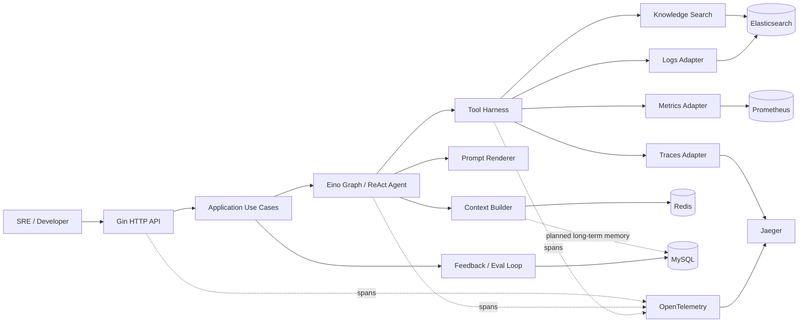
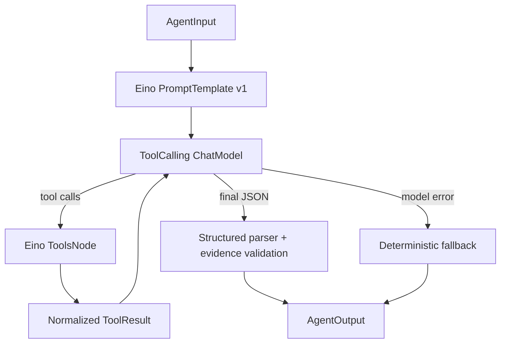
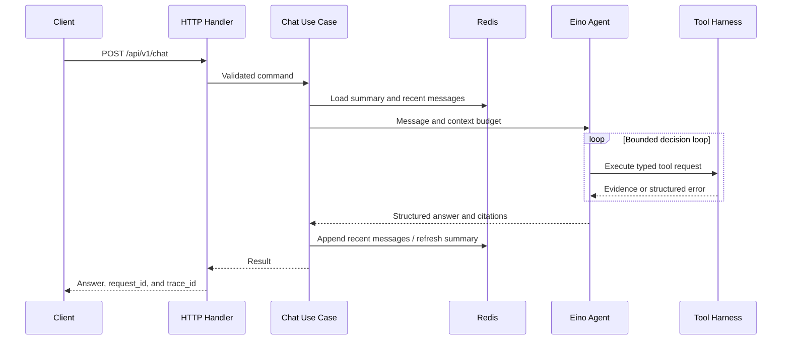

# WatchOps-Lite Architecture

## 1. Overview

WatchOps-Lite follows a pragmatic ports-and-adapters architecture. Gin, Eino, Elasticsearch, Redis, MySQL, and observability backends remain outside the core business-policy boundary.



## 2. Layer Responsibilities

| Layer | Owns | Does not own |
| --- | --- | --- |
| Transport | Gin routing, middleware, binding, DTOs, and status codes | Agent decisions or database semantics |
| Application | Chat, knowledge, and feedback use-case orchestration | Vendor SDK details |
| Domain | Entities, rules, ports, and error semantics | Networking, serialization, or persistence |
| Agent | Eino Graph/ReAct orchestration, prompt rendering, model calls, and tool calling | Direct external-system queries |
| Adapters/Platform | Elasticsearch, Redis, MySQL, model-provider, and telemetry integrations | Product policy |

Dependencies point inward: adapters depend on core interfaces, never the reverse.

## 3. Agent Execution Model

The runtime selects either the deterministic runner or a bounded Eino ReAct Graph while preserving the same `AgentRunner`, `AgentInput`, and `AgentOutput` boundary.



Hard stop conditions:

- Configured Eino graph-step/iteration bound reached
- Request deadline exceeded
- ChatModel request timeout reached

The current Agent layer uses:

- Eino `ToolCallingChatModel` through the official OpenAI-compatible extension
- Eino `PromptTemplate`
- Eino ReAct Graph and `ToolsNode`
- Eino Tool registration and invocation
- `MessageFuture` to collect executed tool results
- OpenTelemetry spans for prompt rendering, model calls, tool calls, parsing, and fallback

WatchOps-Lite does not build a parallel Tool Registry. It defines tool I/O contracts, `ToolError`, timeout/fallback behavior, evidence normalization, redaction, and observability wrappers around Eino tools. Model-produced evidence is never trusted directly: only IDs found in actual `ToolResult` records can support conclusions or inferences.

## 4. Chat Data Flow



A context write failure must not be hidden. If an answer was generated but short-term persistence failed, the API may return the answer while adding a limitation and telemetry event explaining that the next turn might not remember it.

## 5. Context Architecture

### 5.1 Redis Model

```text
session:{id}:recent   LIST/JSON   Recent messages with TTL
session:{id}:summary  HASH/JSON   Summary, version, covered sequence with TTL
session:{id}:lock     STRING      Short-lived summary update lock
```

Each message contains role, content, timestamp, sequence, and request ID. Summary updates use compare-and-set semantics. A version conflict causes one reload and merge attempt, never unbounded retries.

### 5.2 Context Budget

The context implementation bounds recent messages and moves older messages into a rolling structured summary. `summary.mode=llm` uses the configured OpenAI-compatible model with a versioned JSON-only prompt; deterministic mode remains the default. Model errors, summary timeouts, or invalid JSON create `summary.fallback` and use the deterministic summarizer without failing Chat.

The LLM summary is separate from Agent answering: it only compresses already available session context and cannot invoke tools. Its prompt explicitly prevents user guesses or unsupported assistant speculation from becoming confirmed facts and preserves operational identifiers, evidence IDs, tool names, error codes, and time ranges.

Context budgeting follows this order:

1. Preserve the current question, system boundaries, and critical evidence.
2. Move older recent messages into the summary.
3. Shorten RAG chunks while retaining source references.
4. Compress tool output into statistics and representative samples.
5. Remove low-relevance future long-term memories.

Summary tracing uses `summary.llm`, `summary.parse`, and `summary.fallback`. Attributes record only mode, prompt version, message count, parse status, and fallback status—not message or model-output content.

## 6. RAG Architecture

### 6.1 Ingestion Path

```text
JSON document -> Validate -> Normalize -> Chunk
              -> Elasticsearch bulk index (refresh=wait_for)
```

The MVP accepts plain-text or Markdown content synchronously. Elasticsearch stores the chunks, source metadata, and generated document identity. Durable ingestion states, duplicate detection, file extraction, deletion, and asynchronous jobs are deferred.

### 6.2 Retrieval Path

1. Validate and normalize the query.
2. Apply supported metadata filters.
3. Retrieve BM25 candidates from Elasticsearch.
4. Convert returned chunks into source-attributed evidence.
5. Add vector retrieval, fusion, RRF, and reranking only after the MVP.

Elasticsearch query construction remains in the platform adapter and never enters the Agent or HTTP layers.

## 7. Tool Harness

Eino owns tool schema exposure, registration, and invocation. The WatchOps-Lite harness is a policy wrapper, not a second tool runtime or custom Tool Registry.

Tool execution lifecycle:

```text
Resolve -> Validate -> Authorize -> Bound -> Execute
        -> Sanitize -> Normalize -> Observe
```

Every `ToolResult` uses a common envelope:

```json
{
  "status": "ok",
  "tool": "query_logs",
  "evidence": [],
  "summary": {},
  "warnings": [],
  "meta": {
    "duration_ms": 84,
    "truncated": false,
    "source": "logs-primary"
  }
}
```

### 7.1 Fallback Rules

- Fallbacks are configured in advance; the model cannot invent them.
- The fallback source is included in evidence metadata.
- If both primary and fallback fail, return a combined structured error.
- Semantically different sources cannot impersonate each other. Logs may support a metrics failure but cannot be labeled as metric evidence.
- Timeouts, cancellation, and backend rate limiting are modeled separately.

### 7.2 Query Safety

The model emits domain parameters such as service, environment, time range, and filters. Adapters construct bounded Elasticsearch queries or select configured PromQL expressions. Unvalidated complete query strings are prohibited.

### 7.3 Elasticsearch Logs

`query_logs` preserves its Eino schema of service, time range, keywords, and optional level. When `logs.backend=elasticsearch`, the tool maps those domain fields to a bounded Elasticsearch query:

```text
service term + timestamp range + optional level term
             + optional message keyword query + configured result limit
```

The adapter returns log events through `internal/retrieval/logs`; the tool converts each event into a bounded `EvidenceItem` with source `elasticsearch-logs`, the log ID, timestamp, level, trace/span IDs, service resource identity, and truncation metadata.

If the index or Elasticsearch is unavailable, configured mock fallback returns explicit `LOGS_FALLBACK` warning metadata. With fallback disabled, the tool returns `TOOL_DEPENDENCY_UNAVAILABLE`. Neither condition blocks application startup.

### 7.4 Prometheus Metrics

`query_metrics` preserves its Eino schema of service, metric name or symptom, and time range. When `metrics.backend=prometheus`, the metrics service maps the requested reliability intent to an allowlisted PromQL expression from configuration. The first implementation uses an instant query at the end of the requested interval and supports the checkout error-rate, p95-latency, timeout-count, and dependency-latency signals.

`internal/retrieval/metrics` owns query selection and Prometheus HTTP response parsing. The tool converts finite vector samples into `EvidenceItem` records with source `prometheus`, service identity, metric name, numeric value, labels, selected query, and sample timestamp. PromQL is not accepted directly from an Agent or HTTP caller.

If Prometheus is unavailable, configured mock fallback returns explicit `METRICS_FALLBACK` warning metadata. With fallback disabled, the tool returns `TOOL_DEPENDENCY_UNAVAILABLE`. Prometheus availability is checked at query time and never blocks application startup.

### 7.5 Jaeger Traces

`query_traces` accepts a service, time range, optional trace ID, and optional operation. When `traces.backend=jaeger`, exact trace IDs use `GET /api/traces/{traceID}`; otherwise the adapter constructs a bounded `GET /api/traces` request with service, start/end microseconds, operation, and limit.

`internal/retrieval/traces` parses the minimal Jaeger response required by WatchOps-Lite: trace/span IDs, parent reference, operation, process service, start time, duration, tags, and error status. It ranks error-marked spans first and then duration descending. Exact trace-ID lookup does not discard spans merely because the tool's service hint differs from the process service.

The tool maps each selected span to an `EvidenceItem` with source `jaeger`, trace resource identity, bounded summary content, and trace ID, span ID, operation, service, duration, error, and start-time metadata. Raw Jaeger responses and span tags are not copied into evidence or telemetry.

If Jaeger is unavailable, configured mock fallback returns explicit `TRACES_FALLBACK` warning metadata. With fallback disabled, the tool returns `TOOL_DEPENDENCY_UNAVAILABLE`. An available Jaeger instance with no matching spans returns `TRACES_NO_DATA`, not invented evidence.

## 8. Persistence

The MVP creates two MySQL tables:

| Table | Purpose | Important fields |
| --- | --- | --- |
| `feedback` | Raw user feedback | request_id, rating, reason, prompt_version |
| `eval_cases` | Manually seeded good and bad cases | feedback_id, case_type, expected_behavior |

Long-term memory, durable document metadata, review state, and audit records remain planned rather than implied by the current schema.

## 9. OpenTelemetry and Jaeger

The application installs the official OpenTelemetry SDK and exports spans with OTLP over gRPC. Jaeger all-in-one accepts OTLP locally and provides the trace UI. Tracing is configurable and disabled by default.

Implemented trace hierarchy:

```text
http POST /api/v1/chat
└── chat.execute
    ├── session.load_context
    ├── agent.run
    │   ├── tool.query_metrics
    │   │   └── metrics.query
    │   │       └── prometheus.query
    │   ├── tool.query_logs
    │   │   └── logs.search
    │   │       └── elasticsearch.logs.search
    │   ├── tool.query_traces
    │   │   └── traces.query
    │   │       └── jaeger.query
    │   └── tool.search_knowledge
    │       └── knowledge.search
    │           └── elasticsearch.search
    └── session.persist_context
        └── session.update_summary
```

When Eino ReAct mode is enabled, `agent.eino.run` contains `agent.prompt.render`, `agent.llm.call`, `agent.tool_call`, and `agent.output.parse` spans. Request-time model failure also creates `agent.fallback`. Knowledge ingestion, feedback, and eval endpoints create their own application and adapter spans. HTTP middleware extracts W3C trace context and returns `X-Trace-ID`; Chat also returns the same ID in its response contract.

Attributes contain only operational values such as request/session/document IDs, component name, duration, status, result count, tool name, case type, and summary version. User questions, answer bodies, retrieved content, raw logs, credentials, and raw backend errors do not belong in span attributes or events.

Jaeger is the local trace visualization backend. Prometheus is now used as the `query_metrics` evidence backend. Instrumenting WatchOps-Lite itself with Prometheus application metrics remains a separate deferred enhancement.

Potential post-MVP metrics:

- Chat latency and success rate
- Per-tool latency, timeout rate, and fallback rate
- Model tokens and loop steps
- Empty RAG retrieval rate
- Evidence coverage
- Positive/negative feedback ratio
- Eval pass rate

## 10. Dependency Failure Policy

| Dependency | Behavior when unavailable |
| --- | --- |
| Redis | Process a single turn and clearly report loss of short-term continuity |
| MySQL | Feedback and eval APIs return a structured dependency error; Chat is unaffected |
| Elasticsearch | Knowledge APIs return a structured dependency error; logs and knowledge tools use their configured mock fallback |
| Logs | Return real Elasticsearch evidence, explicit mock fallback, or structured unavailability according to configuration |
| Prometheus | Metrics tool uses explicit mock fallback or structured unavailability according to configuration |
| Jaeger | Trace tool uses explicit mock fallback or structured unavailability according to configuration |
| Model | Use the deterministic runner at startup or for the failed request |
| OTel Collector | Drop or buffer telemetry without blocking the request |

## 11. Test Boundaries

- Unit tests: domain rules, context pruning, evidence validation, fallback selection, and stop conditions.
- Golden tests: prompt rendering and structured response templates.
- Contract tests: four tool adapters and their external API fixtures, including Prometheus and Jaeger response parsing.
- Local demo: Compose-backed upload → logs/metrics/traces evidence → Chat → feedback → eval seed.
- Future integration tests: disposable Elasticsearch, Prometheus, Jaeger, MySQL, and Redis lifecycles.
- Future eval runner: tool selection, evidence coverage, forbidden claims, answer structure, and budget.

CI uses redacted fixtures or containers and never depends on real production endpoints.

## 12. Architecture Decision Records

- [ADR 0001: Framework and Technology Stack](adr/0001-framework-and-stack.md)
- [ADR 0002: Eino Tooling and WatchOps Tool Contracts](adr/0002-eino-tooling.md)
- [ADR 0003: Deterministic Chat and Agent Skeleton](adr/0003-chat-agent-skeleton.md)
- [ADR 0004: Redis Session Memory](adr/0004-redis-session-memory.md)
- [ADR 0005: Elasticsearch Knowledge RAG](adr/0005-elasticsearch-rag.md)
- [ADR 0006: MySQL Feedback and Eval Seed](adr/0006-feedback-eval-seed.md)
- [ADR 0007: OpenTelemetry and Jaeger Tracing](adr/0007-opentelemetry-jaeger-tracing.md)
- [ADR 0008: Eino ReAct Agent](adr/0008-eino-react-agent.md)
- [ADR 0009: MVP Demo Packaging](adr/0009-mvp-demo-packaging.md)
- [ADR 0010: Elasticsearch-backed Logs Tool](adr/0010-elasticsearch-logs-tool.md)
