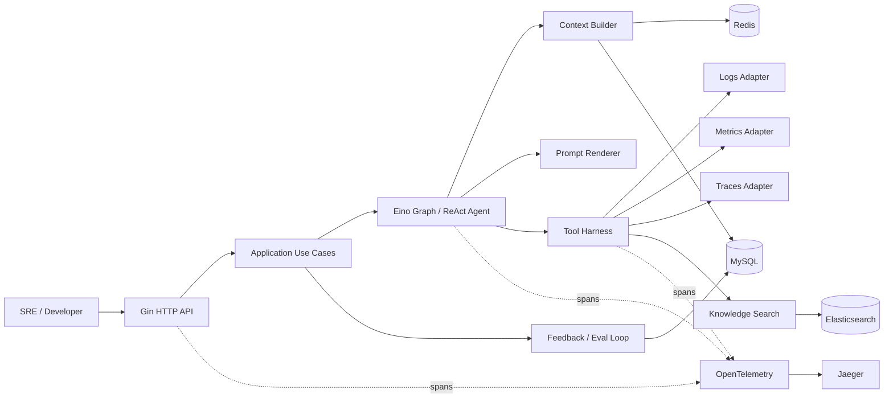
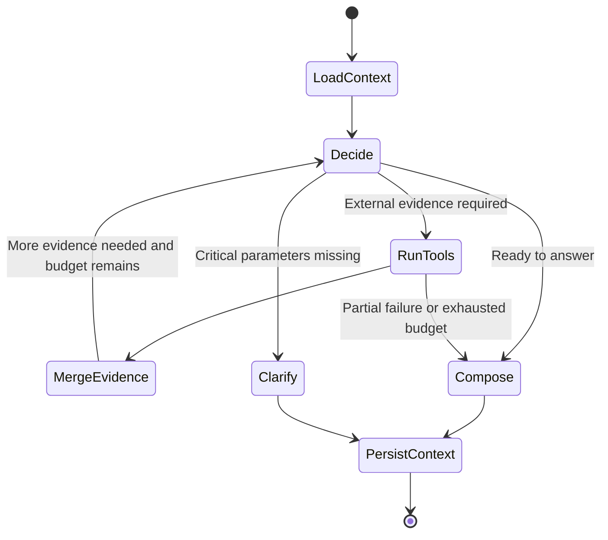
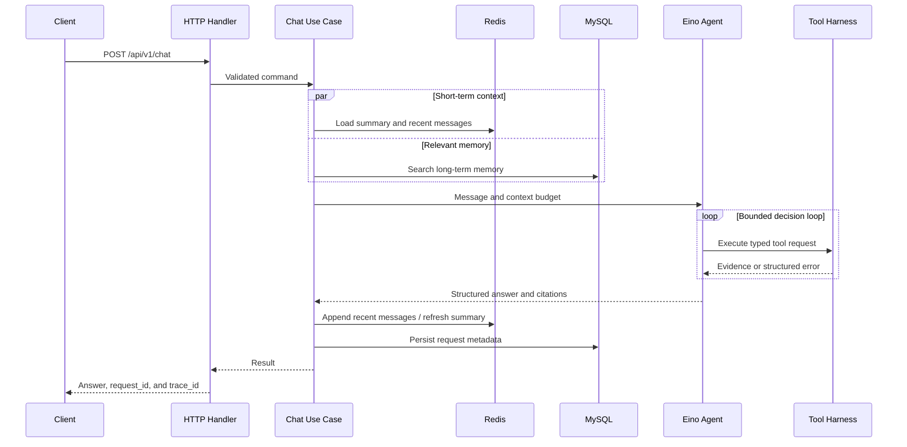

# WatchOps-Lite Architecture

## 1. Overview

WatchOps-Lite follows a pragmatic ports-and-adapters architecture. Gin, Eino, Elasticsearch, Redis, MySQL, and observability backends remain outside the core business-policy boundary.



## 2. Layer Responsibilities

| Layer | Owns | Does not own |
| --- | --- | --- |
| Transport | Gin routing, middleware, binding, DTOs, and status codes | Agent decisions or database semantics |
| Application | Chat, knowledge, and feedback use-case orchestration | Vendor SDK details |
| Domain | Entities, rules, ports, and error semantics | Networking, serialization, or persistence |
| Agent | Eino Graph/ReAct orchestration, prompt rendering, model calls, and tool calling | Direct external-system queries |
| Adapters/Platform | Elasticsearch, Redis, MySQL, model-provider, and telemetry integrations | Product policy |

Dependencies point inward: adapters depend on core interfaces, never the reverse.

## 3. Agent Execution Model

The MVP uses a bounded Eino-based ReAct-style Agent, with Eino Graph for explicit workflow stages. This is easier to observe, test, and cost-control than an unconstrained autonomous loop.



Hard stop conditions:

- Maximum loop steps reached
- Maximum tool calls reached
- Request deadline exceeded
- Token or cost budget exhausted
- Identical tool and arguments produced repeatedly
- User asks for a production write operation forbidden by the MVP

The Agent layer uses Eino capabilities and WatchOps-Lite business contracts:

- Eino `ChatModel`
- Eino `PromptTemplate`
- Eino Graph and ReAct execution
- Eino Tool registration and invocation
- `ContextStore`
- `LongTermMemory`
- `TraceRecorder`, implemented through the OpenTelemetry API

WatchOps-Lite does not build a parallel Tool Registry. It defines tool I/O contracts, `ToolError`, timeout/fallback behavior, evidence normalization, redaction, and observability wrappers around Eino tools.

## 4. Chat Data Flow



A context write failure must not be hidden. If an answer was generated but short-term persistence failed, the API may return the answer while adding a limitation and telemetry event explaining that the next turn might not remember it.

## 5. Context Architecture

### 5.1 Redis Model

```text
session:{id}:recent   LIST/JSON   Recent messages with TTL
session:{id}:summary  HASH/JSON   Summary, version, covered sequence with TTL
session:{id}:lock     STRING      Short-lived summary update lock
```

Each message contains role, content, timestamp, sequence, and request ID. Summary updates use compare-and-set semantics. A version conflict causes one reload and merge attempt, never unbounded retries.

### 5.2 Context Budget

The system does not prune by raw character count alone. The Context Builder assigns soft limits to each information class and handles overflow in this order:

1. Remove low-relevance long-term memories.
2. Shorten RAG chunks while retaining source references.
3. Move older recent messages into the summary.
4. Compress tool output into statistics and representative samples.
5. Preserve the current question, system boundaries, and critical evidence.

## 6. RAG Architecture

### 6.1 Ingestion Path

```text
Upload -> Validate -> Extract -> Normalize -> Chunk
       -> Elasticsearch Index -> Mark Ready
```

Document states are `pending` → `processing` → `ready`. A failed job enters `failed` with a safe error code. Duplicate content can be detected from tenant, source, and content hash.

The MVP may accept uploads synchronously and process them asynchronously. A small `JobQueue` interface separates scheduling from processing. The first implementation may use a database job table and later move to a dedicated message system.

### 6.2 Retrieval Path

1. Normalize the query.
2. Apply tenant, document-state, and access-scope filters.
3. Retrieve BM25 candidates from Elasticsearch.
4. Add vector retrieval and hybrid fusion when embeddings are introduced.
5. Add RRF and reranking when evaluation data demonstrates value.
6. Assign immutable evidence IDs while retaining source positions.

Elasticsearch query construction remains in the platform adapter and never enters the Agent or HTTP layers.

## 7. Tool Harness

Eino owns tool schema exposure, registration, and invocation. The WatchOps-Lite harness is a policy wrapper, not a second tool runtime or custom Tool Registry.

Tool execution lifecycle:

```text
Resolve -> Validate -> Authorize -> Bound -> Execute
        -> Sanitize -> Normalize -> Observe
```

Every `ToolResult` uses a common envelope:

```json
{
  "status": "ok",
  "tool": "query_logs",
  "evidence": [],
  "summary": {},
  "warnings": [],
  "meta": {
    "duration_ms": 84,
    "truncated": false,
    "source": "logs-primary"
  }
}
```

### 7.1 Fallback Rules

- Fallbacks are configured in advance; the model cannot invent them.
- The fallback source is included in evidence metadata.
- If both primary and fallback fail, return a combined structured error.
- Semantically different sources cannot impersonate each other. Logs may support a metrics failure but cannot be labeled as metric evidence.
- Timeouts, cancellation, and backend rate limiting are modeled separately.

### 7.2 Query Safety

The model emits domain parameters such as service, environment, time range, and filters. Adapters construct allowlisted LogQL, PromQL, or trace queries. Unvalidated complete query strings are prohibited.

## 8. Persistence

Suggested MySQL tables:

| Table | Purpose | Important fields |
| --- | --- | --- |
| `sessions` | Session index and deletion state | id, user_id, created_at, deleted_at |
| `memories` | Long-term memory | content, source_type, confidence, expires_at |
| `knowledge_documents` | Document processing state | source, content_hash, status, error_code |
| `feedback` | Raw user feedback | request_id, rating, reason, prompt_version |
| `eval_candidates` | Reviewable eval candidates | feedback_id, kind, review_status |
| `audit_records` | Durable security and workflow audit | action, resource_type, resource_id, created_at |

Whether full request text is retained must be controlled by privacy policy and configuration. The default should favor hashes, summaries, and reproducibility metadata over indefinite raw-content storage.

## 9. OpenTelemetry and Jaeger

Recommended trace hierarchy:

```text
http POST /api/v1/chat
└── chat.execute
    ├── context.load
    │   ├── redis.recent.get
    │   └── memory.search
    ├── agent.run
    │   ├── model.generate
    │   ├── tool.query_metrics
    │   └── tool.query_logs
    ├── answer.validate
    └── context.persist
```

Attributes contain only low-cardinality, non-sensitive values: model name, prompt version, tool name, status, token count, result count, and truncation state. User questions, raw logs, and credentials do not belong in span attributes.

Jaeger is the local trace visualization backend. Prometheus metrics may be added after the MVP and are not required for the tracing baseline.

Key metrics:

- Chat latency and success rate
- Per-tool latency, timeout rate, and fallback rate
- Model tokens and loop steps
- Empty RAG retrieval rate
- Evidence coverage
- Positive/negative feedback ratio
- Eval pass rate

## 10. Dependency Failure Policy

| Dependency | Behavior when unavailable |
| --- | --- |
| Redis | Process a single turn and clearly report loss of short-term continuity |
| MySQL | Reject operations requiring durable persistence; Chat degrades or fails according to policy |
| Elasticsearch | Return a structured knowledge-search error; other tools remain available |
| Logs/Metrics/Traces | A single-tool failure does not stop the Agent; expose the limitation |
| Model | Fail quickly with a retryable dependency error |
| OTel Collector | Drop or buffer telemetry without blocking the request |

## 11. Test Boundaries

- Unit tests: domain rules, context pruning, evidence validation, fallback selection, and stop conditions.
- Golden tests: prompt rendering and structured response templates.
- Contract tests: four tool adapters and their external API fixtures.
- Integration tests: Elasticsearch, MySQL, and Redis lifecycles.
- End-to-end tests: upload → retrieve → Chat → feedback.
- Eval: tool selection, evidence coverage, forbidden claims, answer structure, and budget.

CI uses redacted fixtures or containers and never depends on real production endpoints.

## 12. Architecture Decision Records

- [ADR 0001: Framework and Technology Stack](adr/0001-framework-and-stack.md)
