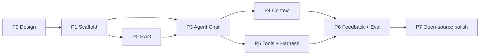

# WatchOps-Lite Development Roadmap

The roadmap follows one principle: each phase should validate a complete technical or product risk. Dates will be assigned when implementation starts; this document defines dependency order and exit criteria.

## Phase 0: Design Baseline

Deliverables:

- Project blueprint, architecture document, and README
- MVP boundaries and recommended project layout
- Explicit implementation points for all four Agent engineering disciplines
- Initial API, error, and evaluation-data contracts

Exit criteria:

- Product scope contains no material contradictions.
- Every external dependency has an abstraction boundary.
- No content is copied from another project.

## Phase 1: Engineering Scaffold

Deliverables:

- `go.mod`, directory skeleton, and configuration loading
- HTTP server, `/healthz`, and graceful shutdown
- Common error envelope and request IDs
- Local MySQL and Redis with Compose
- Basic OpenTelemetry integration
- Lint, test, and build CI

Exit criteria:

- A new environment can start dependencies with one command.
- The service starts, reports health, and shuts down gracefully.
- A request produces a visible root span in the trace backend.

## Phase 2: Minimal RAG Loop

Deliverables:

- Document upload, status, and deletion
- Text extraction, chunking, and embedding
- `VectorStore` interface and one MVP implementation
- `search_knowledge` tool
- Source locations and evidence IDs

Exit criteria:

- A fixed runbook reliably returns the expected passage.
- Duplicate upload and failure behavior are predictable.
- Retrieval never crosses access scopes.

## Phase 3: Agent Chat and Prompt Engineering

Deliverables:

- `POST /api/v1/chat`
- Model port and one adapter
- Bounded Agent loop
- Versioned prompt templates
- Structured answer and evidence validator
- Model, prompt, token, and step tracing

Exit criteria:

- Answers contain conclusion, evidence, inferences, recommendations, and limitations.
- Unsupported factual claims are blocked or downgraded.
- The loop stops reliably on exhausted budget or repeated calls.

## Phase 4: Context Engineering

Deliverables:

- Redis recent-message sliding window
- Structured Redis session summary
- MySQL long-term memory
- Token budget and context pruning
- Concurrent summary version control
- Session and memory deletion endpoints

Exit criteria:

- Long conversations retain confirmed facts after exceeding the raw-message window.
- A Redis outage permits an explicitly degraded single-turn request.
- Model inference never enters long-term memory without confirmation.

## Phase 5: SRE Tools and Harness Engineering

Deliverables:

- `query_logs`
- `query_metrics`
- `query_traces`
- Shared tool registry and executor
- Schema validation, timeouts, bounded retries, and fallbacks
- Structured errors, truncation, and redaction
- Backend contract tests

Exit criteria:

- All four tools execute consistently against fixture environments.
- A tool timeout cannot exceed the overall Chat deadline.
- Partial tool failure still allows an answer using remaining evidence.
- The model cannot bypass the allowlist with arbitrary backend queries.

## Phase 6: Loop Engineering and Eval

Deliverables:

- Like/dislike API
- Feedback reason, version, and evidence snapshot
- Positive-case and bad-case candidate generation
- Redaction and human review states
- `evals/agent_eval_cases.json`
- `cmd/eval` with a JSON report

Exit criteria:

- One like and one dislike can each become a compliant candidate.
- A bad case tests forbidden behavior without preserving a wrong answer as truth.
- Evaluation runs offline and deterministically in CI.
- Prompt or tool changes expose regression differences.

## Phase 7: Open-source Presentation Quality

Deliverables:

- OpenAPI contract, architecture diagrams, and demonstration data
- One reproducible incident-analysis walkthrough
- Security policy, contributing guide, and license
- Example dashboard and trace screenshots
- Capacity, timeout, and degradation guidance

Exit criteria:

- A clean environment can complete the demo from the README.
- The repository contains no credentials, production data, or personal information.
- Critical paths have appropriate test coverage.
- Documentation agrees with actual behavior.

## Milestone Dependencies

## Suggested First Issues

1. Initialize the Go module, base directories, and build tasks.
2. Define the configuration schema and startup validation.
3. Implement HTTP lifecycle, health, and the error envelope.
4. Add the OTel trace provider and request span.
5. Define domain entities and storage ports.
6. Establish MySQL migrations and the Redis session store.
7. Define `VectorStore`, `Embedder`, and `DocumentExtractor`.
8. Define `Tool`, `ToolResult`, `ToolError`, and the registry.
9. Establish prompt-version conventions and golden tests.
10. Create the first `agent_eval_cases.json` and fixture rules.

## Deferred Work

The following items enter the roadmap only when MVP evidence shows they are necessary:

- Multi-agent orchestration
- Automated production changes
- Self-training or model fine-tuning
- Cross-region high availability
- Advanced tenant billing
- Real-time voice and multimodal input

Deferral is not permanent exclusion. It prevents these features from increasing system risk before evidence handling, tool safety, and evaluation feedback are mature.
