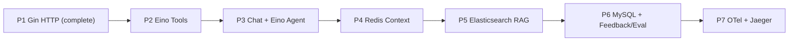

# WatchOps-Lite Development Roadmap

The roadmap introduces one architectural capability at a time. Each phase should remain runnable and testable, and no later-phase infrastructure should be added early merely to complete the directory tree.

## Phase 1: Gin HTTP Skeleton — Completed

Delivered:

- Go module and minimal package structure
- Gin router and `GET /healthz`
- Request logging, request IDs, and panic recovery middleware
- JSON configuration with environment overrides
- Structured logging
- Graceful startup and shutdown
- OpenTelemetry lifecycle placeholder
- Unit tests and developer commands

Exit status: complete.

## Phase 2: Eino Tool Skeleton and WatchOps Tool Contracts

Deliverables:

- Add Eino as the Agent/LLM framework dependency.
- Use Eino's Tool abstraction for schema exposure, registration, and invocation.
- Define business-level input and output contracts for the initial tools.
- Define structured `ToolError`.
- Add wrappers for timeout, fallback, redaction, output size control, and tracing boundaries.
- Introduce deterministic fixture-based tool tests.

Initial tool contracts:

- `query_logs`
- `query_metrics`
- `query_traces`
- `search_knowledge`

Constraints:

- Do not build a custom Tool Registry.
- Do not connect production observability or knowledge backends yet.
- Eino owns registration and calling; WatchOps-Lite owns execution policy and business contracts.

Exit criteria:

- Eino can register and invoke fixture-backed tools.
- Invalid input produces a structured validation error.
- Timeout and oversized-output behavior are deterministic and tested.

## Phase 3: Chat API and Eino Agent Skeleton

Deliverables:

- `POST /api/v1/chat`
- Eino `ChatModel` integration boundary
- Versioned Eino `PromptTemplate` assets
- Eino-based ReAct-style Agent
- Eino Graph for explicit workflow stages where appropriate
- Bounded steps, tool calls, request deadline, and repeated-call detection
- Structured answer sections and evidence validation

Exit criteria:

- A fixture model can complete a Chat request end to end.
- The Agent invokes Phase 2 tools through Eino.
- Unsupported factual claims are rejected or downgraded.
- The Agent stops reliably when its budget is exhausted.

## Phase 4: Redis Session Memory

Deliverables:

- Recent-message sliding window
- Rolling structured session summary
- Session TTL and deletion behavior
- Optimistic summary versioning
- Context budget and pruning
- Redis in the local Docker Compose stack

Exit criteria:

- Multi-turn conversations retain confirmed facts beyond the raw-message window.
- Concurrent summary updates do not silently overwrite newer state.
- Redis failure produces an explicit single-turn degradation.

## Phase 5: RAG with Elasticsearch

Deliverables:

- Document upload, status, and deletion
- Text extraction and chunking
- Elasticsearch chunk indexing
- BM25-first `search_knowledge` implementation
- Source locations, access filters, and evidence IDs
- Elasticsearch in the local Docker Compose stack

Evolution path:

- Add embeddings and vector search.
- Add hybrid lexical/vector retrieval.
- Add RRF and reranking when eval results justify them.

Exit criteria:

- A fixed runbook reliably returns the expected source chunk.
- Duplicate and failed ingestion behavior is predictable.
- Retrieval respects access filters and preserves source locations.

## Phase 6: MySQL Memory, Feedback, and Eval Candidates

Deliverables:

- MySQL-backed long-term memory
- Feedback storage for likes, dislikes, and reasons
- Document metadata and ingestion state
- Bad-case and positive-case eval candidates
- Audit records and review state
- MySQL migrations and local Docker Compose service
- `agent_eval_cases.json` export path

Exit criteria:

- Only confirmed or policy-approved facts enter long-term memory.
- Positive and negative feedback become redacted review candidates.
- A bad case does not preserve an incorrect answer as ground truth.
- Durable records retain the versions needed for reproduction.

## Phase 7: OpenTelemetry and Jaeger Tracing

Deliverables:

- OpenTelemetry SDK and OTLP exporter
- OpenTelemetry Collector and Jaeger in Docker Compose
- Spans for:
  - Agent runs
  - Context building
  - RAG search and ranking
  - Tool execution
  - Prompt rendering
  - Model calls
  - Feedback processing
- Safe trace attributes and redaction rules
- Trace IDs returned from relevant API responses

Exit criteria:

- A Chat trace is visible end to end in Jaeger.
- Tool timeout and fallback events are visible without exposing sensitive data.
- Telemetry export failure does not block business requests.

## Milestone Dependencies

## Deferred Work

- Prometheus application metrics
- Multi-agent orchestration
- Automated production changes
- Model fine-tuning
- Cross-region high availability
- Advanced tenant billing
- Voice and multimodal input

Prometheus may be added after the MVP when concrete service-level metrics and dashboards have been identified.
